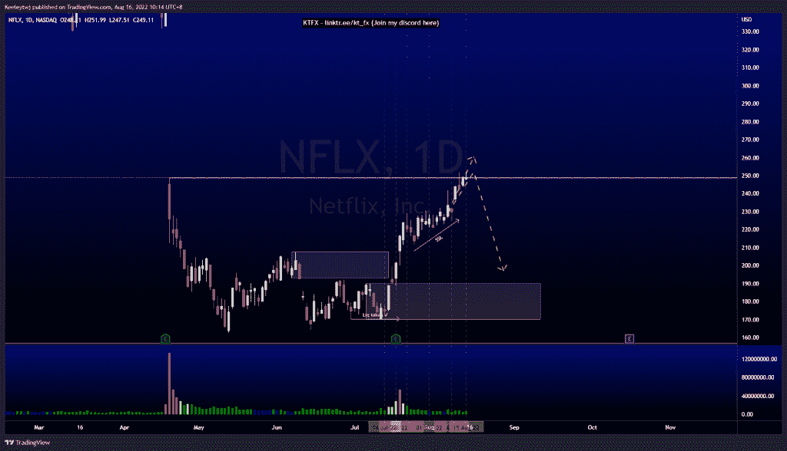
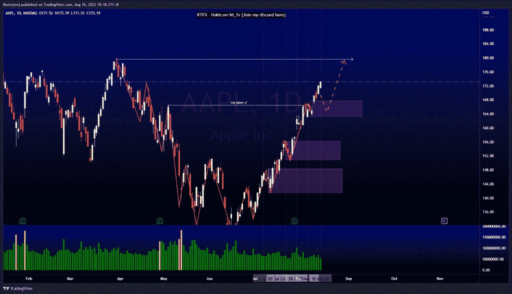
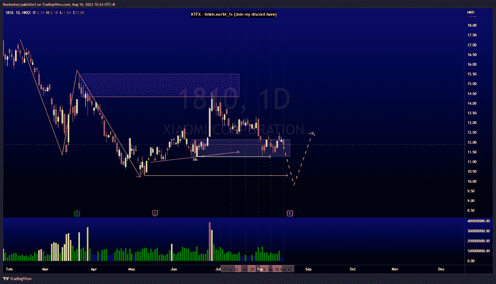

# 每周技术分析#NFLX #AAPL #1810

> 原文：<https://medium.com/coinmonks/weekly-technical-analysis-nflx-aapl-1810-38c757daa4b8?source=collection_archive---------45----------------------->

在这里找到更多关于我的信息(Youtube/discord):[https://www.linktr.ee/kt_fx](https://www.linktr.ee/kt_fx)

如果你觉得我的帖子有帮助，如果你能在这个帖子上给我一个赞，并关注我以后的类似帖子，我将不胜感激。

#NFLX

价格正如预期的那样上涨。价格在 248.70 获得流动性，目前正在填补公允价值缺口。我预计价格将从这里走低，并在 220 美元附近形成卖方流动性。

[https://www.tradingview.com/chart/NFLX/5SpCk9ce-NFLX-Analysis/](https://www.tradingview.com/chart/NFLX/5SpCk9ce-NFLX-Analysis/)

#AAPL

价格向上突破了市场结构，并可能在 179.61 移动以获得流动性。由于我们在每日 TF 中过度扩张，我预计在我们达到最终目标之前，价格将回撤至 167.81 的看涨点，甚至填补 166.9 的公允价值缺口。

[https://www.tradingview.com/chart/AAPL/UxLDAz8e-AAPL-Analysis/](https://www.tradingview.com/chart/AAPL/UxLDAz8e-AAPL-Analysis/)

# 01810 #小米

价格目前正在缓解 12.16 的看涨点。我们也有相同的低点和 11.26 的卖方流动性。在我们看到任何上涨之前，价格更有可能下跌，并带走流动性。

[https://www.tradingview.com/chart/1810/i0eW3cZQ-1810-Analysis/](https://www.tradingview.com/chart/1810/i0eW3cZQ-1810-Analysis/)

让我知道你是否同意和你的想法。如果你持有这些公司中的任何一家，就可以点赞、分享和评论！让我知道，如果你有任何你想让我分析的行情。一定要在其他社交平台上看看我！

种类

发布在[未分类的](https://2minutesliteracy.wordpress.com/category/uncategorized/)

*原载于 2022 年 8 月 16 日 http://2minutesliteracy.wordpress.com***。**

> *交易新手？尝试[加密交易机器人](/coinmonks/crypto-trading-bot-c2ffce8acb2a)或[复制交易](/coinmonks/top-10-crypto-copy-trading-platforms-for-beginners-d0c37c7d698c)*