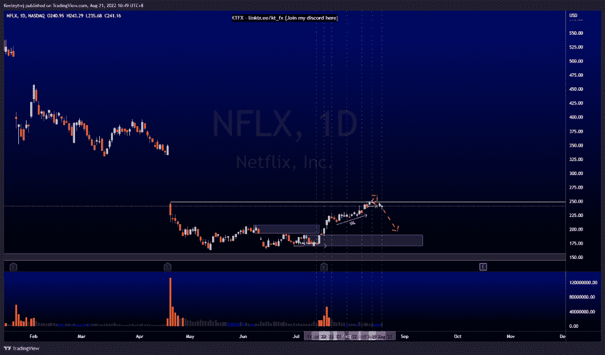
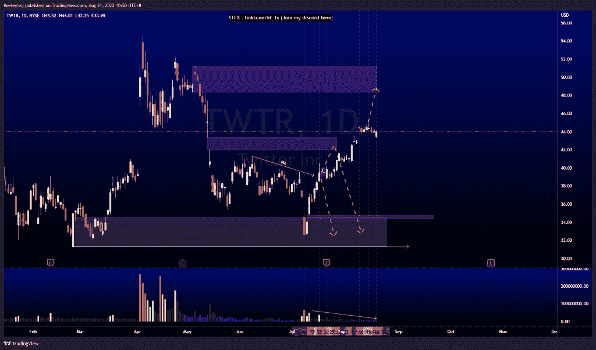
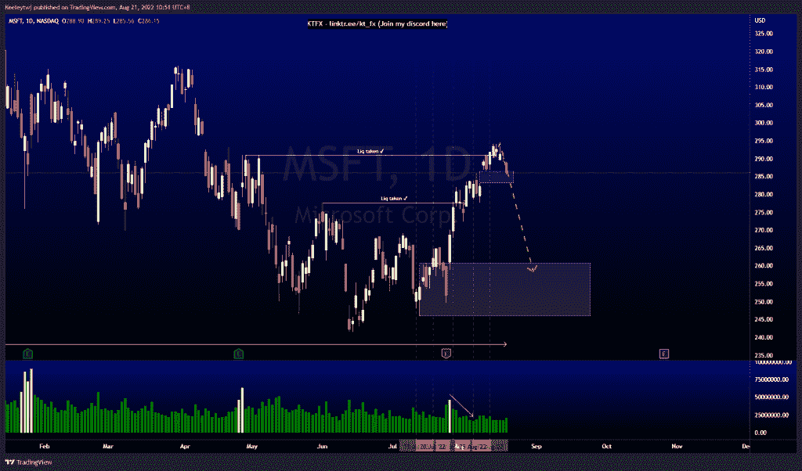

# 每周技术分析#NFLX #TWTR #MSFT

> 原文：<https://medium.com/coinmonks/weekly-technical-analysis-nflx-twtr-msft-e7e1de03bc40?source=collection_archive---------35----------------------->

在这里找到更多关于我的信息(YouTube/Discord/Telegram):[https://www.linktr.ee/keeleytan](https://www.linktr.ee/keeleytan)

如果你觉得我的帖子有帮助，如果你能在这个帖子上给我一个赞，并关注我以后的类似帖子，我将不胜感激。

#NFLX

价格在 248.70 获得了流动性，我们打破了向下的小市场结构。我们确实有大量的卖方流动性。我预计价格将下跌，并带走卖方流动性，并可能在我们继续上行之前缓解 190.21 的看涨点。

#TWTR

价格已经盘整了几天。现在价格呈上升趋势，交易量减少。我预计价格会上涨，并在我们看到价格下跌之前缓解 48.34 的看跌点。

#MSFT

价格的走势与上周的分析完全一致。价格在 290.98 获得流动性，并打破了市场结构的下行。目前，这一价格已经填补了 286.51 美元的公允价值缺口。由于价格在每日 TF 中过度延伸，我预计价格将回撤至主要看涨点 260.84。

让我知道你是否同意和你的想法。

如果你持有这些公司中的任何一家，就可以点赞、分享和评论！

让我知道，如果你有任何你想让我分析的行情。

一定要在其他社交平台上看看我，我在交易、分析和心理学上发布内容。看看我这里:【https://www.linktr.ee/keeleytan】T2

种类

贴在[技术分析](https://2minutesliteracy.wordpress.com/tag/technical-analysis/)

*原载于 2022 年 8 月 21 日 http://2minutesliteracy.wordpress.com**[*。*](https://2minutesliteracy.wordpress.com/2022/08/22/weekly-technical-analysis-nflx-twtr-msft/)*

> *交易新手？尝试[加密交易机器人](/coinmonks/crypto-trading-bot-c2ffce8acb2a)或[复制交易](/coinmonks/top-10-crypto-copy-trading-platforms-for-beginners-d0c37c7d698c)*