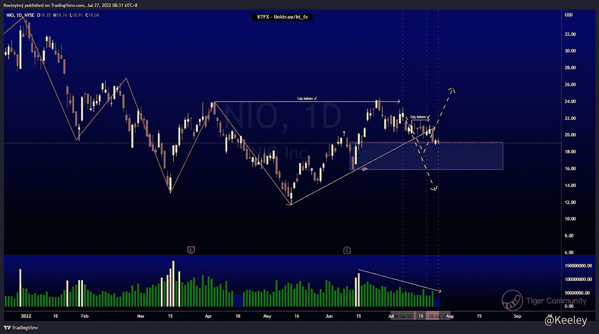
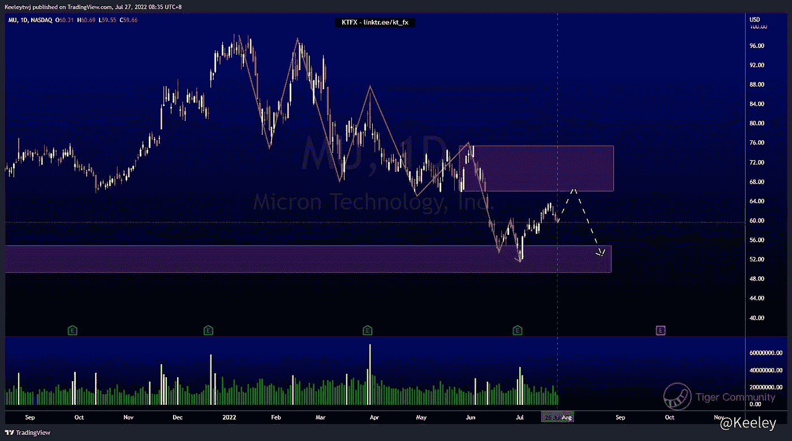
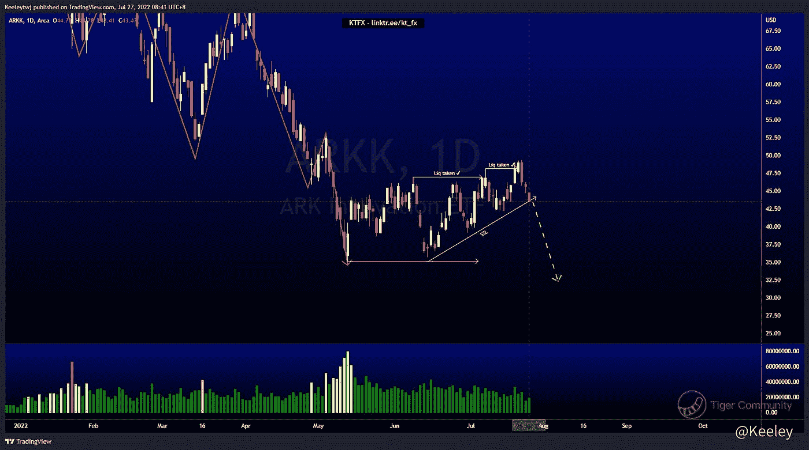

# 每周技术分析$NIO $MU $ARKK

> 原文：<https://medium.com/coinmonks/weekly-technical-analysis-nio-mu-arkk-e29f349f74d1?source=collection_archive---------39----------------------->

在[https://www.linktr.ee/kt_fx](https://www.linktr.ee/kt_fx)了解更多关于我的信息

对我的不和谐有更多的分析:【https://discord.com/invite/reFmPbS 

$NIO

价格与上周的分析完全一致。价格呈下降趋势，预计价格将触及看涨点。我们在看涨点。随着价格缓和这一看涨点，交易量正在减少。我预计价格会进一步下跌，因为价格在 21.80 处获得了流动性，并一直向下突破结构。这个下降趋势的目标应该是 15.84 的低点

[https://www.tradingview.com/chart/NIO/pubTOpYn-NIO-Analysis/](https://www.tradingview.com/chart/NIO/pubTOpYn-NIO-Analysis/)

[$微米科技(MU)$](https://ttm.financial/S/MU)

价格呈下降趋势，最近在 54.85 缓解了看涨的 POI 后，市场结构向上突破。价格正在创造一个短期的上升趋势，在我们看到继续向下之前，价格可能会走高，以缓解 66.01 的看跌点。

[https://www.tradingview.com/chart/MU/7Cup1hLI-MU-Analysis/](https://www.tradingview.com/chart/MU/7Cup1hLI-MU-Analysis/)

[$方舟创新 ETF(ARKK)$](https://ttm.financial/S/ARKK)

价格明显呈下降趋势。价格一直在建立卖方流动性，并在 46.94 和 48.12 处获得流动性。这很可能是一个牛市陷阱，而精明的资金会推低价格。我期待价格从这里下降。这次下跌的目标是相对相等的低点 35.10。

[https://www.tradingview.com/chart/ARKK/alK8SkZz-ARKK-Analysis/](https://www.tradingview.com/chart/ARKK/alK8SkZz-ARKK-Analysis/)

让我知道你是否同意和你的想法。如果你持有这些公司中的任何一家，就可以点赞、分享和评论！让我知道，如果你有任何你想让我分析的行情。

*原载于 2045 年 7 月 27 日*[*https://TTM . financial*](https://ttm.financial/post/9909258859)*。*

> 交易新手？尝试[加密交易机器人](/coinmonks/crypto-trading-bot-c2ffce8acb2a)或[复制交易](/coinmonks/top-10-crypto-copy-trading-platforms-for-beginners-d0c37c7d698c)