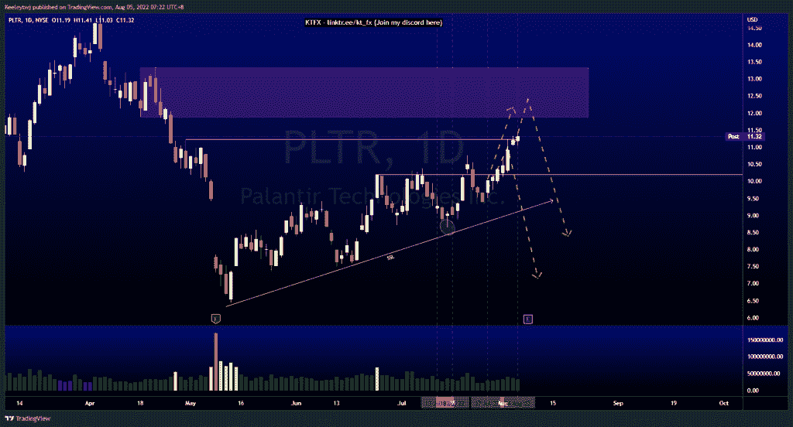
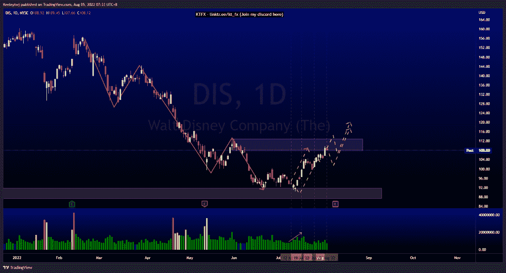
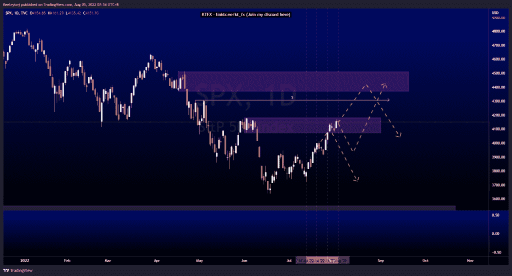

# 每周技术分析$PLTR $DIS $SPX

> 原文：<https://medium.com/coinmonks/weekly-technical-analysis-pltr-dis-spx-9f5804346d55?source=collection_archive---------32----------------------->

在这里找到更多关于我的信息(Youtube/discord):[https://www.linktr.ee/kt_fx](https://www.linktr.ee/kt_fx)

$PLTR
的价格并没有像预期的那样发挥。价格将流动性带到了 11.32 以上。现在，我预计价格会走高，以缓解 11.88 的看跌情绪。下周一我们将有收益，我们将看看这一看跌点是否成立。

[https://www.tradingview.com/chart/PLTR/eB30XMBb-PLTR-Analysis/](https://www.tradingview.com/chart/PLTR/eB30XMBb-PLTR-Analysis/)

$DIS

自 2022 年 7 月 12 日以来，价格一直如预期般上涨。我们在 8 月 10 日有盈利电话。我们目前正在缓解 107.91 的看跌点。我预计这一看跌点将保持不变，并在我们走高之前看到一些向下的回撤。或者，我们可以看到在价格下跌之前，112.95 的流动性成为目标。

[https://www.tradingview.com/chart/DIS/pIII1NB2-DIS-Analysis/](https://www.tradingview.com/chart/DIS/pIII1NB2-DIS-Analysis/)

$SPX

价格一直在发挥作用，缓解了目前 4073.85 的看跌点。我预计价格会从这里向下回撤。我们有同样的高点 4308.45 采取，以及一个强大的熊市 POI 减轻。如果价格没有从这里向下回撤，我们应该在 4370.30 点看跌

[https://www.tradingview.com/chart/SPX/tHdKXVre-SPX-Analysis/](https://www.tradingview.com/chart/SPX/tHdKXVre-SPX-Analysis/)

让我知道你是否同意和你的想法。如果你持有这些公司中的任何一家，就可以点赞、分享和评论！让我知道，如果你有任何你想让我分析的行情。一定要在其他社交平台上看看我！

*原载于 2022 年 8 月 4 日 http://2minutesliteracy.wordpress.com**的* [*。*](https://2minutesliteracy.wordpress.com/2022/08/05/weekly-technical-analysis-pltr-dis-spx/)

> 交易新手？尝试[加密交易机器人](/coinmonks/crypto-trading-bot-c2ffce8acb2a)或[复制交易](/coinmonks/top-10-crypto-copy-trading-platforms-for-beginners-d0c37c7d698c)