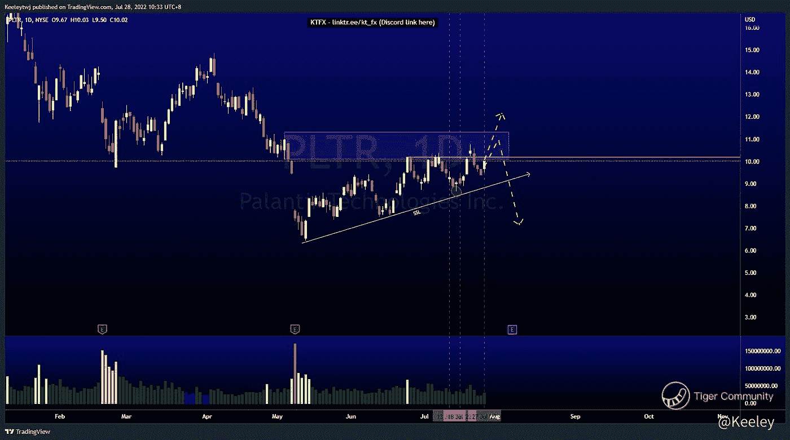
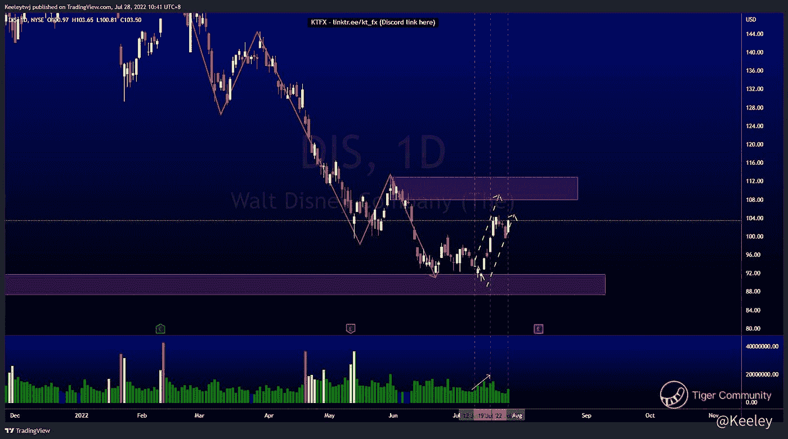
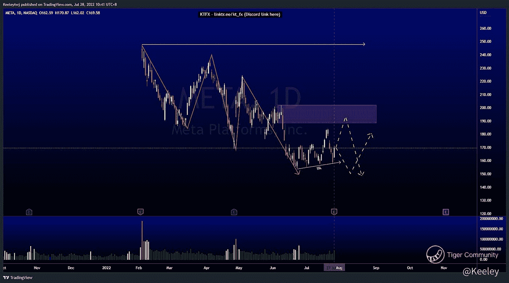

# 每周技术分析$PLTR $META $DIS

> 原文：<https://medium.com/coinmonks/weekly-technical-analysis-pltr-meta-dis-3a2749bc9b8b?source=collection_archive---------44----------------------->

在这里找到更多关于我的信息(Youtube/Discord):[https://www.linktr.ee/kt_fx](https://www.linktr.ee/kt_fx)

[$帕兰蒂尔技术公司(PLTR)$](https://ttm.financial/S/PLTR)

普莱斯并没有按照预期发挥作用。我原本预计会有一次看跌行动，以消除卖方流动性。然而，价格上涨带来了更多的买方流动性。我们目前处于这个熊市点，它已经被测试了 3 次。我们可能会看到上面有一个缺口。我们还需要注意，价格正在攻击高点，同时在下方构建趋势线以设计流动性。我们也处在一个没有被打破的熊市点。我预计价格会更低。

[https://www.tradingview.com/chart/PLTR/AD3oh6YY-PLTR-Analysis/](https://www.tradingview.com/chart/PLTR/AD3oh6YY-PLTR-Analysis/)

[$华特·迪士尼(DIS)$ ](https://ttm.financial/S/DIS)

Price 正在做我上周分析的事情。上周我的分析没有变化。价格呈下降趋势。价格填补了 Q1 2020 创造的 91.80 英镑的公允价值缺口。我们也开始看到威科夫累积图的特征发生了变化，成交量随着上涨而增加。我预计价格将继续反弹走高，看跌的目标点位为 107.91。

[https://www.tradingview.com/chart/DIS/xg6VWjVY-DIS-Analysis/](https://www.tradingview.com/chart/DIS/xg6VWjVY-DIS-Analysis/)

[$Meta 平台公司(META)$](https://ttm.financial/S/META)

价格呈下降趋势。价格处于短期上升趋势，建立卖方流动性。我们在 188.40 有一个完全看跌的 POI，这是这个短期上升趋势的一个可能目标。如果价格想要上涨，价格仍有可能带走卖方建立的流动性。

[https://www.tradingview.com/chart/META/DXQSOjDi-META-Analysis/](https://www.tradingview.com/chart/META/DXQSOjDi-META-Analysis/)

让我知道你是否同意和你的想法。如果你持有这些公司中的任何一家，就可以点赞、分享和评论！让我知道，如果你有任何你想让我分析的行情。一定要在其他社交平台上看看我！

*原载于 2022 年 7 月 28 日*[*https://TTM . financial*](https://ttm.financial/post/9903374793)*。*

> 交易新手？尝试[加密交易机器人](/coinmonks/crypto-trading-bot-c2ffce8acb2a)或[复制交易](/coinmonks/top-10-crypto-copy-trading-platforms-for-beginners-d0c37c7d698c)