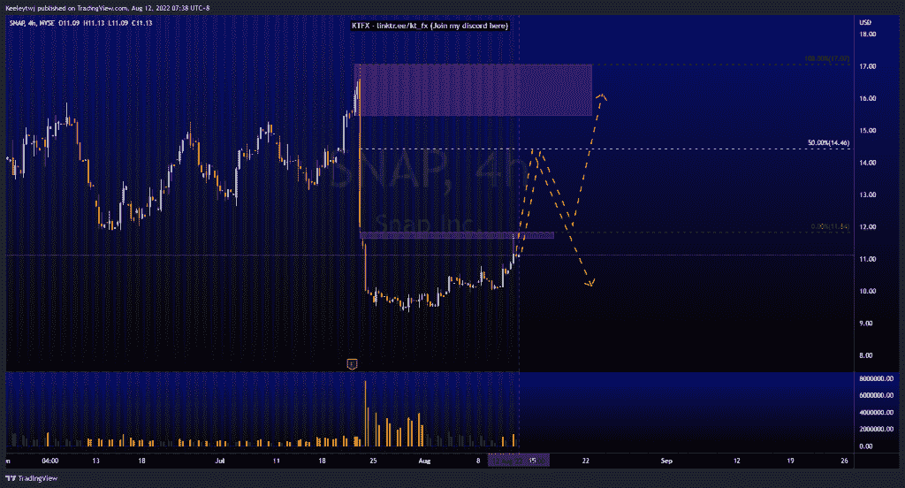
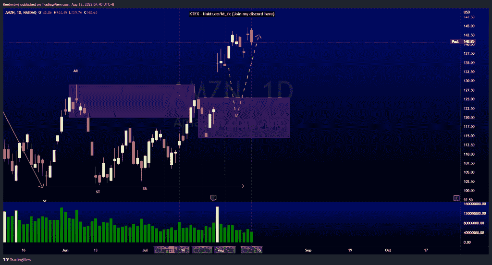
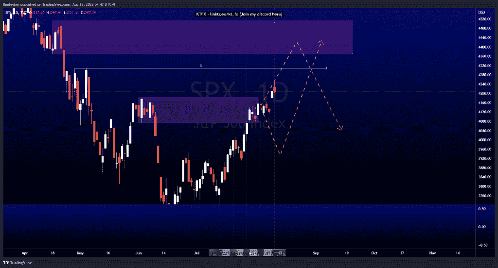

# 每周技术分析#SNAP #AMZN #SPX500

> 原文：<https://medium.com/coinmonks/weekly-technical-analysis-snap-amzn-spx500-c6c5c6cf5d8e?source=collection_archive---------34----------------------->

在这里找到更多关于我的信息(Youtube/discord):[https://www.linktr.ee/kt_fx](https://www.linktr.ee/kt_fx)

#SNAP

价格目前在 H4 图上盘整。我们在收益发布期间看到了一个垃圾场。目前，价格填补了 11.64 的公允价值缺口，并向下强劲回撤。由于我们有非常强烈的不平衡，我预计价格将走向 14.46，以填补 50%的不平衡，然后我们会看到向下的回撤。

[https://www.tradingview.com/chart/SNAP/kI6M430h-SNAP-Analysis/](https://www.tradingview.com/chart/SNAP/kI6M430h-SNAP-Analysis/)

#AMZN

价格目前正在巩固。我预计在我们继续上行之前，价格将回撤至看涨点 125.50。我的期望仍然没有改变。还有一个巨大的公允价值缺口需要填补，这与看涨的 POI 不谋而合。价格更有可能从这里向下回撤。

[https://www.tradingview.com/chart/AMZN/pZuYH8ui-AMZN-Analysis/](https://www.tradingview.com/chart/AMZN/pZuYH8ui-AMZN-Analysis/)

#SPX500

价格正如预期的那样上涨。我预计价格要么在 4073.85 点走出熊市，要么从这里开始回撤。现在，价格消除了看跌的因素。此次上涨最有可能的目标是在 4308.45 的同等高点，并在我们看到向下移动之前，在 4370.30 的位置缓解看跌情绪。

[https://www.tradingview.com/chart/SPX/3BP8aN2N-SPX-Analysis/](https://www.tradingview.com/chart/SPX/3BP8aN2N-SPX-Analysis/)

让我知道你是否同意和你的想法。如果你持有这些公司中的任何一家，就可以点赞、分享和评论！让我知道，如果你有任何你想让我分析的行情。一定要在其他社交平台上看看我！

种类

贴在[的股票分析](https://2minutesliteracy.wordpress.com/category/stocks-analysis/)

*原载于 2022 年 8 月 11 日 http://2minutesliteracy.wordpress.com***。**

> *交易新手？尝试[加密交易机器人](/coinmonks/crypto-trading-bot-c2ffce8acb2a)或[复制交易](/coinmonks/top-10-crypto-copy-trading-platforms-for-beginners-d0c37c7d698c)*