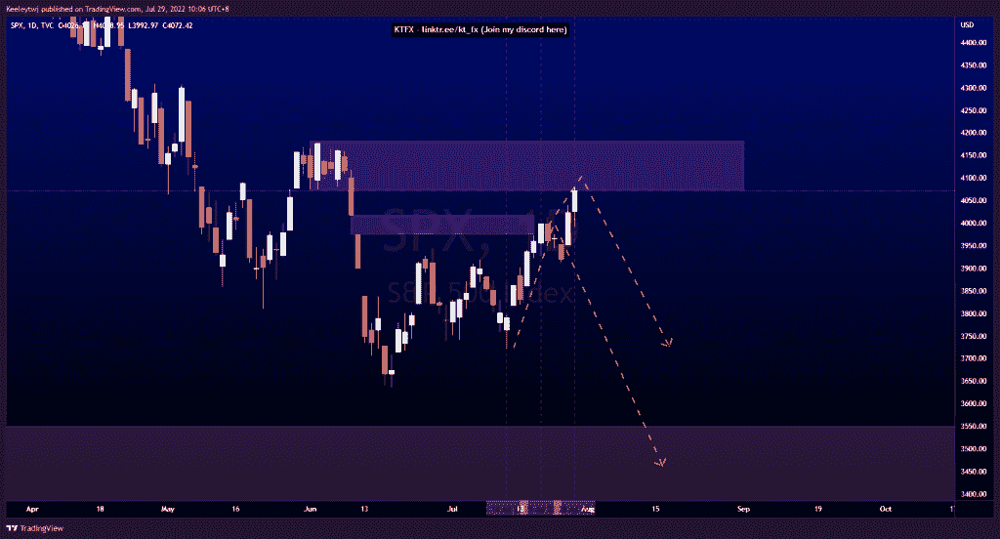
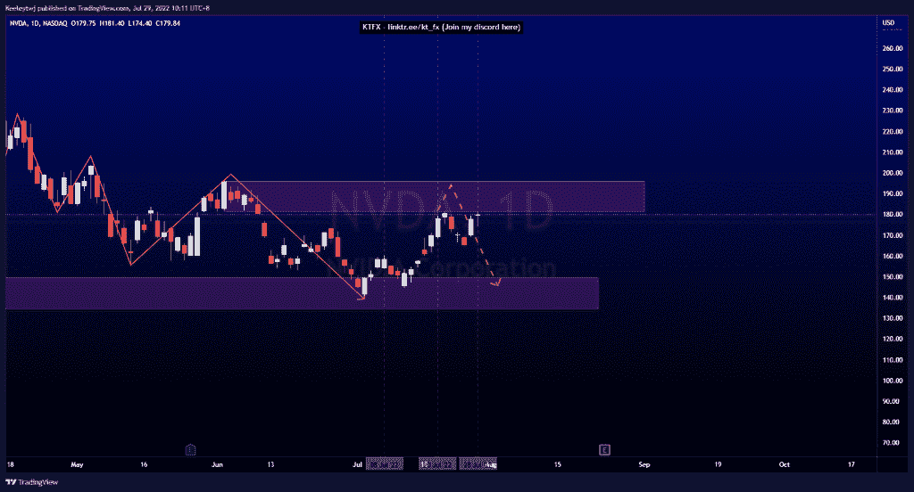
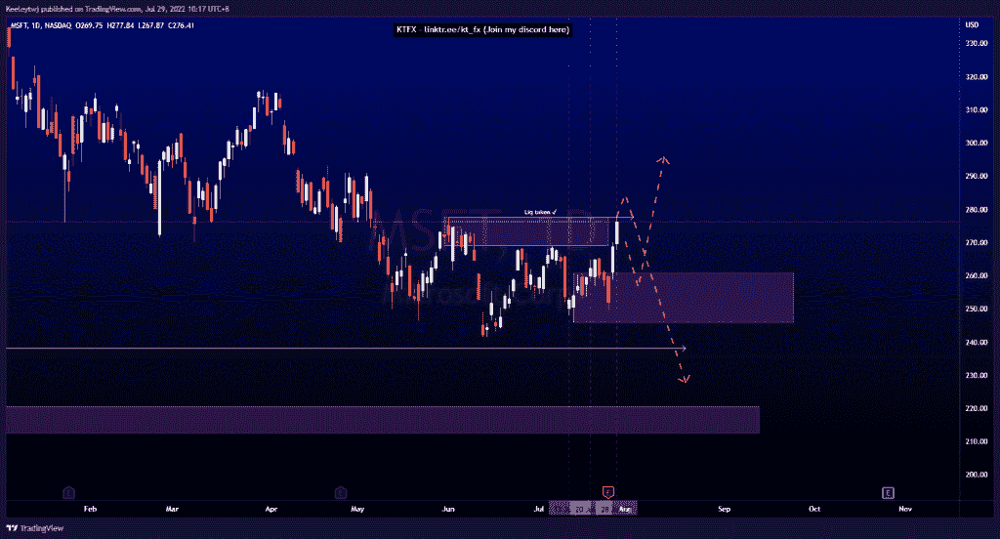

# 每周技术分析$SPX $NVDA $MSFT

> 原文：<https://medium.com/coinmonks/weekly-technical-analysis-spx-nvda-msft-8470f438d00f?source=collection_archive---------42----------------------->

在这里找到更多关于我的信息(Youtube/Discord):[https://www.linktr.ee/kt_fx](https://www.linktr.ee/kt_fx)

$ 标准普尔 500(。SPX)$

价格正在上演上周的分析。我预计会从任何一个看跌点出现回撤。价格呈上升趋势，触及看跌点 4073.85。现在，我预计价格会减轻这一看跌点，并开始下跌趋势。

英伟达公司(NVDA)

价格的走势与上周的分析完全一致。价格触及看跌点，并对下跌做出反应。我预计价格在回撤至下行之前会进一步缓解看跌点。

$微软(MSFT)$

普莱斯没有发挥预期。价格呈下降趋势。上周，我预计价格将在 238.07 的同等低点下跌，并在上涨前进入 220.58 的看涨点。然而，价格反而上涨了。现在，我们已经打破了上升，无效的看跌点。从这里开始，我们很可能会在 260.84 看到一个回撤进入看涨点，并继续向上。在另一种情况下，我们可以看到 277.69 的高点是一个流动性抓取，以降低。

让我知道你是否同意和你的想法。如果你持有这些公司中的任何一家，就可以点赞、分享和评论！让我知道，如果你有任何你想让我分析的行情。一定要在其他社交平台上看看我！

*原载于 2022 年 7 月 29 日*[*【http://2minutesliteracy.wordpress.com】*](https://2minutesliteracy.wordpress.com/2022/07/29/weekly-technical-analysis-spx-nvda-msft/)*。*

> 交易新手？尝试[加密交易机器人](/coinmonks/crypto-trading-bot-c2ffce8acb2a)或[复制交易](/coinmonks/top-10-crypto-copy-trading-platforms-for-beginners-d0c37c7d698c)