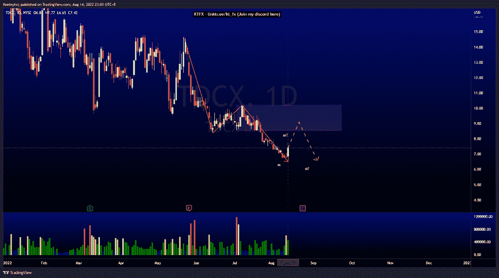
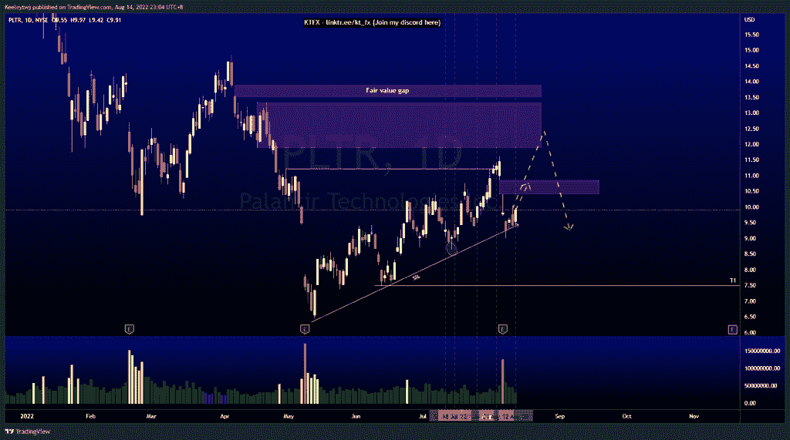
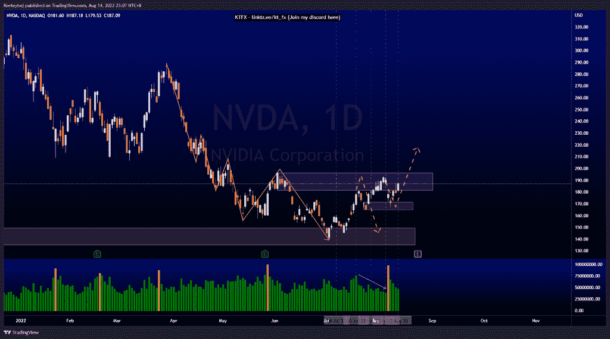

# 每周技术分析#TDCX #PLTR #NVDA

> 原文：<https://medium.com/coinmonks/weekly-technical-analysis-tdcx-pltr-nvda-e73b3ffa995a?source=collection_archive---------27----------------------->

在这里找到更多关于我的信息(Youtube/discord):[https://www.linktr.ee/kt_fx](https://www.linktr.ee/kt_fx)

如果你觉得我的帖子有帮助，如果你能在这个帖子上给我一个赞，并关注我以后的类似帖子，我将不胜感激。

#TDCX

价格呈下降趋势。随着交易量的增加，我们有了第一个改变的迹象，但是价格不能再低了。随后，我们看到价格在 8 月 12 日被推高。我们可能会看到一个威科夫累积图的开始，销售高潮已经到来。我预计价格将走高，以缓解 8.56 的看跌情绪。

[https://www.tradingview.com/chart/TDCX/5p6YqcgB-TDCX-Analysis/](https://www.tradingview.com/chart/TDCX/5p6YqcgB-TDCX-Analysis/)

#PLTR

据分析，上周收益电话会议后价格下跌。价格也造成了 10.40 英镑的公允价值差距。价格可能会上涨，以填补公允价值缺口，然后下跌，以获取卖方流动性。价格也可能走高，以缓解下跌前留在 11.88 的看跌情绪。

[https://www.tradingview.com/chart/PLTR/Vcz6hYCA-PLTR-Analysis/](https://www.tradingview.com/chart/PLTR/Vcz6hYCA-PLTR-Analysis/)

#NVDA

价格的走势与上周的分析完全一致。价格从 171.24 的看涨点反弹，并推高到 181.22 的看跌点。我预计价格会使看跌的观点失效。然而，我们可以看到，随着价格试图推高，交易量有所减少，这表明了疲软的迹象，价格仍可能从这里走低。

[https://www.tradingview.com/chart/NVDA/o8Rt5EpH-NVDA-Analysis/](https://www.tradingview.com/chart/NVDA/o8Rt5EpH-NVDA-Analysis/)

让我知道你是否同意和你的想法。如果你持有这些公司中的任何一家，就可以点赞、分享和评论！让我知道，如果你有任何你想让我分析的行情。一定要在其他社交平台上看看我！

种类

贴在[技术分析](https://2minutesliteracy.wordpress.com/tag/technical-analysis/)

*原载于 2022 年 8 月 14 日 http://2minutesliteracy.wordpress.com***。**

> *加入 Coinmonks [电报频道](https://t.me/coincodecap)和 [Youtube 频道](https://www.youtube.com/c/coinmonks/videos)了解加密交易和投资*

# *另外，阅读*

*   *[什么是保证金交易](https://coincodecap.com/margin-trading) | [美元成本平均法](https://coincodecap.com/dca)*
*   *[支持卡审核](https://coincodecap.com/uphold-card-review) | [信任钱包 vs MetaMask](https://coincodecap.com/trust-wallet-vs-metamask)*
*   *[Exness 回顾](https://coincodecap.com/exness-review)|[moon xbt Vs bit get Vs Bingbon](https://coincodecap.com/bingbon-vs-bitget-vs-moonxbt)*
*   *[如何开始用加密贷款赚取被动收入](https://coincodecap.com/passive-income-crypto-lending)*
*   *[BigONE 交易所评论](/coinmonks/bigone-exchange-review-64705d85a1d4) | [电网交易机器人](https://coincodecap.com/grid-trading)*