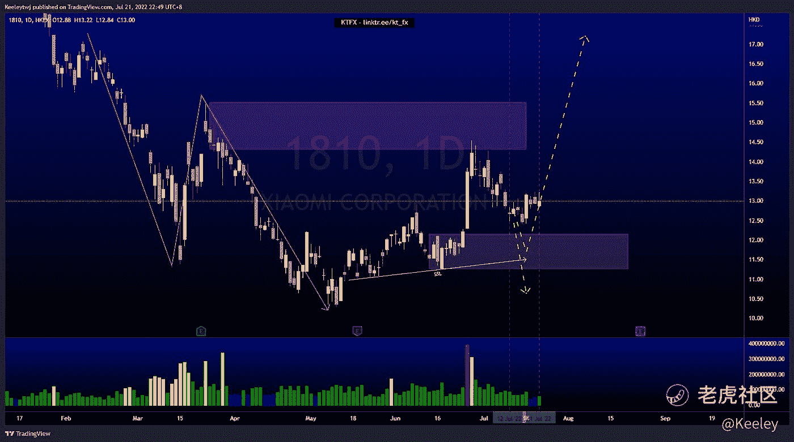

# 每周技术分析$TIGR $SPX $01810

> 原文：<https://medium.com/coinmonks/weekly-technical-analysis-tigr-spx-01810-aa967eba71cc?source=collection_archive---------46----------------------->

在这里找到更多关于我的信息:linktr.ee/kt_fx

$TIGR

分析是在 4H 完成的，因为 1D 价格走势混乱。价格处于盘整状态。价格已经建立了买方和卖方的流动性。目前的价格走势表明下行空间更大，因为我们之前采取了较低的时间框架卖方流动性，价格无法推动和打破市场结构上行。随后，我们有买方流动性，价格目前正试图打破市场结构下降到下行。如果我们看到向下结构的明显突破，我们可以看到 3.68 的低点成为目标。

$SP500

价格正在上演上周的分析。价格呈下降趋势。价格回升至 3974.39，如预期填补了缺口。目前，我预计价格会继续走低。当然，在我们看到另一次下跌之前，价格也有可能进一步反弹，并缓解 4073.85 的看跌点。

$01810 小米

自上周以来，价格一直在巩固。价格呈下降趋势。价格未能触及 12.16 的看涨点，并显示出一些看涨势头。我仍然预计价格在开始上升趋势之前会触及看涨点。然而，请注意，卖方流动性正在增加，价格可能会在上涨前走出 11.26 的低点。

让我知道你是否同意和你的想法。如果你持有这些公司中的任何一家，就可以点赞、分享和评论！

*原载于 2022 年 7 月 21 日*[*https://TTM . financial*](https://ttm.financial/post/9074753743)*。*

> 交易新手？尝试[加密交易机器人](/coinmonks/crypto-trading-bot-c2ffce8acb2a)或[复制交易](/coinmonks/top-10-crypto-copy-trading-platforms-for-beginners-d0c37c7d698c)