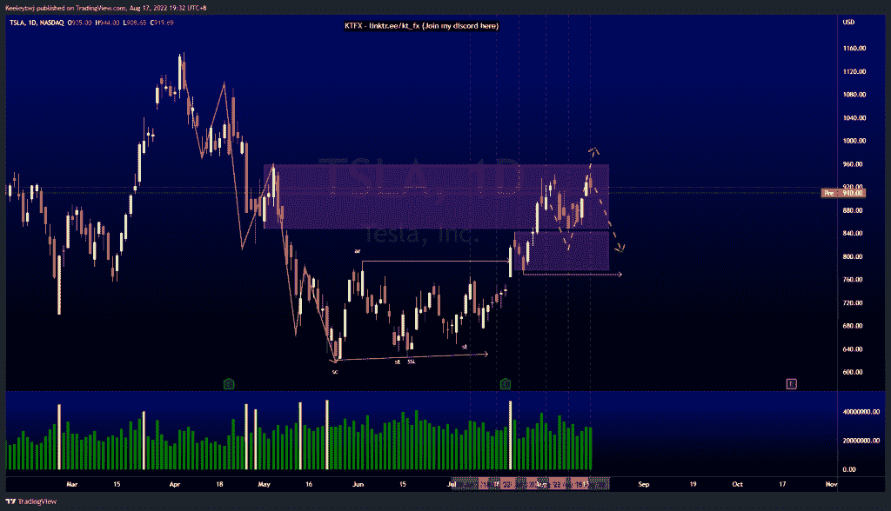
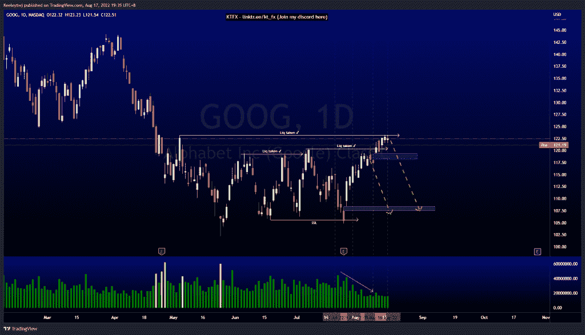
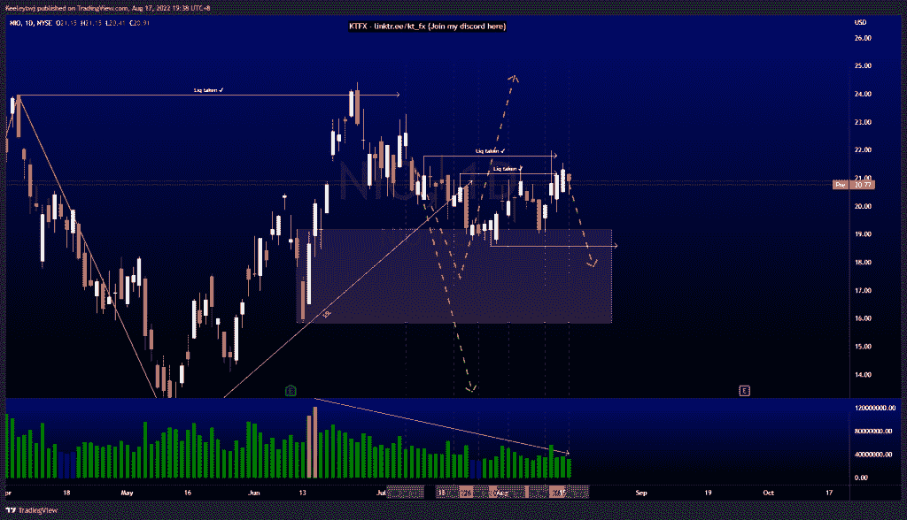

# 每周技术分析# TSLA # NIO #谷歌

> 原文：<https://medium.com/coinmonks/weekly-technical-analysis-tsla-nio-goog-43ee2cdd878b?source=collection_archive---------52----------------------->

在这里找到更多关于我的信息(YouTube/Discord/Telegram):[https://www.linktr.ee/keeleytan](https://www.linktr.ee/keeleytan)

如果你觉得我的帖子有帮助，如果你能在这个帖子上给我一个赞，并关注我以后的类似帖子，我将不胜感激。

#TSLA

根据上周的分析，价格从看涨的 POI 反弹至 842.36。目前，价格无法推高至 848.03 的看跌点。从这里，我们可能会看到一个回撤回到看涨点，并可能在我们看到任何上涨之前获得更多的流动性。

#GOOG

与我上周的分析没有变化。价格在 120.37 获得流动性，现在正在巩固。我们无法收于 123.14 点的高点之上，这可能是流动性紧张的迹象。我预计价格会走低，以填补 108.42 的公允价值缺口。我们也看到 119.36 的公允价值差距，但我预计在上涨前会回撤至折价水平。

#NIO

根据上周的分析，价格上涨了。价格从 19.18 的看涨点反弹，在 21.80 获得流动性，无法收高。我们可能会看到 18.59 的潜在下行，并在我们看到任何上行之前获取更多的流动性。

让我知道你是否同意和你的想法。如果你持有这些公司中的任何一家，就可以点赞、分享和评论！让我知道，如果你有任何你想让我分析的行情。一定要在其他社交平台上看看我！

种类

贴在[技术分析](https://2minutesliteracy.wordpress.com/category/technical-analysis/)

*原载于 2022 年 8 月 17 日 http://2minutesliteracy.wordpress.com***。**

> *交易新手？尝试[加密交易机器人](/coinmonks/crypto-trading-bot-c2ffce8acb2a)或[复制交易](/coinmonks/top-10-crypto-copy-trading-platforms-for-beginners-d0c37c7d698c)*