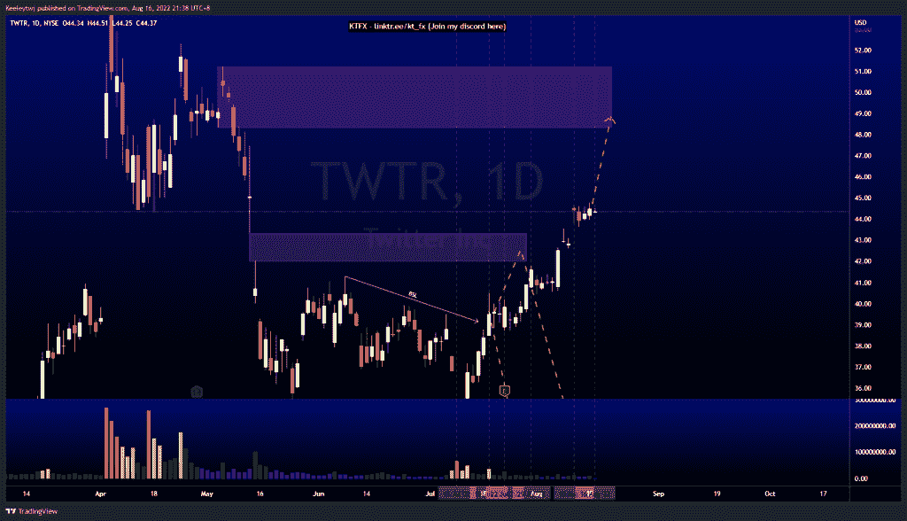
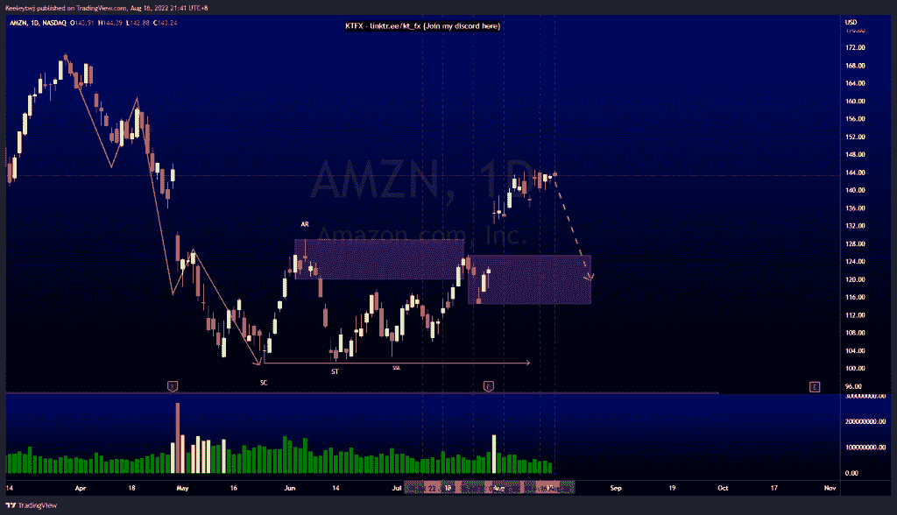
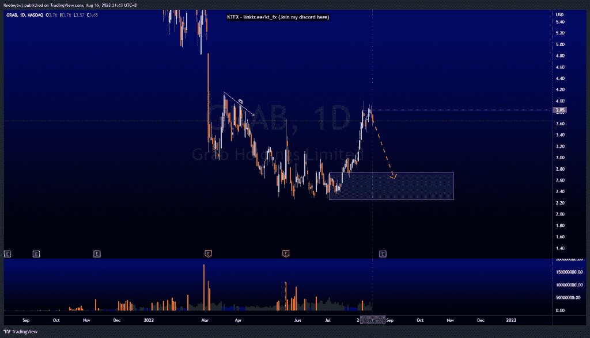

# 每周技术分析#TWTR #GRAB #AMZN

> 原文：<https://medium.com/coinmonks/weekly-technical-analysis-twtr-grab-amzn-8c20bdb4aca7?source=collection_archive---------37----------------------->

在这里找到更多关于我的信息(YouTube/Discord/Telegram):[https://www.linktr.ee/keeleytan](https://www.linktr.ee/keeleytan)

如果你觉得我的帖子有帮助，如果你能在这个帖子上给我一个赞，并关注我以后的类似帖子，我将不胜感激。

#TWTR

价格完全按照上周的分析运行。我们以 42.00 英镑填补了公允价值缺口。价格目前呈上升趋势。我预计价格将继续上升势头，看跌目标为 48.34。

[https://www.tradingview.com/chart/TWTR/6B9UGCgJ-TWTR-Analysis/](https://www.tradingview.com/chart/TWTR/6B9UGCgJ-TWTR-Analysis/)

#AMZN

价格目前呈上升趋势。我们下面有一个巨大的公允价值缺口需要填补。我预计价格将向下回撤，填补公允价值缺口，并在我们看到价格走向之前缓解 125.50 的看涨点。

[https://www.tradingview.com/chart/AMZN/elrzvCCA-AMZN-Analysis/](https://www.tradingview.com/chart/AMZN/elrzvCCA-AMZN-Analysis/)

#抓取

价格目前呈上升趋势。我们在每日 TF 上过度扩张。我预计从这里到看涨点 2.74 会有一个向下的回撤。此外，价格已采取买方流动性，无法收于 3.85 以上。

[https://www.tradingview.com/chart/GRAB/BXcAiGx9-GRAB-Analysis/](https://www.tradingview.com/chart/GRAB/BXcAiGx9-GRAB-Analysis/)

让我知道你是否同意和你的想法。如果你持有这些公司中的任何一家，就可以点赞、分享和评论！让我知道，如果你有任何你想让我分析的行情。一定要在其他社交平台上看看我！

种类

贴在[技术分析](https://2minutesliteracy.wordpress.com/category/technical-analysis/)

*原载于 2022 年 8 月 16 日 http://2minutesliteracy.wordpress.com***。**

> *交易新手？尝试[加密交易机器人](/coinmonks/crypto-trading-bot-c2ffce8acb2a)或[复制交易](/coinmonks/top-10-crypto-copy-trading-platforms-for-beginners-d0c37c7d698c)*