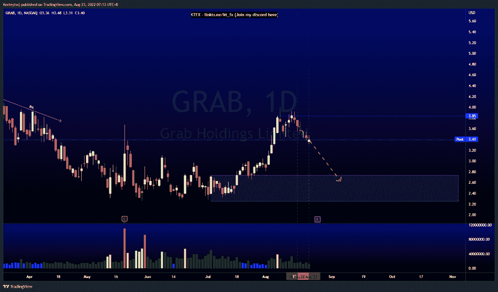
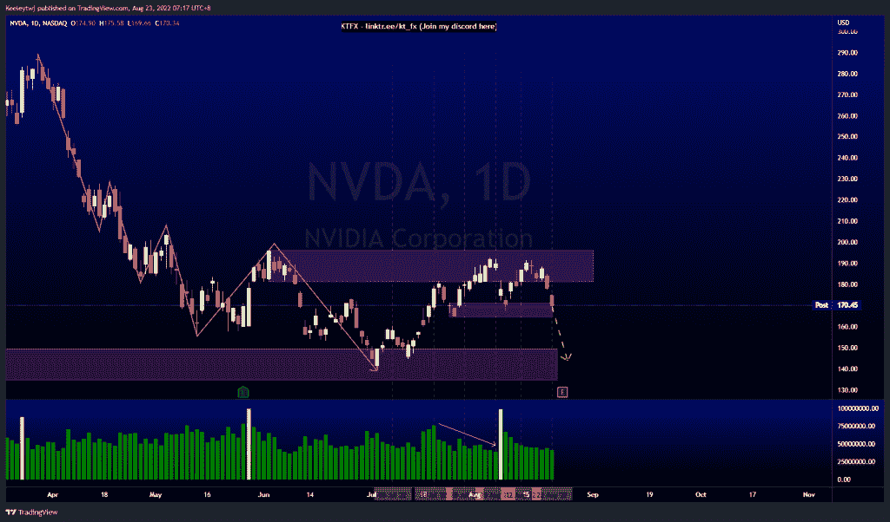
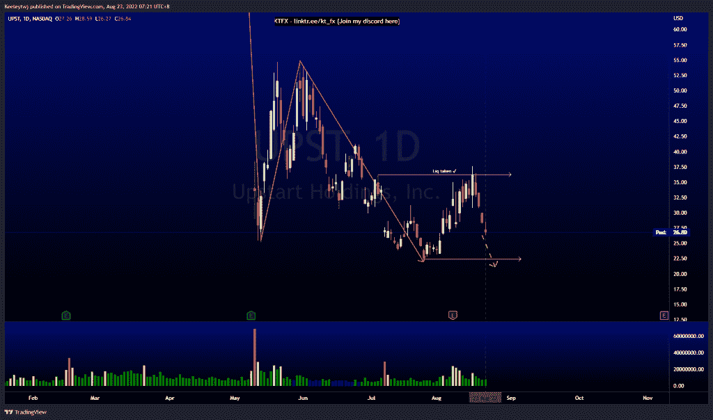

# 每周技术分析# UPST # NVDA #抓斗

> 原文：<https://medium.com/coinmonks/weekly-technical-analysis-upst-nvda-grab-e20ce45e5f94?source=collection_archive---------38----------------------->

在这里找到更多关于我的信息(YouTube/Discord/Telegram):[https://www.linktr.ee/keeleytan](https://www.linktr.ee/keeleytan)

如果你觉得我的帖子有帮助，如果你能在这个帖子上给我一个赞，并关注我以后的类似帖子，我将不胜感激。

#抓取

根据上周的分析，价格上涨了。我的分析没有变化。价格在 3.85 以上获得流动性，无法以强劲的价格收盘。我预计价格将回撤至 2.74 的看涨点。

#NVDA

价格正如预期的那样上涨。价格漂亮地从看涨的 POI 反弹到 171.24。然而，价格在缓解看涨 POI 后无法再创新高，表明流动性不足。从这里开始，我预计价格会走低，可能会在 2022 年 8 月 24 日盈利前再次缓解 149.71 的看涨 POI。

#UPST

价格呈下降趋势。价格在 36.25 获得流动性，无法收于 36.25 以上。价格正在向下突破市场结构。这一下跌趋势的目标可能是 22.42 的低点。我期待这些低点被拿掉。

让我知道你是否同意和你的想法。

如果你持有这些公司中的任何一家，就可以点赞、分享和评论！

让我知道，如果你有任何你想让我分析的行情。

一定要在其他社交平台上看看我，我在交易、分析和心理学上发布内容。看看我这里:【https://www.linktr.ee/keeleytan】T2

*原载于 2022 年 8 月 22 日 http://2minutesliteracy.wordpress.com***。**

> *加入 Coinmonks [电报频道](https://t.me/coincodecap)和 [Youtube 频道](https://www.youtube.com/c/coinmonks/videos)获取每日[加密新闻](http://coincodecap.com/)*

# *另外，阅读*

*   *[如何购买 Monero](https://coincodecap.com/buy-monero) | [IDEX 评论](https://coincodecap.com/idex-review) | [BitKan 交易机器人](https://coincodecap.com/bitkan-trading-bot)*
*   *[CoinDCX 评论](/coinmonks/coindcx-review-8444db3621a2) | [加密保证金交易交易所](https://coincodecap.com/crypto-margin-trading-exchanges)*
*   *[红狗赌场评论](https://coincodecap.com/red-dog-casino-review) | [Swyftx 评论](https://coincodecap.com/swyftx-review) | [造币厂评论](https://coincodecap.com/coingate-review)*
*   *[Bookmap 评论](https://coincodecap.com/bookmap-review-2021-best-trading-software) | [美国 5 大最佳加密交易所](https://coincodecap.com/crypto-exchange-usa)*
*   *[如何在 FTX 交易所交易期货](https://coincodecap.com/ftx-futures-trading) | [OKEx vs 币安](https://coincodecap.com/okex-vs-binance)*