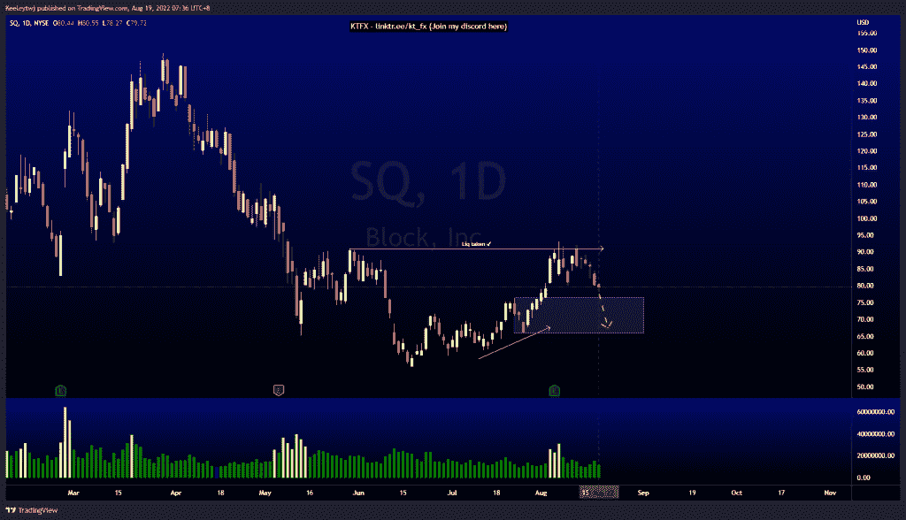
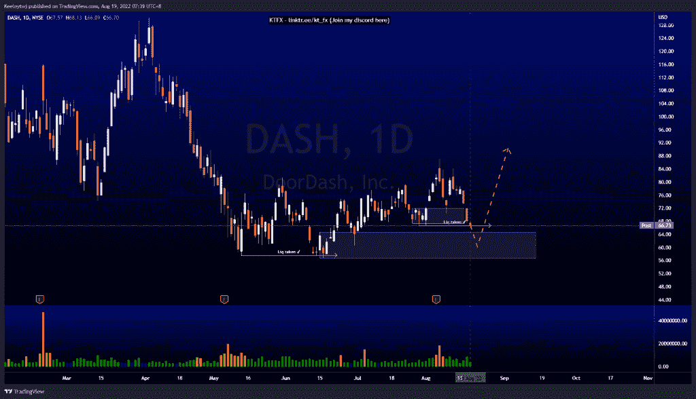
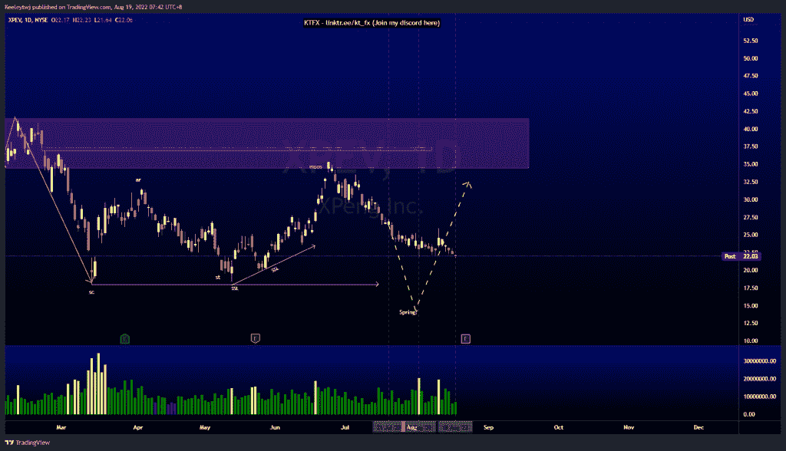

# 每周技术分析#XPEV #DASH #SQ

> 原文：<https://medium.com/coinmonks/weekly-technical-analysis-xpev-dash-sq-d892f3edab4e?source=collection_archive---------41----------------------->

在这里找到更多关于我的信息(YouTube/Discord/Telegram):[https://www.linktr.ee/keeleytan](https://www.linktr.ee/keeleytan)如果你觉得我的帖子有帮助，如果你能在这个帖子上给我一个赞，并关注我以后的类似帖子，我将不胜感激。

#SQ

价格最近在 90.99 获得流动性，无法收高。价格呈上升趋势，并打破了昨天的市场结构下行。我们在下方建立了卖方流动性，我预计价格至少会从这里回撤至看涨点 76.44。

破折号

价格最近使 71.99 的看涨 POI 失效。现在我们在 66.63 有一个流动性抓取。从这里开始，我预计价格将继续下跌一点，以缓解 64.71 的看涨情绪，并从那里开始上涨。

#XPEV

与前几周相比没有变化。价格目前正在积累威科夫示意图。价格在 34.46 缓解了看跌点，并呈下降趋势。我预计价格会走低，在 18.01 形成一个春天。

让我知道你是否同意和你的想法。如果你持有这些公司中的任何一家，就可以点赞、分享和评论！让我知道，如果你有任何你想让我分析的行情。一定要在其他社交平台上看看我！

种类

贴在[技术分析](https://2minutesliteracy.wordpress.com/category/technical-analysis/)

*原载于 2022 年 8 月 18 日 http://2minutesliteracy.wordpress.com***。**

> *交易新手？尝试[加密交易机器人](/coinmonks/crypto-trading-bot-c2ffce8acb2a)或[复制交易](/coinmonks/top-10-crypto-copy-trading-platforms-for-beginners-d0c37c7d698c)*