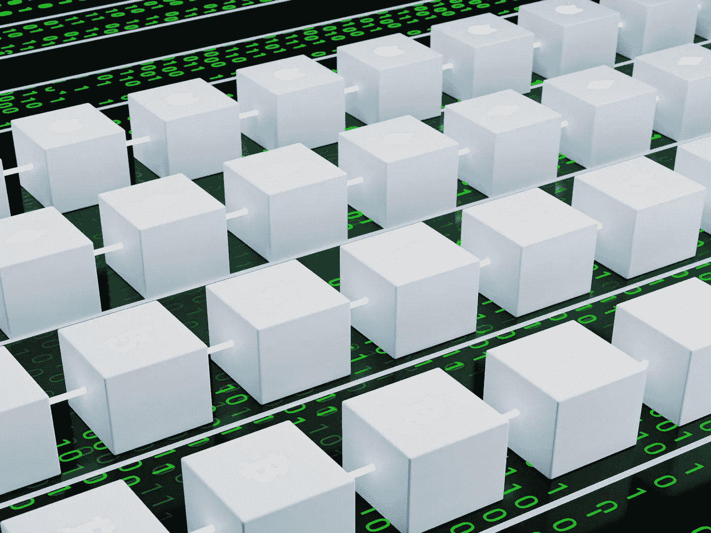

# 欢迎来到区块链

> 原文：<https://medium.com/coinmonks/welcome-to-blockchain-b6dba21d588c?source=collection_archive---------48----------------------->

区块链的安全架构不受防火墙或防病毒软件的支持，**区块链**是指包含三种类型数据的区块链，第一种是与交易相关的信息，第二种是将区块标识为唯一且不可重复的**哈希**，第三种是存储前一个区块的**哈希**的区块链，因此每个区块都与其前任和继任者有联系，实际上这些区块正在创建一个链！

photo de [GuerrillaBuzz Crypto PR](https://unsplash.com/@theshubhamdhage?utm_source=unsplash&utm_medium=referral&utm_content=creditCopyText) en [Unsplash](https://unsplash.com/es/s/fotos/mineria-de-datos?utm_source=unsplash&utm_medium=referral&utm_content=creditCopyText)

**为什么使用区块链？**

这个世界目前需要生产、管理和存储大量的信息，这是目前由人类执行的工作，区块链的想法是每天高效、廉洁、安全和更快地承担这项任务。

**为什么说区块链是鲁棒安全？**

photo by [John Salvino](https://unsplash.com/@jsalvino?utm_source=unsplash&utm_medium=referral&utm_content=creditCopyText) on [Unsplash](https://unsplash.com/es/s/fotos/seguridad-hash?utm_source=unsplash&utm_medium=referral&utm_content=creditCopyText)

仅仅是因为两件事，哈希和一直在观看的用户数量。
如上所述，**散列**是唯一的，但具有提供和保证安全性的特殊性，该数字由块的内容生成，这意味着如果您改变块的信息，则自动改变**散列**，使区块链无效，实际上没有单个数据库，因为每个**区块链**用户都有一个副本，块的安全性和认证由用户授予，而不是由控制实体或任何权力机构授予。然而，我们不是在谈论几个用户，我们指的是有很多用户，而且还在继续增长的事实。

**谁使用这项技术？**

这些用户进入网络有两个原因，在交易中使用网络的服务或在网络中创建新的块，后者是挖掘者，因为在网络中签订了进行转移和不同交易的合同，有必要在新的块中存储信息并使之成为可能，有必要解决需要计算潜力的复杂数学问题，因此挖掘者最大限度地使用他们的处理器来尝试解决它，一旦解决了，网络的其余用户验证该解决方案是正确的；新的区块以整合的形式进入供应链，协议得到执行，这反过来为参与的矿工带来回报。

该系统的应用非常广泛，并且正在不断增长。**区块链**不仅仅是一个数据库，它是一个超越传统的系统，可以验证和管理人类发展的大量重要信息。

区块链是创造一个更加公平、透明和真实的社会的工具。

> 交易新手？试试[密码交易机器人](/coinmonks/crypto-trading-bot-c2ffce8acb2a)或者[复制交易](/coinmonks/top-10-crypto-copy-trading-platforms-for-beginners-d0c37c7d698c)