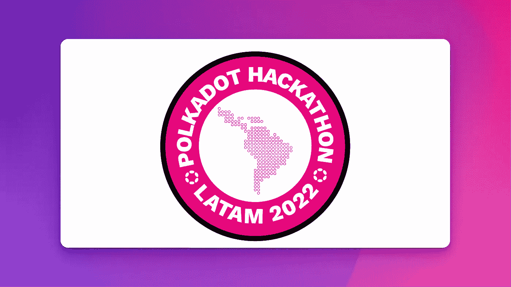

# 欢迎来到第一届拉丁美洲波尔卡多特黑客马拉松

> 原文：<https://medium.com/coinmonks/welcome-to-the-first-latin-american-polkadot-hackathon-ever-879c41b4cd6b?source=collection_archive---------8----------------------->

## 波尔卡多黑客马拉松

## 你需要知道的一切，就在这里。



Screenshot courtesy of the author in collaboration with Polkadot Hackathon Latam.

如你所知，波尔卡多特联合并保护了一个不断增长的叫做副链的特殊区块链生态系统。它们可以安全地跨链通信，形成了真正可互操作的分散式网络的基础。

Polkadot Hackathons 的目标是将世界各地最优秀的开发人员联系起来，为这个美丽的区块链做出贡献并继续工作。

今年已经在世界各地举办了两次波尔卡多特黑客马拉松。第一次是在亚太的[黑客马拉松，第二次是在北美](/polkadot-network/polkadot-hackathons-go-global-starting-in-apac-oct-22-cde53ad9113b)[的](/@angelhack/the-polkadot-hackathon-global-series-comes-to-north-america-b17ba57fb620)。两部都很受欢迎。

现在轮到拉丁美洲了，**这是你的机会**成为世界上最大的区块链项目之一的一部分。

```
*You can read the original article on the* [*Polkadot Hackathon Latam*](https://polkadothackathonlatam.com/) *website.*
```

## 欢迎来到拉丁美洲的第一届波尔卡多特黑客马拉松

拉丁美洲的黑客马拉松**将 100%在线，持续约两个月【6 周】。你可以单独参与，也可以组建多达 5 人的团队。这种黑客马拉松模式已经在北美使用，并取得了难以置信的成功。**

您将能够接触、咨询和参与由最好的 Polkadot 开发人员开展的研讨会。

[**现在就加入！**](https://polkadothackathonlatam.com/registro/)

## 如何参与

这个黑客马拉松将在拉丁美洲举行，但任何人都可以参加，因为这是一个 100%的在线活动，毕竟，Polkadot 的目标是团结社区。

顺便说一句，如果你认为自己是一个有创造力的，原创的人，你有很棒的创新想法，你想成为这个活动的一部分但你不知道如何编码，不要担心，你仍然可以参与！

> 下周一开始。快一点！(+140.000 美元奖金)。

**要求**

*   超过 18 岁
*   笔记本电脑
*   创造力和独创性
*   互联网连接
*   至少有一个团队成员必须知道如何用 Rust、Ink 或 Solidity 进行编码(不一定是你)。

Source: YouTube

## 类别和价格

**第一类:web 3/区块链工具。**第一类致力于构建各种工具、公共基础设施、UI/UX、接口和应用程序，以扩展 Web3.0

*   一等奖:17000 美元
*   二等奖:1 万美元
*   三等奖:3000 美元

第二类:智能合约。该类别致力于开发智能合同链。例如，用于智能合约的 Transpiler 提供了与 Wasm 的互操作性，用 EVM[以太坊虚拟机]编写的应用程序运行在底层链上，用 Wasm 编写的应用程序运行在底层链上。

*   一等奖:17000 美元
*   二等奖:1 万美元
*   三等奖:3000 美元

**第三类:DeFi。**该类别致力于 dex 和 Stablecoins 的构建和开发。基于智能合约或运行在基板上的 DeFi 应用。

*   一等奖:17000 美元
*   二等奖:1 万美元
*   三等奖:3000 美元

**第四类:NFT。**这个类别是最有趣的类别之一，因为它致力于构建游戏、艺术、收藏品和其他 NFT 用例。基于智能合约或在底层运行的 NFT 应用程序。

*   一等奖:17000 美元
*   二等奖:1 万美元
*   三等奖:3000 美元

## 但这还不是全部…还会有更多的奖品。

除了黑客马拉松的四个主要类别的奖品，还将有更多由一些波尔卡多特 Parachains 赞助的奖励，具体来说，两个月光奖金，三个时代精神挑战和一个 NFT 挑战。

**这些是副链和奖品:**

**月光赏金 1**

*   一等奖:3500 美元 USDC
*   二等奖:1000 美元 USDC

**月光赏金 2**

*   一等奖:1000 美元 USDC
*   二等奖:500 美元 USDC

**时代精神挑战 1**

*   奖金:5000 美元

**时代精神挑战 2**

*   奖金:5000 美元

**时代精神挑战 3**

*   奖金:5000 美元

**独特的 NFT 挑战赛**

*   奖品:20000 UNQ 代币[价值 5000 美元]

更多关于类别、奖励、挑战、日程、评委、导师等的信息，请访问官方 [Polkadot Hackathon Latam 网站](https://polkadothackathonlatam.com/)。

## [加入 1K+其他企业家的行列，在您的电子邮件中获取每周独家内容](https://www.getrevue.co/profile/JuanSC)📨☕喜欢在媒体上阅读？[购买会员资格](https://juanscienfuegos.medium.com/membership)获得全部权限。

> 交易新手？尝试[加密交易机器人](/coinmonks/crypto-trading-bot-c2ffce8acb2a)或[复制交易](/coinmonks/top-10-crypto-copy-trading-platforms-for-beginners-d0c37c7d698c)