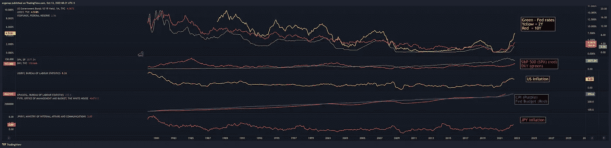
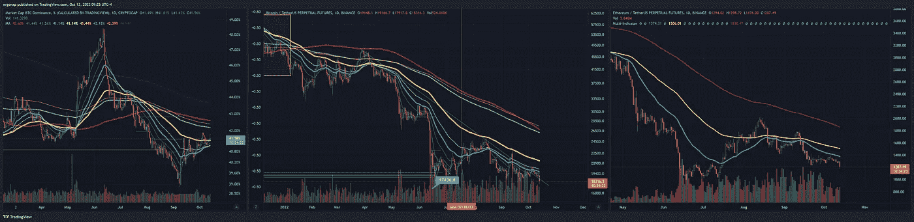
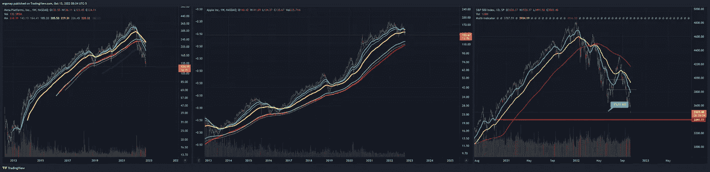
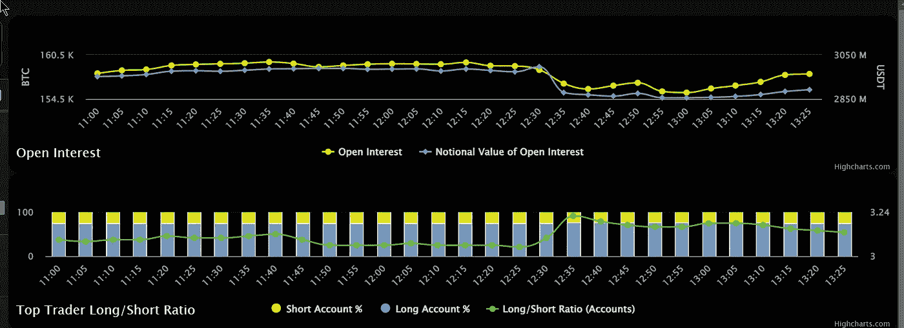
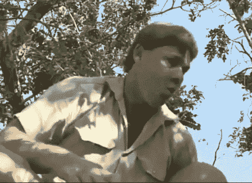

# 好了，再见，谢谢你的鱼。

> 原文：<https://medium.com/coinmonks/well-so-long-and-thanks-for-all-the-fish-80639937095f?source=collection_archive---------35----------------------->

2013 年 10 月市场分析

是真正的市场下跌发生的时候了。可笑的是，这是基于一个轻微的通货膨胀变化。CPI 继续上涨，然而…

 [## 最新数据:美国劳工统计局

### 的。gov 的意思是官方的。联邦政府网站经常以。在分享敏感信息之前…

www.bls.gov](https://www.bls.gov/cpi/latest-numbers.htm) 

通货膨胀下降了。为什么？如果不弄乱数字，这有什么意义呢？我的意思是……消费者的成本上升了，但是通货膨胀下降了？听起来#QT 很管用。

[https://www.tradingview.com/x/QRDOJh1w/](https://www.tradingview.com/x/QRDOJh1w/)

与此同时，BTC 统治了 BTC。随着奥特曼死亡和 BTC 掉落，d 爆炸了。

修卡。BTC 说底部见，笨蛋们。底部=轻松低于 12k 美元。我怀疑他们是在追求低于 4k 美元的 [@saylor](http://twitter.com/saylor) ，所以这一点要记住。

[https://www.tradingview.com/x/vWrOMln3/](https://www.tradingview.com/x/vWrOMln3/)

有趣的是，他现在可以走开了，因为他不是首席执行官。如此反复，眼睛上的暴动和马拉同时死去。与此同时，随着 META 朝着 20 美元左右的最终目标前进，扎克得到了他应得的。我不会等着打它，即使 70 美元足够了。我预计短期内 SPX 在$AAPL 低于 50 美元，在 SPX 低于 3300 美元。

[https://www.tradingview.com/x/vWrOMln3/](https://www.tradingview.com/x/vWrOMln3/)

准备好，伙计们，真正的东西来了。对于任何穿短裤的人来说，现在是睡个好觉的时候了，BTC R & R 绝对是要爆发了，而对于市场来说，它甚至还没有开始。提醒:美国还没有真正陷入崩溃，甚至还没有接近崩溃。

this is danger town. Major, major dangertown.

don’t get steve irwin’d by a btc stingray

> 交易新手？试试[密码交易机器人](/coinmonks/crypto-trading-bot-c2ffce8acb2a)或者[复制交易](/coinmonks/top-10-crypto-copy-trading-platforms-for-beginners-d0c37c7d698c)