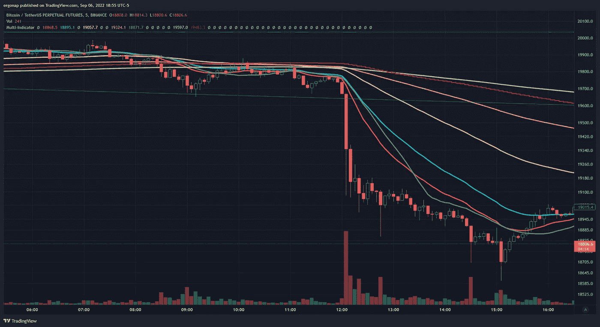
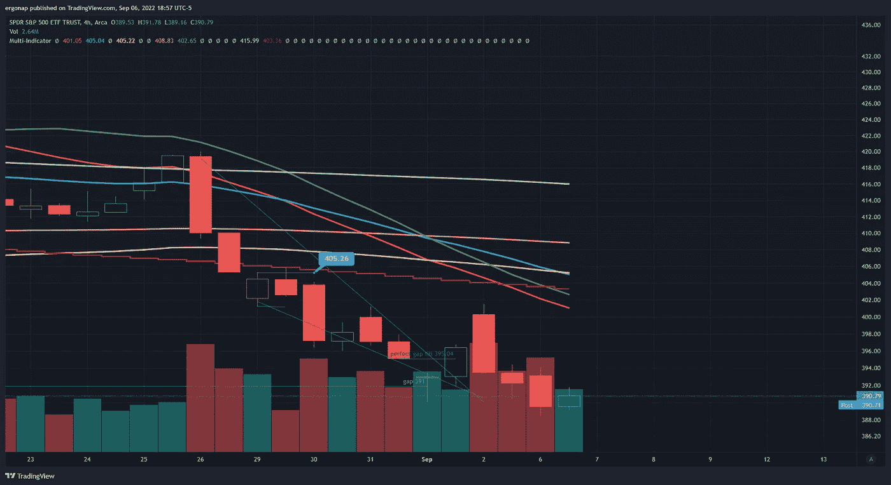

# 我们在流血，但不是街上的血。

> 原文：<https://medium.com/coinmonks/were-bleeding-but-not-blood-on-the-streets-12ecfe7e75f4?source=collection_archive---------32----------------------->

## 加密货币市场/比特币市场分析 9/6。

今天，是井，**看跌**。我认为有些人确实注意到了比特币在 10 分钟内跌了 1000 美元。

当然，这些确实会让人们震惊，因为他们并不乐观。与此同时，一些呼吁团体正兴高采烈地降低目标。“要停在 19k，不要 18.8k，不要 18.6k！”这个词叫做 rekt。

我想这更像是——15 分钟内跌了 800 美元，或者 30 分钟内跌了 1000 多美元——但仍然没有太大的惊喜。很大一部分是因为它的体积很大。

[https://www.tradingview.com/x/ZC5BxVHF/](https://www.tradingview.com/x/ZC5BxVHF/)

我必须将蜡烛线上移，以便在更大的时间范围内显示体积蜡烛线，它就那么大。

[https://www.tradingview.com/x/sIdBq4RW/](https://www.tradingview.com/x/sIdBq4RW/)

间谍没有像 BTC 那样移动，这一点意义重大。这是 BTC 的走势比股票更悲观。不是力量的象征。这当然是间谍向下移动和宏观看跌，但仍然。

[https://www.tradingview.com/x/09NeVNfB/](https://www.tradingview.com/x/09NeVNfB/)

就链而言，我们还没有看到新手比特币持有者的投降，这增加了我们预期的失败。感谢 [@whalemap](http://twitter.com/whalemap) ，这张图片显示我们还没有触及真正定义市场底部的点。

this would be pretty close to a bottom except for how long the bear is likely to be.

它表明，随着每一波的到来，玩家的数量都在减少，而最大的玩家(令人震惊)却在不断变大。只是用了不同的钱包。去中心化…等等…不。所以需求很少甚至没有。

我不知道任何人会怎么想，但上升似乎不是这条路。

> 交易新手？试试[密码交易机器人](/coinmonks/crypto-trading-bot-c2ffce8acb2a)或[复制交易](/coinmonks/top-10-crypto-copy-trading-platforms-for-beginners-d0c37c7d698c)