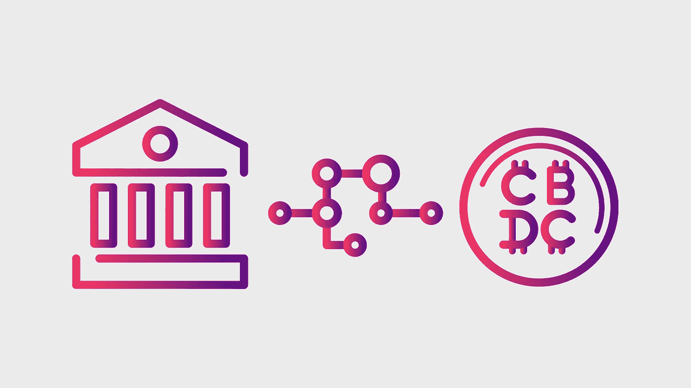

# 我们离大规模采用 CBDCs 只有几年了

> 原文：<https://medium.com/coinmonks/were-only-a-few-years-away-from-mass-adoption-of-cbdcs-38b5a0687454?source=collection_archive---------13----------------------->

“中央银行数字货币”这几个字在加密界激起了很多争议。一些人完全支持更加数字化和安全的金融体系，另一些人则认为，中央银行只是当前金融精英保持权力的另一种方式。无论你是支持还是反对他们，CBDCs 正在快速到来！

# 哪些国家目前正在使用 CBDCs？

截至 2022 年第一季度，至少有 87 个国家正在探索 CBDC 项目。进展从研究和试验到全面实施。目前有 9 个国家——巴哈马、尼日利亚和东加勒比联盟的 7 个国家——推出了中央管理的数字货币。这比两年前疫情的高峰期有了很大的增长，当时只有 35 个国家在探索某种形式的 CBDC，没有一个国家实施。

第一个到达终点的是巴哈马，他们推出了沙币。这是第一个覆盖整个国家的 CBDC。第一个推出 CBDC 的非洲国家是尼日利亚，他们推出了 eNaira 和附带的数字钱包，可用于非接触式支付和数字转账。鉴于主要经济体的金融系统更加复杂，它们采用数字货币的速度略慢。中国是领先 CBDC 研究的国家之一，早在 2020 年 4 月就开始了数字元(电子 CNY)的试验。该计划是在今年的某个时候在全中国推出这种数字货币。对于像美国和英国这样的西方国家，CBDCs 仍在研究中，还没有达到推出日期。

> 交易新手？试试[加密交易机器人](/coinmonks/crypto-trading-bot-c2ffce8acb2a)或者[复制交易](/coinmonks/top-10-crypto-copy-trading-platforms-for-beginners-d0c37c7d698c)

# 加密货币、stablecoins 和 CBDCs 有什么区别？

每当 CBDC 的话题出现时，问题总是“这不就是政府的一个秘密吗？”加密货币与 CBDCs 之间存在一些关键差异。加密货币是一种加密的数字货币，可以在没有中介验证交易的情况下转移。比特币是最著名的加密货币，并推出了其他几项区块链创新，如以太坊，这是一种使用自己的加密货币以太的智能合约去中心化软件。稳定币也是一种加密货币，然而，与比特币等加密货币的价格波动不同，稳定币的价格与美元、欧元或日元等法定货币挂钩。

那么稳定货币和数字货币的区别是什么呢？这取决于如何管理和控制它们。稳定硬币由储备资产支持，当用户使用菲亚特购买稳定硬币时，他们会被分配到数字硬币，以便在加密经济中使用。CBDCs 的独特之处在于它们由中央银行发行，是国家货币的数字版本。中央银行跟单信用证可以用来购买任何正常法定货币可以买到的东西。这种创新仅仅是将现有的流程数字化，以获得更大的稳定性和关于一个国家经济运行情况的数据。CBD 由金融精英集中和控制，而加密货币的核心原则之一是它们是分散的。密码受其运行的网络而非单一实体的监管。只有在网络的大多数成员同意的情况下，规则才会更新。

# 中央商务区在世界的什么地方？

我们离拥有一个成熟的 CBDC 还有多远？取决于你在世界的哪个地方。自 2014 年以来，中国一直处于领先地位，然而，鉴于其庞大的经济规模，研究和规划一直是首要重点。中国数字元的目标是让人民币成为国际货币。这将是对 1944 年布雷顿森林会议后确立的美元全球霸主地位的巨大破坏。通过让中国的货币数字化，跨境发送和接收货币的能力将比传统的转账更简单、更便宜。这促使其他国家利用中央银行来保护本国货币的主权。中国目前正在扩大电子 CNY 的试验范围，覆盖近 500 万商家。

另一个主要经济体印度也紧随其后。印度政府宣布，他们的“数字卢比”将于 2022-23 年左右推出。印度采取了与中国类似的方式，打击加密货币交易，为 CBDC 霸权铺平道路。然而，该禁令在 2020 年 3 月被印度最高法院撤销。继试行数字卢布之后，俄罗斯即将完成并推出其 CBDC。引入数字货币后，俄罗斯如何应对制裁和新的加密禁令，这将是一件有趣的事情。

目前遭受高通胀的发达国家也在加快实施 CBDCs，美国和英国继续进行研究。美国一直在围绕数字资产和加密货币的使用制定法规，同时也在设计一个 CBDC，以便在生态系统中开辟出一席之地。鉴于目前困扰政府的政治混乱，英国在促进加密和实施 CBDC 项目方面的努力存在一些困惑和不确定性，因此英国稍微落后一些。依赖商品的发展中国家有潜力为管理通货膨胀和货币政策提供更好的控制机制。有了更多的数据，当局就能更好地了解经济的表现以及需要进行哪些调整。然而，这有侵犯公民隐私的风险，因为 CBDCs 可用于监控支出和购买的产品。鉴于央行可以有效控制个人的买卖能力，这引发了对操纵和审查的担忧。

总的来说，CBD 已经存在，而且很快就会成为主流。重要的是要关注政府和当局如何使用这些强大的数字货币，以及它们是否符合我们稳定经济体系的最佳利益，或者它们是否被用于服务于特定的议程。