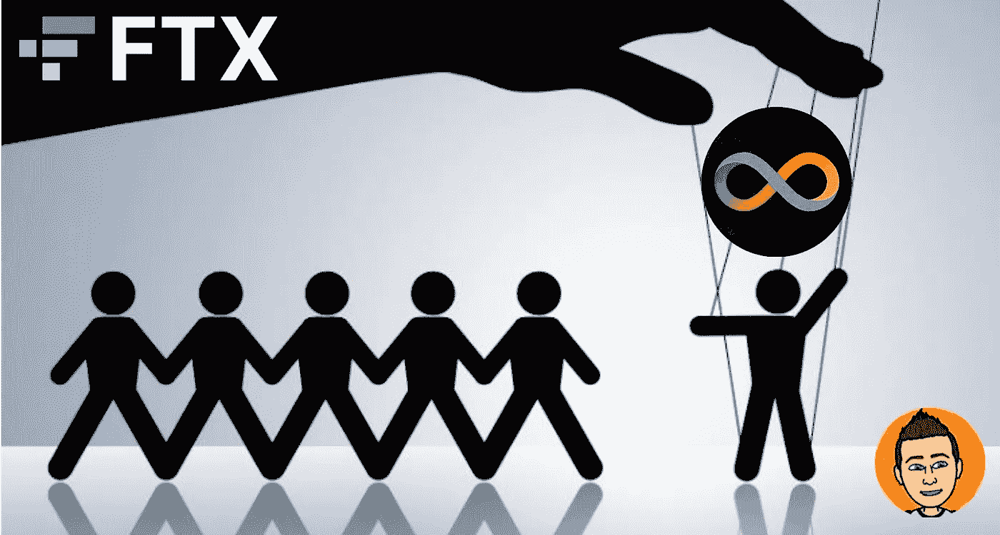

# 我们被愚弄了——FTX 是如何试图摧毁互联网计算机(ICP)的

> 原文：<https://medium.com/coinmonks/weve-been-fooled-how-ftx-tried-to-destroy-internet-computer-icp-886c8fe22737?source=collection_archive---------2----------------------->

我们被骗了，大多数人都上当了。如果你需要知道加密货币市场中的一件事，那就是并非一切都是表面上的样子。有些游戏我们大多数人都不知道，不了解，也不知道发生了什么。数十亿美元的赌注，没有任何规则的游戏。的…