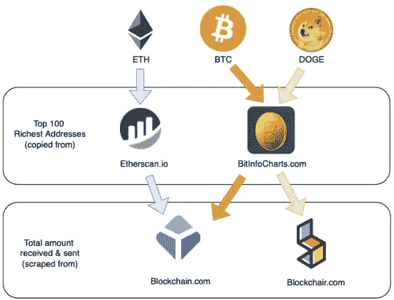
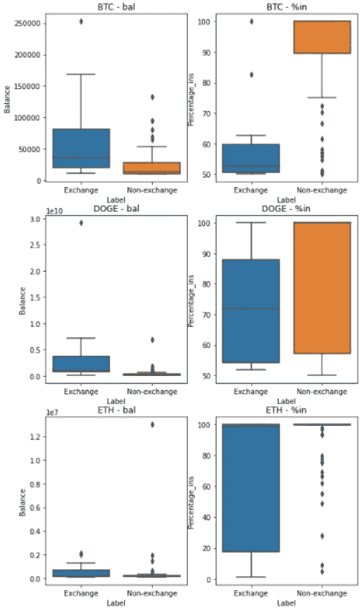
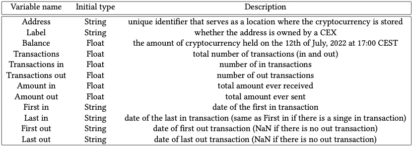

# 比特币、Dogecoin 和以太坊的鲸力分析(第二部分)

> 原文：<https://medium.com/coinmonks/whale-analysis-of-bitcoin-dogecoin-and-ethereum-part-2-b462a039f716?source=collection_archive---------18----------------------->

## 交易行为

> 这篇文章介绍了最富有的比特币、Dogecoin 和以太坊持有者的交易行为，之前的[帖子](/coinmonks/whale-analysis-of-bitcoin-dogecoin-and-ethereum-part-1-cdc1af1546ae)在代币经济学层面探索了三种加密货币的分散化。

# 1.介绍

大多数加密货币的最大持有者是允许其交易的中央交易所(cex)。由于它们是由一家容易受到政府监管的公司运营的，人们可以感觉到一个额外的分权层。出于这个原因，我们发现系统地探索这些地址以了解更多关于它们对加密货币的潜在影响是有益的。具体来说，我们计划剖析多种加密货币的[鲸](https://www.investopedia.com/terms/b/bitcoin-whale.asp)交易行为，并寻找共性和差异。

据此，本研究试图以双重方式分析比特币、Dogecoin 和以太坊三种加密货币的顶级所有者及其交易行为。首先，对于每种加密货币，有一种区块链内部的方法，考虑到 CEX 拥有的地址与其他地方的地址之间的差异。随后是第二个分析程序，即区块链国家间分析程序，其目标是评估三个区块链之间的相互关系。

因此，本帖的研究问题是:

> 就这三种加密货币而言，无论是单独交易还是集体交易，CEXs 的交易模式与非交易所所有账户的交易模式有何不同？

在下一节中，方法和实验设置部分将显示收集、处理和分析数据的程序。之后，对研究结果进行总结，并对研究问题及其局限性进行讨论。最后，本文给出了结论和对未来工作的两点设想。

在继续下一节之前，我们先建立本文其余部分使用的特定术语:

*   积累——获取加密货币的过程
*   卸载—发送加密货币的过程
*   BTC——比特币区块链上用于代表加密金额的股票代码
*   DOGE——股票代号，用于表示区块链 DOGE 上的加密金额
*   ETH——股票代码，用于代表以太坊区块链的加密金额
*   CEX —由一家公司运营和控制的集中式交易所，允许加密交易

# 2.方法和实验装置

这篇文章的这一部分报告了用于解决研究问题的方法和实验装置。第一步包括获取适当的数据。随后，通过将可用变量转换为适当的类型、提取附加特征并移除呈现错误信息的实例，对数据进行处理以进行分析。最后，描述了数据分析过程。

## 2.1 数据收集

为了尝试研究这个问题，需要包含比特币、Dogecoin 和以太币最富有持有者信息的数据。因为这项研究的范围很小，并且没有找到类似的研究项目，所以没有单一的来源可以提供所有需要的特性。因此，必须从多个地方收集数据，如图 1 所示。

Fig. 1 — Data Collection

因此，我们区分数据收集过程的两个部分。首先，提取最富有的地址，包括它们的当前余额、它们是否是集中交易所拥有的地址、它们的交易次数以及它们执行第一次和最后一次交易的日期。收集的第二部分指的是每个地址发送的总量和接收的总量的网络搜集。这是使用 Python 模块[请求](https://requests.readthedocs.io/en/latest/)和[美汤](https://beautiful-soup-4.readthedocs.io/en/latest/)完成的。此时做出的一个设计选择是，我们在请求之间引入了 5 秒的缓冲时间，以避免源网站停止抓取。

数据收集的另一个重要方面是，为了确保三种加密货币富豪榜之间的公平比较，数据快照必须尽可能在时间上接近。出于这个原因，所有快照都是在 2022 年 7 月 12 日 CEST 时间 17:00 拍摄的，以太坊数据收集一直持续到 CEST 时间 19:00，因为选择过程更加繁琐，这将在下面解释。

*比特币数据。*前 100 名最富有的比特币持有者是从[BitInfoCharts.com](https://bitinfocharts.com/top-100-richest-bitcoin-addresses.html)抄袭来的。除了地址、余额以及是否属于 CEX 之外，记录还包含有关进出事务的数量以及下列事务的日期的信息:先进、后进、先出和后出。然后，每个地址收发的总量在从[Blockchain.com](https://www.blockchain.com/explorer)后不久就被废弃了。

*Dogecoin 数据。*与比特币数据集的收集过程类似，我们选择了 Dogecoin 前几名持有人的信息，唯一的区别是使用了不同的网站来收集收到和发送的总金额，即 Blockchair.com 的。

*以太坊数据。*在以太坊的例子中，最富有的地址来自 [Etherscan.io](https://etherscan.io/accounts) 。然而，该来源不包括进出交易的数量和日期特征，这些必须从同一网站上每个地址的单独页面中手动选择。由于 Ehterscan API 不提供相应的功能，因此该操作无法自动化，我们不得不手动提取信息，这延长了数据收集的持续时间，如前所述。

*数据描述。因此，我们收集了 2022 年 7 月 12 日比特币、Dogecoin 和以太坊区块链前 100 个最富有的地址。对于每个地址，数据具有关于它们的余额、标签(即，它们是否属于 CEX)、进出交易的数量、发送的总金额、接收的总金额以及对应于先进先出、后进后出交易的日期的信息。为了简单明了，这些特性也显示在附录的表 A 中，紧挨着它们的初始类型和简短描述。除此之外，每种加密货币的流通供应量来自 [CoinMarketCap](https://coinmarketcap.com/) 和起源日期(即第一块在区块链上处理和验证的时间)来自[维基百科](https://en.wikipedia.org/wiki/Main_Page)。因此，人们可以在下表中看到各自的值。*

Table 1 — The circulating supply of the three cryptocurrencies at the time of the snapshot (12.7.2020 at 17:00 CEST) and their genesis date

## 2.2 数据处理

收集数据后，对变量进行检查，并将其转换为适合分析的类型。然后，它们被用来派生出能够解决研究问题的附加特征。最后，进行了一些检查，以评估数据质量并定位特征中的错误。

*特征类型。*表 A 显示了可用功能的初始类型。可以看出，事务数是 *Float* 而不是 *Int* 。因为这不影响后面执行的处理，所以不做调整。另一方面，日期变量(即*先入，后入，先出，后出*)是字符串格式。由于此类型不允许对 datetime 对象进行适当的操作，因此它们被转换为适当的格式。

*特色工程。*在本部分中，我们将描述使用初始变量集得出的特征。首先，我们为每条记录计算了输入和输出事务数量之间的差异、输入事务占总事务数量的百分比、天数累计间隔(即从第一个输入事务到最后一个输入事务)、天数卸载间隔(即从第一个输出事务到最后一个输出事务)以及两个间隔之间的差异。有了各自的时间间隔，我们就可以得出每天的平均累积和卸载量，将进出总量除以各自的时间间隔。之后，我们确定了创世纪区块链和每个实例的第一个事务之间的时间跨度。最后，我们提取另外两个时间间隔，即第一次入和第一次出事务之间的天数，表示地址自创建以来发送任何金额所用的天数，以及从最后一次事务到快照时刻所经过的天数(即 2022 年 7 月 12 日 17:00 CEST)。

*数据质量和清洗。*为了确保数据质量处于最高水平，进行了各种检查。首先，任何地址都需要发出至少与收到的总金额相同的金额，因为不可能花费不可用数量的加密货币，这被称为双重花费问题[2]。因此，我们对三个数据集进行了检查，发现三个以太坊地址不符合这一真理。这种情况的一个潜在原因可能是在收集步骤中疏忽的人为错误。然而，第二次验证确认错误仍然存在于 explorer 网站上。因此，鉴于实例的数量很少，我们决定将它们从研究的其余部分中移除。

第二次检查是基于这样一个事实，即第一笔交易的日期应该始终是第一笔内部交易的日期，原因如前一段所述，即地址首先需要收到才能消费。又一次，三个 ETH 持有者没有通过检查，表明数据中有错误。由于没有找到解释或更正，这三个地址被删除。

类似地，最后一个 out 日期必须晚于第一个 out 日期，对于剩余的 294 个地址总是如此。

之后，我们检查了数据来源的可靠性。此时，我们手动检查随机选择的几个地址的变量是否与其他块浏览器上的变量相匹配。这证明了用于收集的数据源是可靠的，因为多个探索者确认了相同的值。

最后，对于有超过 100 000 个入事务和 100 000 个出事务的三个以太坊地址，使用任何以太坊块浏览器都无法确定入和出事务的确切数量。因此，相应的地址也被丢弃。因此，在清理之后，分别有 100、100 和 91 个实例可用于 Bitcoin、Dogecoin 和 Ethereum rich lists，所有初始特性都在适当的类型中，并且新派生了变量。

*特征分布。*随着信息源的验证和数据的清理，我们绘制了几个连续特征，以观察它们的分布并注意异常值，例如负余额或交易数。幸运的是，没有发现这样的错误。谈到变量的分布，大多数都类似于指数分布。换句话说，这些图表明高频随着特征值的增加而急剧下降。在不符合这种模式的变量中，有一些是早先得到的区间，它们的分布是不规则的，不同于众所周知的分布。

## 2.3 数据分析

一旦数据经过处理并准备好进行分析，就会执行两种类型的检查来生成见解，即数字聚合和图形表示。在此之前，使用标签功能将三个数据集分为交易所和非交易所，以便进行二维比较，区块链内部(交易所与非交易所)以及更广泛的区块链内部(比特币与 Dogecoin 和以太坊)。

*数字聚合。*使用了四种不同的聚合函数(计数、求和、最大值和平均值)来汇总各列，并有可能带来洞察力。更准确地说，计算了仅用于累加(即零出事务)的地址数量。然后，我们合计了三种加密货币的地址持有的当前供应量的百分比，并按*标签*分组。接下来，计算每个加密货币的最大进出量，包括所有地址，然后分别计算交换和非交换地址。最后，使用平均值来总结几个变量，即交易总数、内部和外部结算的数量、它们的差异、内部交易占结算总数的百分比以及第 2.2 节中介绍的间隔。最后，用加密量表示的所有数量除以流通供应量，并以百分比表示，以便与其他区块链进行比较。

*图形表示。*关于视觉表示，我们生成了箱线图来探索交换和非交换的各种特征的局部性、范围和偏斜度。

# 3.结果

在这一部分，我们来看看富人的交易模式，看看他们与其他加密货币相比有何不同。此外，我们还区分了交换和非交换，以扩展比较的维度。

首先，图 2 显示了描述交换和非交换如何相互对应的六个箱线图。在左栏中，地址由*余额*进行比较，而在右栏中，地址由结算总数中的*交易百分比*表示。关于行，它们依次显示了比特币、Dogecoin 和以太币的信息。

Fig. 2 — Boxplots of balance (left) and percentage of in-transactions among the total number of settlements (right), for exchange and non-exchange addresses for each cryptocurrency

查看第一列中的箱线图，可以看到三个箱线图之间的相似性，它们都显示出总体上更高的平衡以及更宽的交换地址范围。然而，一个区别是，对于以太坊来说，最大的持有者是非交换钱包，而不是比特币和 Dogecoin 的 CEX。

在内部交易百分比的箱线图中，三种加密货币互不相同。对于比特币，非交换地址在交易中的比例明显更高，指出大多数仅用于积累。不出所料，交易所的这一比例较低，因为它们有动机向其交易客户发送 BTC。令人惊讶的是，Dogecoin 的方框范围有一定程度的重叠，表明交换并不频繁，而非交换并不倾向于仅积累。最后，在以太坊的情况下，大多数非交换地址仅用于累积 ETH 的储备，而 cex 变化很大，即使高度倾向于累积。从本质上讲，人们可以从这些箱线图中注意到，比特币和以太坊的非交换持有者更有可能积累，而 Dogecoin 地址则倾向于交易，包括进出交易。

接下来，生成的数字聚合为比较事务模式提供了有价值的信息。在图 3 中，可以看到一个包含所有计算值的表格。当涉及到以天数表示的数字时，这些数字被四舍五入，而对于加密的数字，这些数字被除以流通硬币的供应量后被转换成一个百分比，因此区块链之间的比较是可行的。

Fig. 3 — Trading Behavior Results

其中最重要的发现是从创世到第一笔交易的平均天数，这表明以太坊的最早采用者，其次是 Dogecoin 和比特币，以及与 ETH 相比，仅用于积累 BTC 和 DOGE 的非交易所的显著比例，而差异并不显著。然后，我们注意到 BTC 最富有的非外汇持有者的平均交易数量非常低，这说明这些账户主要用于积累而不是交易。然而，这并不适用于 Dogecoin，它的非交易所比交易所更活跃。

此外，正如预期的那样，我们观察到三种加密货币的非交换交易从先入先出的平均天数更高，以太坊的间隔最短。这可能是因为每秒处理的事务比其他两种处理器多，从而增加了功能[1]。我们还从图 3 的表格中看到，鉴于区块链的起源首先发生，比特币的最富有者最近更活跃，积累期更长。最后，表格的最后两行表明，对于比特币来说，交易所拥有的钱包比非交易所拥有的钱包每天的平均积累和卸载量更高，但以太坊的情况正好相反。

# 4.讨论

在这一部分中，我们首先讨论在研究背景下获得的结果。其次，我们反思了研究的局限性，主要是围绕所使用的数据。

## 4.1 反射

首先，第 3 节中检查的箱线图显示，CEX 拥有的地址在三种加密货币中的余额更高。图表还表明，大多数比特币和以太坊的非交换地址只倾向于累积，而 Dogecoin 持有者更有可能双向交易。

接下来，我们介绍了几个评估交易模式的指标。从这些结果中，我们发现富人的早期采用与加密货币的诞生日期而不是账户余额更相关，并且最富裕的 BTC 非交换持有者主要用于积累而不是交易。然后，我们看到 DOGE 非交易所比交易所更活跃，以太坊在第一次和最后一次交易之间的平均时间间隔最短，第二次交易是由以太坊区块链增加的功能和更快的交易速度推动的。最后，有人指出，平均而言，比特币持有者的积累时间更长，这是意料之中的，因为区块链也是三个国家中最老的。

## 4.2 限制

这一研究领域的大部分限制都围绕着可用的数据。虽然这篇特定的文章旨在建立在 Sai 等人(2021) [3]的工作基础上，但并非所有研究的加密货币都可以进行分析。其原因是缺少*标签*特征，即一个地址是否由集中交换所拥有。尽管已知有一个莱特币和三个比特币现金地址属于 CEXs，但这些加密货币被跳过，因为这个数字无法与研究的数字相比较，每个数字都有 15 个这样的地址。而对于 Dash、ZCash 和 Ethereum Classic，没有找到标签。

关于数据的另一个限制是解决*标签*变量的有效性。换句话说，不能保证被视为非交换的地址实际上不属于 CEX，因为目前没有一个经认可的来源提供此信息。同样，反之亦然。有些实例可能归 CEX 所有，但没有相应的标签。因此，研究的结果取决于这一特征是准确的这一假设。

最后，在大多数与加密相关的研究中，加密货币地址的伪匿名性质将研究限制在简单的统计分析上。

# 5.结论

这项研究开始于缺乏对最富有的密码持有者及其交易行为的广泛分析，以及缺乏对集中交易与其对手之间的差异的调查。因此，我们建议提取各种交易模式，考虑交易所和非交易所拥有的地址。因此，我们收集、准备和分析数据，探索建立假设的领域，而不是测试理论的有效性。

另一方面，关于研究的不足，我们认识到一些数据的局限性可能会影响研究的普遍性和有效性。然而，在编写本报告时，没有证据表明可以忽视数据的质量，并且采取了各种预防措施来确保用于分析的数据没有错误。

## 5.1 未来的工作

未来工作的一个潜在想法是收集相同数据集的多个快照，以记录指标随时间的演变。通过这种方式，可以获得关于整体趋势的新见解。

另一个建议是增加收集的实例数量。在这项研究中，我们将每个加密货币的地址数量限制在 100 个。然而，你可以在我们用来收集的网站上找到更多。然而，随着排名的上升，前 100 名最富有的持有人之外的已知交换地址的数量急剧减少。

**所有用来生成结果的代码和数据都可以在我的** [**GitHub**](https://github.com/dragos-pop/Crypto/tree/main/Whale-Analysis-BTC-DOGE-ETH_PART2) **上找到。**

# 参考

[1]安西卡·巴拉。2022.[交易速度高的顶级加密货币](https://www.blockchain-council.org/cryptocurrency/top-cryptocurrencies-with-their-high-transaction-speeds/)。【在线；于 2022 年 7 月 19 日获得]。

[2]杰克·弗兰肯菲尔德。2022.[重复消费定义](https://www.investopedia.com/terms/d/doublespending.asp)。【在线；访问日期:2022 年 7 月 19 日】。

[3] Ashish Rajendra Sai、Jim Buckley 和 Andrew Le Gear。2021.用加密货币描述财富不平等。区块链前沿(2021)，38。

# 附录

Table A — Data Features

感谢您的宝贵时间！

如果你喜欢读这篇文章，请给它一个掌声，并关注更多的密码相关的文章！

> 交易新手？尝试[加密交易机器人](/coinmonks/crypto-trading-bot-c2ffce8acb2a)或[复制交易](/coinmonks/top-10-crypto-copy-trading-platforms-for-beginners-d0c37c7d698c)