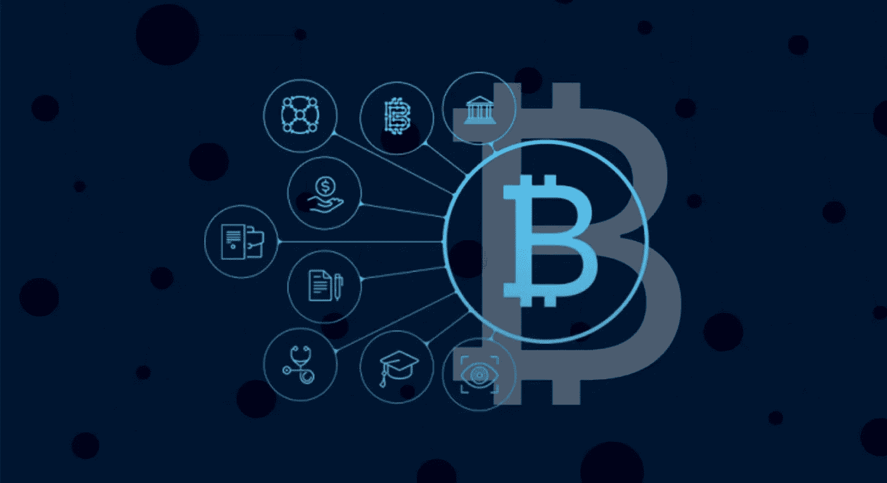

# 2022 年对区块链有什么意义，投资者应该对此着迷吗？

> 原文：<https://medium.com/coinmonks/what-2022-has-in-it-for-blockchain-and-should-investors-be-enthralled-dfd4e9da35e4?source=collection_archive---------27----------------------->

*The Future of Blockchain Technology in 2022!*

当中本聪分享比特币白皮书时，没有人想到到 2021 年，无纸化货币的概念会破土而出。

区块链技术引发了新一轮的创新和增长。完全的数据安全、去中心化和在线自由推动了这一概念。

我们看到 NFT 迈向新的里程碑，元宇宙和 Web3 吸引大公司，Defi 满足市场成熟度，顶级加密货币达到历史最高水平——这只是我们的看法，还是你也能看到未来？

所有这些飙升和到期都源于全球投资者令人难以置信的积极参与。所以，事不宜迟，让我们深入了解 2022 年对区块链有什么意义，投资者是否应该对此着迷。

# 顶级区块链趋势推动其进入系统

Crypto 看到了一些反弹，因为专家认为它在 2009 年的操作范围很小。然而，令他们惊讶的是，当专家们开始深入研究这个概念时，区块链具有极其令人生畏的潜力——这种前所未有的潜力可能会彻底改变我们今天生活和工作的整个生态系统！

今天，区块链在许多行业都取得了长足的进步。从工业金融、银行和教育到医疗保健和电子游戏，应有尽有！那么，我们还能看到什么？

让我们放下话题，深入了解 2022 年区块链的三大趋势:

# 不可替代代币的崛起

不可替代的代币，即 NFTs，无疑是 2021 年最重要的投资趋势——而且它们似乎不会放缓。让我们定义一下 NFTs 赋予外行人的力量，你告诉我们，你认为它会很快流行起来吗？

NFT 总是像魔杖一样工作，不会给你三个愿望，而是给你很多！它通过使用区块链技术将所有权授予资产持有人来确认用户对特定物理/虚拟事物的权利。因此，允许您使用代表真实世界项目的数字收藏品来分享独家真实世界资产。很有趣，不是吗？

虽然你不能像 crypto 一样交换 NFT，但它可能会见证多样化和扩展，因为它们可以是你能想到的任何东西！NFTs 在产品推广、观众参与和电子游戏中的使用正在激增。

# 区块链即服务的扩展

专家们已经假设区块链很可能会作为一种服务进行扩展——而且它已经开始了！到 2022 年第一季度，许多公司和平台开始提供 BaaS 服务。毫无疑问，它从“软件即服务”中汲取灵感(SaaS)；然而，它提供了额外的津贴，包括但不限于:

1.降低投资成本

2.增强的安全性和透明度标准

3.与 SaaS 相比，复杂性更低

4.无需对网络元素进行编码

5.确保权力完全下放

如今，包括亚马逊和 IBM 在内的顶级科技巨头使用 Corda、以太坊和 Hyperledger 提供 BaaS 服务。然而，区块链即服务的范围不仅仅是大规模的技术。很快，中小企业也将加入这场竞赛，将区块链带入主流业务，从而使其用例多样化。

# 区块链和绿色理念

当我们看到地球每天都在崩溃时，区块链技术是手头上支持绿色理念的唯一选择——不是因为任何人想要它，而是因为它必须如此。尽管埃隆·马斯克(Elon Musk)因为高能量释放和电力消耗而放弃了使用比特币购买特斯拉汽车，但它将重点转移到了减少碳足迹上。

Elon Musk 特别指出了采矿的负面影响，这使得专家们寻找确保节能采矿工具的方法。此外，碳抵消，从工作证明到利益证明的转变，以及更多支持区块链可持续发展的理念。

# 结论

尽管塞翁失马焉知非福，但我们今天生活的世界给我们带来了数量惊人的增长机会。2021 年，我们看到了 Web3、元宇宙、Stablecoins、NFTs 和加密货币的成功。在 2022 年初，我们看到这些趋势正在进入金融、医疗保健和更多的工业领域。

区块链支持所有这些新时代的概念，因此，让我们期待未来属于这些去中心化的资源——这是投资硬币开发、Defi 开发、Web3 开发、人工智能和更多新时代解决方案的最佳时机。繁荣您的业务标杆的未来和未来！

> 交易新手？试试[加密交易机器人](/coinmonks/crypto-trading-bot-c2ffce8acb2a)或者[复制交易](/coinmonks/top-10-crypto-copy-trading-platforms-for-beginners-d0c37c7d698c)