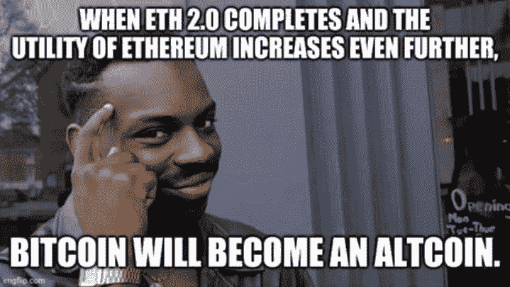

# 你们中 90%的人对以太坊合并还有什么误解

> 原文：<https://medium.com/coinmonks/what-90-of-you-still-misunderstand-about-the-ethereum-merge-ac75f6452718?source=collection_archive---------0----------------------->

提醒:*这不是另一篇典型的“合并你需要知道的错误观念”的文章。*

虽然具有历史意义的[**以太坊合并**](https://ethereum.org/en/upgrades/merge/)**即将到来，但我仍然看到很多关于“合并的误解”的**误解**在密码社区中流传。如果你不想成为那 90%的人，就和我在一起，因为我要一个一个地分解他们。**

****

**Note: The term “ETH2/ Ethereum 2.0” is no longer being used!**