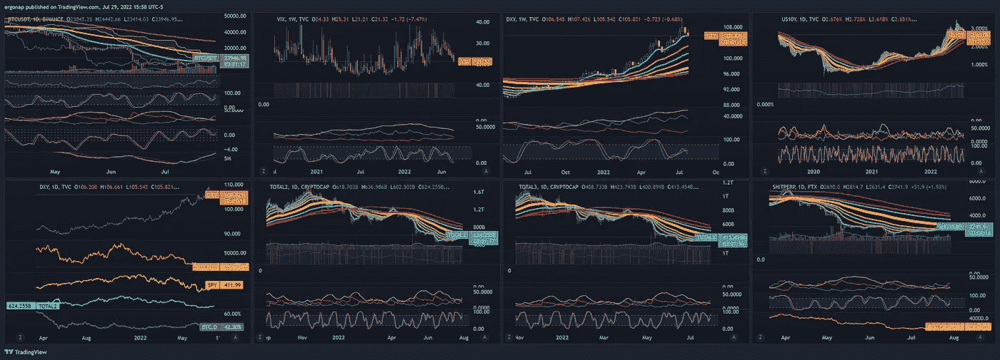
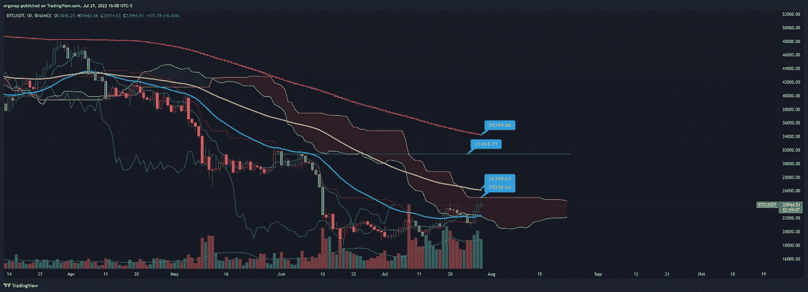
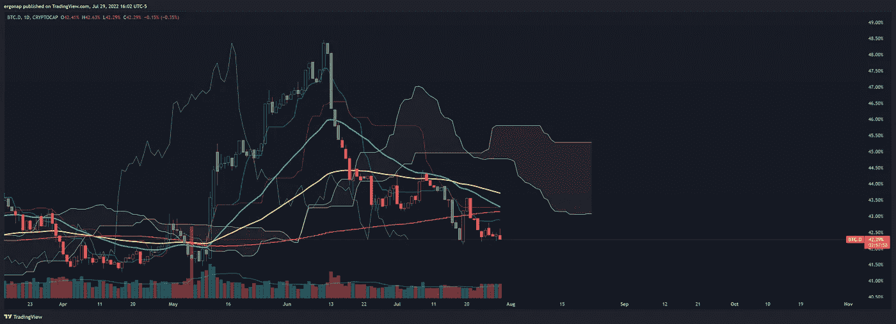
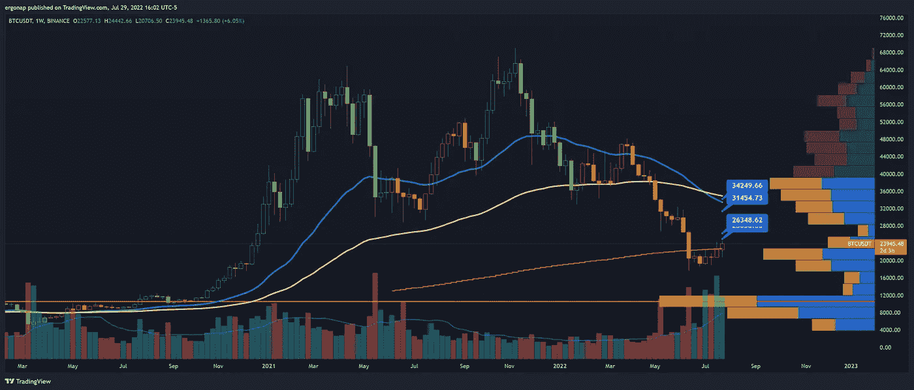

# 多么美好的周末啊

> 原文：<https://medium.com/coinmonks/what-a-weekend-ahead-15b54b554944?source=collection_archive---------39----------------------->

比特币/加密货币市场分析 7 月 29 日

于是，我们向上突围。我们将继续这样做。这里的风险是，由于两个间谍缺口，剩下的唯一需求基本上低于我们对股市的需求。在加密方面，有两个差距——问题是加密现在是否会让间谍领先一点，如果不是预期的话，这是完全可能的。与此同时，比特币的主导地位正在下降，10 年期债券实际上在下降(尽管加息)，波动率指数继续下降。因此低价竞标正在爆炸式增长。当 BTC。d 正在下降，突破 vs BTC/结合 USDT 总是最好的目标。我向一些人展示了 LTC 和 PYR 似乎肯定会有所作为。我们还有很长的路要走，但我们可能会在本周末创下一些新高。

My macro chart. [https://www.tradingview.com/x/syDswjIf/](https://www.tradingview.com/x/syDswjIf/) . We have a long way to go.

每日，比特币将在 E2E 突破标准市币。因此，我们可以一直涨到 34k，但在一定程度上仍然看跌，但总的来说，未来会有很大的波动。

I’m not an ichi expert, but it’s pretty easy to spot the cross and results here. [https://www.tradingview.com/x/4tzfEsH1/](https://www.tradingview.com/x/4tzfEsH1/)

BTC.D is kinda confirming the downtrend for now, and that’s a big deal

缩小到周线宏观，很明显，如果我们超过 28k，我们可能会攻击 30s 以上，因为在 27k 和 35k 之间有一个缺口。时间会证明一切，但迄今为止，成交量肯定支持这一走势。

Under $17k is downtrend/goblintown, but we’re kinda at the crossroads here. [https://www.tradingview.com/x/C95raaDf/](https://www.tradingview.com/x/C95raaDf/)

两天的看涨分析从来都不是坏事。前面的分析见下文。我认为短期内我们是相对安全的，但周一可能会有所不同。

 [## 我们中断了频道！📈🤔

### 加密货币/比特币市场分析 7/27

medium.com](/coinmonks/we-broke-up-the-channel-8c675b1235cd)  [## 危险迫在眉睫，但我们今天就出发。🤔⚠️

### 加密货币/比特币分析 7 月 28 日

medium.com](/coinmonks/danger-looms-but-up-we-go-for-today-️-8cfd243fd98d) 

> 交易新手？试试[加密交易机器人](/coinmonks/crypto-trading-bot-c2ffce8acb2a)或者[复制交易](/coinmonks/top-10-crypto-copy-trading-platforms-for-beginners-d0c37c7d698c)