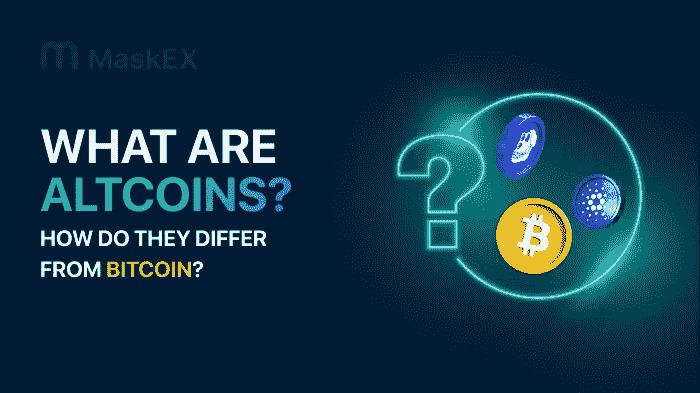

# 什么是 Altcoins，和比特币有什么区别？

> 原文：<https://medium.com/coinmonks/what-are-altcoins-and-how-do-they-differ-from-bitcoin-31bb789a8896?source=collection_archive---------18----------------------->

ALTCOINS

第一种存在的加密货币是比特币，于 2008 年首次亮相。它是由一个名叫“中本聪”的个人或团体创建的除了比特币，还有被称为替代币的加密货币。它们是什么，和比特币有什么区别？

# 什么是山寨币？

术语“替代币”(Altcoin)，是“替代币”的缩写，仅仅指比特币的替代品。它们是采用区块链技术的数字货币，能够实现安全的点对点交易。

除比特币之外的所有加密货币都被称为 altcoins。因为大部分加密货币都是从比特币或以太坊(ETH)中的一种分叉出来的，所以有人把 altcoins 定义为除了那两种以外的所有加密货币。Altcoins 通过适度修改规则来迎合不同用户，从而扩大了比特币的成功。

虽然使用了产生比特币的同样的去中心化思想，但替代币通过具有它们的特殊特征而走得更远。

例如，以太坊发明了“智能合同”的概念，这是一种利用区块链技术自动执行双方协议的计算机程序。因此，密码学的新应用和用例成为可能。

以下是替代硬币的示例:

*   涟漪 XRP
*   卡尔达诺
*   茄属植物
*   Dogecoin (DOGE)
*   波尔卡多(点)
*   多边形(MATIC)
*   UNI WAP(UNI)
*   雪崩
*   克罗诺斯(CRO)
*   氦气(HNT)

# 替代硬币的类型

**Stablecoins**

被称为 stablecoins 的加密货币由黄金等实物支持，或者与美元等法定货币挂钩，以保持价格稳定。、戴和就是其中的例子。由于它们可以应对其他加密货币的极端波动性，稳定硬币作为数字世界的流动性工具正变得越来越受欢迎。

稳定币的价值可能与一篮子参考资产挂钩，并直接与一项资产挂钩，以保持价格稳定。商品、法定货币、政府证券、数字资产或这些资产的任意组合都可以包含在参考资产篮子中。

例子有:、、戴

> 交易新手？试试[密码交易机器人](/coinmonks/crypto-trading-bot-c2ffce8acb2a)或者[复制交易](/coinmonks/top-10-crypto-copy-trading-platforms-for-beginners-d0c37c7d698c)

**实用令牌**

在特定生态系统中具有特定用例的加密货币令牌称为公用令牌。这些令牌使用户能够在特定网络上执行指定的操作。

生态系统的效用令牌是特殊的。例如，Filecoin 上的 FIL 令牌只能用于支付存储费用。除了推测其价值，FIL 没有任何用处。任何实用程序令牌都可以用同样的方式来表述。

与加密货币不同，公用令牌不能被挖掘。相反，它们通常是预先挖掘的，这意味着它们是一次生成的，并以项目团队决定的方式分发。

实用令牌的示例包括 Filecoin (FIL)、基本注意力令牌(BAT)和 Polygon (MATIC)。

**治理令牌**

一种称为治理令牌的特定类型的实用令牌用于保护投票权(在全区块链选举中投票的机会)。顾名思义，用户可以使用治理令牌对影响区块链生态系统的选择进行投票。

治理令牌的例子:Maker (MKR)、Apecoin (APE)和 Aave (AAVE)。

**迷因币**

迷因币，顾名思义，是对其他知名加密货币的模仿或幽默解读。然而，他们通常很快出名，并经常被著名的影响者或希望赚快钱的投资者在网上推广。

迷因币的例子有 Dogecoin (DOGE)、Shiba Inu (SHIB)和 MonaCoin (MONA)。

**安全令牌**

证券交易所提供的令牌化资产包括证券令牌。令牌化是将资产价值转换为令牌，随后分发给投资者。任何资产，包括股票和房地产，都可能被令牌化。但是，当然，资产必须得到保管和保护才能运行。否则，代币就没有任何价值，因为它们不代表任何东西。

安全令牌的例子有 Swarm (BZZ)和 Polymath (POLY)。

**支付令牌**

支付令牌用于在数字市场上的产品和服务的买方和卖方之间直接交易，而不是像传统银行和金融中那样通过中介进行交易。当然，大部分加密货币和代币都属于这一类别，无论它们是安全代币还是实用代币。但是并不是所有的公用事业代币都可以用作支付代币。

支付代币的例子有 Litecoin (LTC)和 Dash (DASH)。

# 比特币 vs 替代币

比特币和替代币在许多方面都不同，尽管它们非常相似，并且在相同的基础上运行。

由于用于构建密码块的技术，即所谓的工作证明，是如此耗能、苛刻和受限，实施和使用比特币极具挑战性。

然而，替代硬币的发展已经超越了这一点。相反，他们利用利益证明机制来获得竞争优势，这需要更少的能量并加快交易验证。

这些对比特币的批评被 altcoins 巧妙地处理了，它一直沿着可持续性和可扩展性的路线运行。

> 加入 Coinmonks [电报频道](https://t.me/coincodecap)和 [Youtube 频道](https://www.youtube.com/c/coinmonks/videos)了解加密交易和投资

# 另外，阅读

*   [氹欞侊贸易评论](https://coincodecap.com/anny-trade-review) | [火币保证金交易](/coinmonks/huobi-margin-trading-b3b06cdc1519)
*   [分散交易所](https://coincodecap.com/what-are-decentralized-exchanges) | [比特 FIP](https://coincodecap.com/bitbns-fip) | [Pionex 评论](https://coincodecap.com/pionex-review-exchange-with-crypto-trading-bot)
*   [用信用卡购买密码的 10 个最佳地点](https://coincodecap.com/buy-crypto-with-credit-card)
*   [最好的卡达诺钱包](https://coincodecap.com/best-cardano-wallets) | [Bingbon 副本交易](https://coincodecap.com/bingbon-copy-trading)
*   [如何给 MetaMask 钱包添加 Arbitrum？](https://coincodecap.com/how-to-add-arbitrum-to-metamask-wallet)