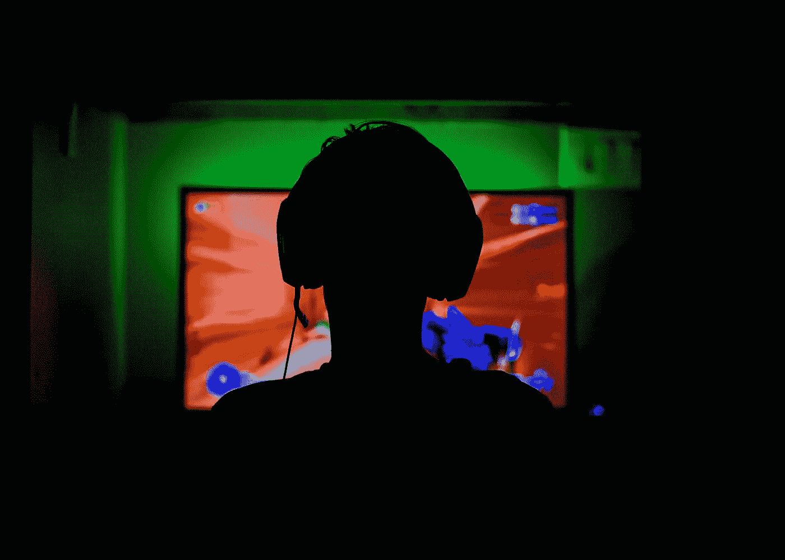

# 什么是区块链游戏？

> 原文：<https://medium.com/coinmonks/what-are-blockchain-games-ff4884885514?source=collection_archive---------44----------------------->

NFT 代表了数字世界中独特的可收藏物品，因此它们出现在游戏世界中也是很自然的。你考虑的时间越长，就越能在游戏中找到 NFT 的用途。

你有没有在一个游戏中赢得一件物品，花了几个小时与那条被诅咒的龙战斗，却发现游戏中一半的玩家也是如此，有吗？这就是不可替代代币派上用场的地方，允许玩家实际拥有资产、角色、武器等等，确保它们的独特性和价值。甚至有可能拥有整个游戏作为一个不可替代的象征，使玩特定的游戏成为一种独特的特权，拥有它就相当于拥有一件宏伟的艺术品。

# 先玩后赚模式

多年来困扰许多玩家的一件事是，玩游戏几乎不可能超越简单的爱好来赚取实际收入。游戏赚取模式(Game-to-earn model)能够解决这个问题，将 NFTs 融入游戏世界，允许玩家在游戏中赢得物品，然后在 [NFT 市场上出售，在做他们最喜欢的事情的同时获得收入](https://isotopic.io/)。

游戏中的 NFT 与众不同，区别于普通代币的地方在于玩家不仅仅拥有一个物品，也不能用它做任何有用的事情。相反，最独特的物品是最有用的，因为它们可以在游戏过程中使用，提供非凡的能力和技能，或者使用户与其他人区分开来。同样的概念也可以用在制造供应品，控制资源的数量，影响游戏中的经济，鼓励玩家互相交易和交换。这种方法可以创造出一种[极度真实的游戏体验](https://isotopic.io/)，这种体验受到玩家自身的影响，允许他们建立自己的世界规则，结盟，或者进行战争。

有些物品甚至在游戏之外也可能变得有价值，因为它们被视为正常的非功能性物品，即使游戏不再维持，也可以出售和交换。它为玩家创造了一个额外的激励因素，让他们即使不再想或不能玩游戏也能赚钱。

# 是怎么做到的？

智能合约确保玩家之间的交易，并允许他们交换、出售甚至赠送资产。利用区块链技术的[透明性和安全性](https://isotopic.io/)建立了交易的安全性，使用户可以轻松地进行交易。智能合同可以被描述为保证处理可靠性的工具。它们通常是一种由计算机代码集规则预定义的数字协议。区块链技术中使用的合同允许创建无信任协议，这意味着各方之间的交易可以通过区块链完成，从而消除了参与者之间信任的必要性。

文章由来自[同位素](https://isotopic.io/)的珍妮·李斯撰写

[**同位素**](https://isotopic.io) **是区块链支持的软件分发服务，托管整合了 NFTs 和加密货币的游戏和应用。**

> 交易新手？在[最佳加密交易](/coinmonks/crypto-exchange-dd2f9d6f3769)上尝试[加密交易机器人](/coinmonks/crypto-trading-bot-c2ffce8acb2a)或[复制交易](/coinmonks/top-10-crypto-copy-trading-platforms-for-beginners-d0c37c7d698c)