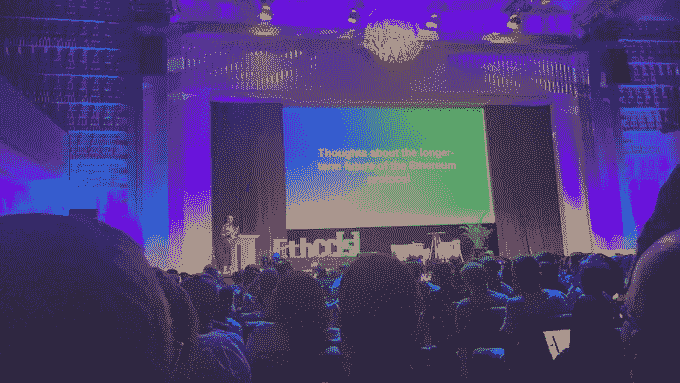

# 什么是区块链节点提供商？它们是如何工作的？

> 原文：<https://medium.com/coinmonks/what-are-blockchain-node-providers-how-do-they-work-fb4e9022f249?source=collection_archive---------15----------------------->

roadmap of ethereum at #ETHCC5

如果您是区块链开发的新手，有很多关于节点的新概念需要学习，以及它们如何适应您的区块链堆栈。到底什么是区块链节点？为什么运行自己的以太坊节点很难？什么是节点提供者，为什么我需要一个？像 Infura、Alchemy、ChainStack、Ankr 和 Quicknode 这样的服务提供商之间有什么区别？

## 到底什么是区块链节点？

我们从头开始吧！节点本质上是一个运行在单台计算机上的程序，它将你与区块链网络的其余部分连接起来。

它与其他节点通信以来回发送信息，验证人与人之间的事务，并存储有关区块链状态的关键信息。

区块链网络的一个特点是，它本质上只由节点组成:也就是说，运行以太坊或比特币等区块链的物理硬件只是世界各地个人运行的所有节点的集合。

因为没有主服务器或者单一的真相来源，所以是去中心化的！

Web3 是一个无服务器的互联网愿景——去中心化网络——的顶峰。一个用户可以控制自己的数据、身份和命运的互联网。

Web3 堆栈看起来像这样:

*   **网络层** —又名区块链，后端
*   **交互层** —又名节点提供商，区块链世界的 AWSes
*   **分散式应用** —访问 Web 3.0 的客户界面，即“应用”

在 Web3 开发周期的开始，需要知道第 1 层的重要性。此外，您可能对访问第 1 层的替代方案感到好奇。

使用交互层有两种方法:

1.利用第三方服务提供商:例如，Infura、Alchemy、QuickNode

2.您自己的节点客户机:例如，Geth

正如你所料，两种选择都有优点和缺点。选项 2 在 90%的 dapp 开发中使用，但是没有太多关于这个主题的研究。

## **选项 1:利用节点服务提供商**

节点服务提供商，顾名思义，在后台为您运行节点客户端，这样您就不必。然后，该节点可以被它的每个客户端“使用”(显然，它是共享的)。听说过规模经济吗？这就是现在这里发生的事情。
这些服务提供商通常会为您提供一个 API 密钥，您可以使用它与节点进行通信。是的，您的整个 ***提供商。这里使用了 getBalance(0x)*** 和类似的函数。

使用这些节点通常就像将它们插入 SDK 一样简单。
这些服务由许多节点提供商提供，包括 Alchemy、Infura 和 QuickNode。

## **选项 2:操作自己的节点**

通过运行我们自己的节点，我们意味着整个区块链存储在您的服务器上。您可以指定您的节点是否应该在将每个数据块添加到区块链之前对其进行验证(是的是的，我们正在讨论挖掘，以及以太坊区块链的工作证明)。

虽然运行您自己的节点是一种好的做法，但是由于安装所需的成本和时间，不建议这样做。

## 为什么跑一个节点很难？

有几件事使得在您自己的联网节点上进行开发特别不方便。让我们来看看其中的一些:

**节点可能需要几周的时间来设置！**

花费大量时间来设置一个对您试图构建的东西没有直接贡献的工具是任何开发人员的负担，而节点是最糟糕的违规者之一。

一般有两种类型的节点:轻型节点和完整节点。对于许多查询，轻型节点只同步来自完整节点的块头和请求，而完整节点保留区块链的整个状态—曾经创建的每个事务。

至少，一个可靠的节点提供商将提供:

连接到轻型和完整节点，以及不断修改的节点和警报，因此您不必担心分叉或网络更改。

访问历史交易记录的记录端点

可伸缩性和可靠性:只要您需要，节点应该随时可用。

提供商应该一致地处理棘手的边缘情况，比如上面的最新阻塞问题。当使用 Infura 或其他提供者时，这经常是一个问题。

**开始在 Web3 上构建并获得 100 美元的信用**【https://alchemy.com/?r=TgxNTE0NTY0NDM0O】T4

> 交易新手？尝试[加密交易机器人](/coinmonks/crypto-trading-bot-c2ffce8acb2a)或[复制交易](/coinmonks/top-10-crypto-copy-trading-platforms-for-beginners-d0c37c7d698c)