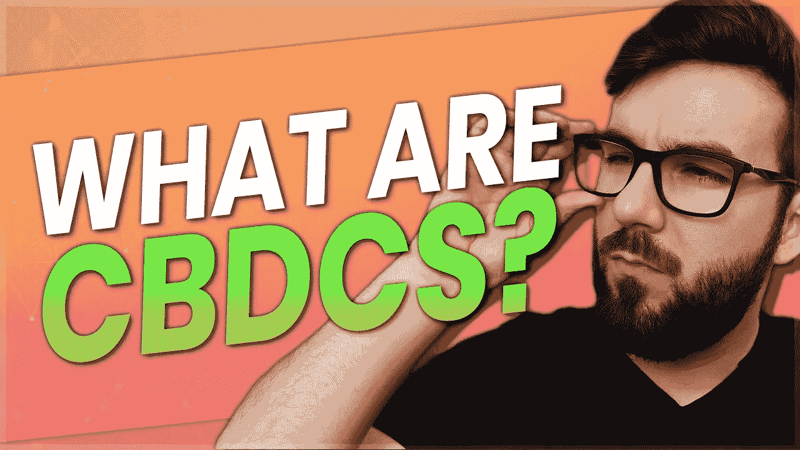

# 什么是 CBD cs & stable coins 的未来— Stablecoins 第 4 部分

> 原文：<https://medium.com/coinmonks/what-are-cbdcs-the-future-of-stablecoins-stablecoins-part-4-956ae956bafe?source=collection_archive---------31----------------------->

我们今天要回答的问题是稳定的硬币有多安全和稳定？在这一集里，我们将讨论中央银行数字货币或 CBDCs 以及稳定货币的未来。

[https://odysee.com/@ScottCBusiness:4/stablecoins-cdbcs:a](https://odysee.com/@ScottCBusiness:4/stablecoins-cdbcs:a)

[https://rumble . com/v1h 3699-what-be-CBD cs-and-the-future-of-stable coins-stable coins-part-4 . html](https://rumble.com/v1h3699-what-are-cbdcs-and-the-future-of-stablecoins-stablecoins-part-4.html)

【https://www.bitchute.com/video/ncjOCLj4XQdk/ 

我们将探讨稳定货币的未来，围绕它们的担忧，什么是中央银行数字货币或 CBDCs，以及它们如何影响加密。

总之，中央银行发展中国家是中央银行为主权国家创造和管理稳定货币的一种方式。通过利用区块链技术，他们可以创造一种比他们目前拥有的更好的数字货币，允许他们进行更多的控制和监督，并在法定和加密市场之间提供更多的流动性。

让我们来分析一下，因为这对 crypto 来说有好有坏。对我来说，越来越明显的是，允许比特币等加密货币储备的国际结算银行可能真的是开始将 CBDCs 引入银行业的一种方式。我相信这类似于看涨事件，如 Paypal 出售 crypto 或 Robinhood。然而，就像那些希望进一步集中加密货币的中央实体一样，CBDCs 也会这样做。

**CBD cs 的优点**

目前，我们主要依靠第三方实体来审计和控制广泛采用的稳定资本，如 USDC 或 USDT。虽然它们像银行一样集中，但它们没有同样的信任或合法性，也没有任何保护用户的保险。因此，如果联邦存款保险公司的保险覆盖到这方面，CBDCs 将非常好，你可以更多地依靠他们来保持良好的会计。这也将为加密用户提供大量的流动性，因为他们允许你在公开市场上自由投资。如果银行以这种方式将他们的客户转变为加密货币，每个人都可以进入加密市场，而他们目前遇到的阻力很小。将我们的常规金融体系与我们的投资整合在一个金融生态系统下，将简化一切，提高金融服务的效率。

请记住，我不信任银行或任何完全集中管理我财务的实体。让我们来谈谈 CBDCs 的缺点。

**CBD cs 的缺点**

Paypal、银行和其他支付处理器等金融机构显然在推动加密货币的集中化，而实际上并不需要这样做。贝宝做到这一点，只允许你购买或出售，不转让或花费你的密码，这意味着他们将永远控制实际资产。也许银行会让我们用 CBDCs 购买密码，但他们只会让你把密码放在银行控制的密码钱包里。除此之外，赋予央行更多加密货币的权力从来都不是一件好事。想象一下，未来你的税款会根据你在区块链的活动自动计算，并通过一些智能合同自动从你的钱包中取出。随着区块链的出现，对货币政策进行大规模改革的控制水平和能力可能会大大增强。

你可能会问，为什么我们不能用目前的数字现金系统做到这一点。正如我们在过去两年中所看到的，它们非常脆弱。在加拿大，他们花了很大力气来追踪钱包和银行账户。如果这些都在 CBDCs 的一个系统之下，它将会更容易和更快地展开。不仅如此，我们的 Interac 服务下降了一半，其中包括许多银行系统。这真的表明我们当前的系统并不是很好，虽然这将被宣传为升级，但这主要是对银行的升级，而不是对你的升级。我们已经可以看到过去几年美联储在管理通胀和美国经济方面做得有多差，所以类似这样的事情只会进一步放大这一点。最后，我要指出的是，这对商业银行来说可能非常不利，因为它们将无法竞争，或者将被迫持有央行的稳定货币，从而赋予它们对商业银行更大的权力。

在我们结束之前，让我们来看看这里分享的一些例子:[https://www . euro news . com/next/2022/03/09/CBD cs-这些国家正在使用-推出-或试行-他们自己的数字货币](https://www.euronews.com/next/2022/03/09/cbdcs-these-are-the-countries-are-using-launching-or-piloting-their-own-digital-currencies)

巴哈马——推出了沙币

尼日利亚——推出 eNaira

东加勒比货币联盟—加勒比地区的 7 个国家采用了 DCash

还有许多其他国家有试点项目或正在开发基于社区的发展中国家。你可以看看这个跟踪系统，看看世界各国是如何采用它的，它们处于什么阶段:【https://www.atlanticcouncil.org/cbdctracker/】T2 根据德勤的说法，大约 90%的国家正在以某种形式考虑 CBDCs。

德勤在这里给了 cbdc 一个很好的概述:[https://www2 . Deloitte . com/us/en/pages/financial-services/articles/cbdc-central-bank-digital-currency . html](https://www2.deloitte.com/us/en/pages/financial-services/articles/cbdc-central-bank-digital-currency.html)

Investopedia 定义:[https://www . investopedia . com/terms/c/central-bank-digital-currency-cbdc . ASP](https://www.investopedia.com/terms/c/central-bank-digital-currency-cbdc.asp)

你有稳定的硬币吗？你喜欢 CBDCs 背后的理念吗？比起私人稳定的硬币发行商，你更信任银行吗？stablecoins 的未来是中心化的吗？请在下面的评论中告诉我你对此的看法，别忘了订阅哦！

***免责声明:这不是理财建议，纯粹出于娱乐目的。您看到的、听到的或读到的都是我的个人观点，所做的任何陈述都是基于我的观点，不应被误解为事实。我的加密组合可能是模拟的，也可能不是***

👥支持我&跟随我去别的地方👥

👉[http://www.scottcbusiness.com](http://www.scottcbusiness.com)

在我的电报中提问:[https://t.me/cryptoandthings](https://t.me/cryptoandthings)

你可以在[https://cointr.ee/scottcbusiness](https://cointr.ee/scottcbusiness)上找到我所有的加密货币地址

你可以在这里找到我所有的推荐链接:[https://linktr.ee/scottcbusiness](https://linktr.ee/scottcbusiness)

> 交易新手？尝试[加密交易机器人](/coinmonks/crypto-trading-bot-c2ffce8acb2a)或[复制交易](/coinmonks/top-10-crypto-copy-trading-platforms-for-beginners-d0c37c7d698c)