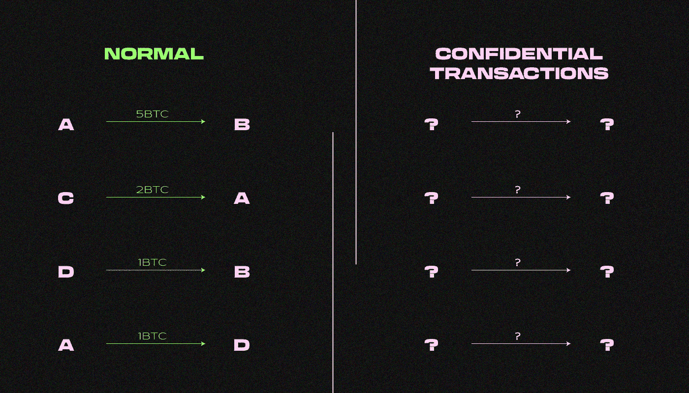

# 什么是保密交易？

> 原文：<https://medium.com/coinmonks/what-are-confidential-transactions-63d48bd20772?source=collection_archive---------15----------------------->

***保密交易(CT)是一种加密协议，允许您在交易输入和输出时对第三方隐藏接收者的地址和实际金额。它是如何工作的？这合法吗？我们可以回答你的问题！***

另一方面，机密交易允许每个人验证所有输出的总和不超过所有输入的总和，这足以验证交易。

# **谁在何时发明了保密交易技术？**

**Adam Back**,[Hashcash](https://forklog.com/genezis-arhivy-hashcash-ili-kak-adam-bek-sozdal-dvigatel-bitkoina/)的创建者和 Blockstream 公司的联合创始人[在 **2013** 推出了](https://bitcointalk.org/index.php?topic=305791.0)这个概念的第一个版本，名为“具有同态价值的比特币”。

该技术于 **2015** 首次在 Blockstream 的[元素](https://elementsproject.org/)侧链中实现。

比特币核心开发者 Gregory Maxwell 进一步发展了这个概念。

# 我们为什么需要 CT？

众所周知，比特币并不提供完全的隐私。因为区块链是公开的，你可以跟踪用户的资金流动，并确定谁在进行这些交易。

比特币由于缺乏隐私而无法完全替代，这也降低了其对审查的抵抗力。例如，交易所和其他服务可以屏蔽用户的个人资料，因为比特币此前曾被用于非法目的，即使当前所有者并不知道这一事实。这些问题可以通过保密交易技术来解决。

# **保密交易技术是如何工作的？**

该技术实现了新的地址和交易格式。交易格式由 scriptPubKey、Pedersen 承诺方案和随机 [ECDH](https://en.wikipedia.org/wiki/Elliptic-curve_Diffie%E2%80%93Hellman) (Diffie-Hellman 椭圆曲线)码组成。

脚本 PubKey 包含一个机密交易(CTA)的地址和一个数学条件，该条件规定只有在地址的私钥所有权得到签名确认的情况下，才能使用比特币。

机密交易的地址是一个盲密钥与常规比特币地址的散列。

致盲密钥的作用是隐藏公共注册表中的比特币地址和交易金额。此外，获得致盲密钥可以让你看到机密交易中的比特币地址和金额。

彼得森的承诺方案由所有比特币输出的散列加上一个致盲密钥组成。

ECDH 密码是一把钥匙，可以让你揭示整个私人交易。它用于向交易接收方发送加密数据，接收方了解比特币交易的结果以及保密交易的致盲因素。

***保密交易如何工作的一个例子:***

Alice 的钱包中有两个比特币，她希望将其中一个发送给 Bob。

Alice 在接收到 Bob 的地址后，生成了一个盲密钥，并将其与一个散列值结合在一起。所以，有一个保密地址。虽然它被记录在公共注册表中，但是除了 Alice 和 Bob 之外，没有人知道机密事务的地址与 Bob 的地址相关联。

***一个保密地址的例子:***

ctewqjyerenrxo 8 ds q 6 pq 5 ATS S7 ym9 S7 p 6 ggk 4 pigaqrgogo 1 IPU klq 168 kqptfnwmpxr 2 BF 7 ipq sagi

然后，Alice 创建了一个机密交易。她用同样的致盲密钥和一个比特币的输出生成了一个彼得森承诺。Alice 发送给 Bob 的金额是隐藏的，但是他们都可以看到，因为他们都有一个公开的盲密钥。爱丽丝拥有它，因为她创造了一个致盲密钥，鲍勃可以使用他的比特币地址的私钥来提取它。

然后，Alice 用她用 Bob 的比特币地址创建的机密交易的地址创建了一个 scriptPubKey，其中有一个数学条件要求 Bob 用签名确认该地址私钥的所有权。

然后，交易记录在公共登记处。

# **技术如何解决保持零平衡的问题？**

比特币的一个基本原则是，地址应该有零余额——到达该地址的比特币数量应该等于离开该地址的比特币数量。

但是，由于保密交易隐藏了金额，因此出现了两个问题:

*   用传统的减法计算交易费用的方法是不可能的。
*   网络无法确定地址的输出是否对应于输入，从而无法保持零平衡。

第一个问题很容易通过公开交易费用来解决。

彼得森的承诺方案解决了第二个问题。

Pedersen 提出的承诺概念具有独特的同态数学性质。同态是在两个代数结构之间保持象的结构。这种解决方案对加密很有用，因为它使您能够缓存数据，并使用基本的代数运算(如加法)来验证散列背后的数据。换句话说，可以在不泄露数据本身的情况下传输数据。

***例如:***

让我们用一个简单的代数结构，通过乘以 2 来“散列”这些值。

(a + b)2 = a*2 + b*2

我们假设 a=1，а b=3。

(1+3)2 = 1*2 + 3*2

(4)2 = 2+6

如果将等式左侧的值“a”替换为另一个数，例如 4，则代数结构将不再成立:

(a + b)2 = a*2 + b*2

(4 + 3)2 ≠ 1*2 + 3*2

由于 Pederson 义务的同态属性，保密交易确保了比特币地址零余额的保存。

让我们通过让 Alice 给 Bob 发送一个比特币来实现这一点。简单来说，不考虑交易费用。

对于她的保密交易，爱丽丝有彼得森的两个比特币的承诺。当 Alice 给 Bob 发送一个比特币时，她使用特定的数学公式创建了一个哈希。然后使用相同的数学公式向交换地址发送一个比特币。我们将两个哈希相乘，看看结果是否与彼得森承诺的爱丽丝的地址和两个比特币相同。如果结果相同，则散列被认为是有效的机密事务。

# **CT 的优势是什么？**

该协议允许你增加比特币的隐私。致盲密钥掩盖了比特币的地址和金额，增加了比特币的可替代性。

盲密钥也可以用于审计:付款的发送者或接收者可以将盲密钥转移给第三方进行审计。

# **CT 技术用在哪里？**

Blockstream 的商业侧链 Liquid 中使用了保密交易技术。流动用户可以使用该技术来确保收到的金额不超过发送的金额。

这意味着资金可以在交易所之间流动，没有人知道确切的金额。竞争对手将无法看到交易所储存了多少数量，交易者也无法像现在这样在交易时使用这些信息:区块链的公共性质允许那些了解即将进行的重大操作信息的人达成交易，从价格变化中获利。

环形保密交易(Ring CT)是保密交易的一种变体，用于 Monero 加密货币。对该技术的修改也用于 Bitshares 加密货币和 MimbleWimble 协议，这是 Grin 和 Beam 加密货币的基础。

主比特币协议也可以支持保密交易。关于如何使用向后兼容的软件来做到这一点，有几种想法，但是这种升级仍然会对可伸缩性产生负面影响，并且很可能仍然有很长的路要走。

# **什么是机密资产技术？**

机密资产技术扩展了机密交易的功能，允许您在区块链中看到交易的发送方和接收方，同时隐藏正在移动的资产，如比特币、黄金、证券或其他资产。

# **谁在何时发明了机密资产技术？**

机密资产的技术是由 Blackstream 开发者 **Andrew Poelstra** 、 **Adam Back** 、 **Mark Friedenbach** 、 **Gregory Maxwell、**和 **Pieter Wuille** 发明的。

[白皮书](https://blockstream.com/bitcoin17-final41.pdf)机密资产于**2017 年 4 月 3 日在 Blockstream 网站发布。**公司宣布将机密资产作为侧链元素的侧链技术的新选项

# **机密资产技术是如何工作的？**

保密交易技术使用 Pedersen 的承诺，替代区块链中的初始交易金额:

*承诺= xG + a(H + rG)*

*a 是交易金额，G 和 H 是椭圆曲线生成器。g 是一个常数。h 代表资产类型，对不同的机密资产取不同的值。x 和 r 是致盲因子。*

*在每个 UTXO(未用交易输出)中，它们被设置为不同的随机值，以便隐藏交易金额和资产类型。*

该模型允许您检查每笔交易中资产的进入和退出金额的平衡。与此同时，核查人员知道债务，但不知道交易金额或资产类型。

发送者以加密的形式向接收者发送关于交易金额和资产类型的数据，以 p2p 格式在链上或链下发送，使得数据只有交易双方知道。

在发放资产、转移资产和销毁资产的过程中，还需要使用 ZKP(零知识证明)过程来证明交易金额和资产类型具有可接受的价值，而不披露价值本身。资产类型的证明称为**满射证明。**

# **机密资产技术有哪些缺点？**

该技术只能在新区块链或通过现有区块链的硬分叉实现。

因为智能合约不能添加到此解决方案中，所以不可能定制机密资产的逻辑或基于它们创建链上应用程序。开发人员只能使用类似无脚本脚本的方案来实现简单的逻辑。

这个问题正在由阿兹特克，泽瑟，匿名泽瑟，PGC，夜幕降临，和其他人解决。针对保密交易的现有区块链解决方案(zk-SNARK、MimbleWimble 等)。)在所有这些协议中都是使用智能合约实现的。这种模式具有以下特点:

*   **可编程性**:智能合约修改了资产的发布、销毁、转移和交换的逻辑，扩展了机密资产的功能和属性集。
*   **互操作性**:机密资产可以与其他合同(代币、拍卖、投票)交互，允许更多样化的应用。

> 在跟踪更新方面，订阅我们的[媒体提要。](https://medium.com/sunflowercorporation)敬请期待！
> 
> 您也可以在我们的平台[向日葵公司](https://sunflowercorp.com/)上尝试使用加密货币。

# **机密资产技术用于何处？**

Elements 项目将机密资产技术应用于比特币网络。

基于比特币的系统中的交易过程不是交互式的，这意味着交易的接收者不需要在线就可以完成交易。在基于 MimbleWimble 的系统实现中，事务流程是交互式的。

与基于 MimbleWimble 的系统不同，在基于比特币的系统中，双方的地址不会隐藏在机密资产的实现中。

该技术也可以在基于 MimbleWimble: Grin 和 Beam 协议的系统中实现。Beam 开发人员在 2020 年 6 月的**中实现了这个功能，作为渴望电子 5.0 硬分叉的一部分。**

> **交易新手？尝试[加密交易机器人](/coinmonks/crypto-trading-bot-c2ffce8acb2a)或[复制交易](/coinmonks/top-10-crypto-copy-trading-platforms-for-beginners-d0c37c7d698c)**