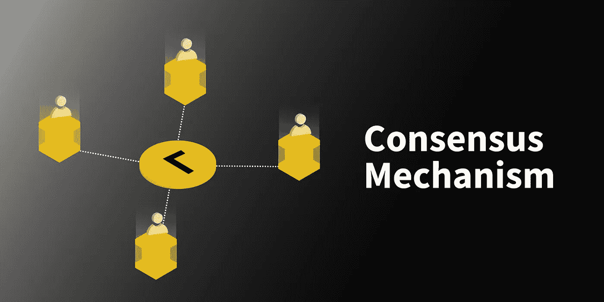

# 什么是共识机制？

> 原文：<https://medium.com/coinmonks/what-are-consensus-mechanisms-1051feb93568?source=collection_archive---------31----------------------->

单个管理员维护和更新集中式系统，例如包含重要信息的公司数据库。

负责保存所有记录的管理机构进行所有更改，如添加、删除或更新信息。

区块链是分散的自治网络，在全球范围内运作，没有单一的中央权力机构。它们涉及许多用户的参与，这些用户试图对区块链上发生的交易进行认证和验证。

这些开放的共享分类帐需要一种高效、公平、实时、实用、可靠和安全的机制来确认所有网络交易都是合法的，并且所有参与者都同意分类帐的状态。这一重要功能由共识机制执行，共识机制是一套确立不同区块链参与者(即节点或交易者)所做贡献的合法性的规则。

为了在分布式进程或多代理系统中获得关于单个数据值或单个网络状态的所需共识，例如对于加密货币，共识机制充当区块链系统中采用的容错机制。这有助于保持记录，除其他外。

共识机制是一种确保分布式数据库安全性和验证条目的技术。由于加密货币的数据库被称为区块链，共识过程保护区块链。

**共识机制的类型**

在区块链和加密货币的背景下，两种最常用的共识机制是工作证明(PoW)和利益证明(PoS)。

**工作证明(战俘)**

工作证明(PoW)是一种分散的共识机制，通过让网络用户花时间解决随机数学难题来防止系统博弈。它经常被用于加密货币挖掘，目的是验证交易和生产新的硬币。

工作证明需要付出大量实际的努力，以阻止对计算资源的浪费或恶意使用，例如发送垃圾邮件或发起拒绝服务攻击。

当中本聪在 2008 年创造比特币时，他将这种数字货币描述为建立在工作证明协议的基础上，这种协议允许安全的点对点交易，而不需要中央权威机构。

以前阻碍实用数字货币发展的一个问题是重复消费问题。由于加密货币本质上是数据，因此需要一种机制来防止用户重复使用相同的单位，然后系统才能记录交易。

如果你曾经复制和粘贴过一个计算机文件，你可能会看到你如何花数字货币两次——或者十次或更多——而在两次不同的购买中使用相同的美元纸币是很困难的。

中本聪的共识算法解决了这种双重花费。工作证明有助于防止重复支出，它激励矿工在将新的加密交易添加到被称为区块链的分布式记录之前，检查它们的合法性。

**股权证明**

作为工作证明(POW)的替代方法，利益证明(POS)共识方法是一种分散式分类帐技术。加密货币的所有者可以根据下注硬币的数量来验证大宗交易。

与工作证明方法相反，利益证明方法要求验证者持有并持有令牌以换取赚取交易费的权利，而工作证明方法则依赖于挖掘者来解决密码难题。

在区块链，股权证明用于处理交易和创建新区块，这减少了验证区块和交易所需的计算工作量。区块链的安全性是通过工作证明来维护的。桩的证明修改了如何使用硬币所有者的设备来确认块，减少了必要的计算工作量。所有者投资他们的货币作为抵押品，以换取验证区块的机会，并随后转变为验证者。

为了验证数据块和确认事务，验证器是随机选择的。该系统随机选择有资格收取费用的人，而不是使用像工作证明这样的基于奖励的竞争策略。

要成为验证者，你必须“下注”一定数量的硬币，例如，在以太坊的用户成为验证者之前，必须下注 32 ETH。一定数量的验证器必须确认一个块是准确的，它才能被终结和关闭。多个验证器对块进行验证。

各种利害关系证明系统可以使用各种技术达成共识。例如，当以太坊采用分片时，一个验证器将确认交易并将它们添加到一个分片块中，这就需要一个委员会中至少有 128 个验证器。在创建了一个块并验证了碎片之后，当三分之二的验证者证明事务是有效的时，这个块就被关闭了。

# 工作证明和利益证明的区别？

区块链可以通过这些共识机制同步数据、验证数据和进行交易。尽管各有利弊，但每种方法都被证明能有效地维持区块链。但是这两种算法使用的策略有很大的不同。

块制造者在 PoS 中被称为验证者。验证器保存记录，验证活动，对结果进行投票，并检查交易。在 PoW 系统中，块创建者被称为矿工。为了验证交易，矿工试图找到散列，一个加密数字。他们收到了一枚硬币作为破译哈希的报酬。

要成为 PoS 区块链上的验证者，你只需要有足够的硬币或代币来“买入”积木制作者的角色。对于 PoW 来说，矿工必须在处理硬件方面进行大量投资，并支付高额能源成本来为运行计算的机器提供动力。

电力开采需要昂贵的能源和设备，这限制了谁可以开采，并增加了区块链的安全。具有 PoS 模型的区块链需要较少的计算能力来验证块和交易。此外，该方法减少了网络拥塞，并消除了战俘区块链基于奖励的动机。

**总之**

其他共识算法，如容量证明(PoC ),提供区块链网络上的贡献节点的存储空间共享，尽管 PoW 和 PoS 是区块链扇区中最常见的。节点拥有的内存或硬盘空间越多，其维护公共分类帐的权限就越多。已颁布的区块链活动证明(PoA)协议是 PoW 和 PoS 元素的混合体。另一种加密货币要求用户向无法到达的钱包地址发送小额资金，以有效地“烧掉”它们的存在，这就是 Burn Proof(PoB)。

还有其他机制，如 Solana 项目创建的历史证明(PoH ),类似于流逝时间证明(PoET ),它使用加密技术对时间流逝本身进行编码，以便在不使用大量资源的情况下达成共识。

感谢您的阅读！

**关注我** [**推特**](https://twitter.com/Soy_Enigma)

> 交易新手？尝试[加密交易机器人](/coinmonks/crypto-trading-bot-c2ffce8acb2a)或[复制交易](/coinmonks/top-10-crypto-copy-trading-platforms-for-beginners-d0c37c7d698c)