# 什么是加密链上数据？

> 原文：<https://medium.com/coinmonks/what-are-crypto-on-chain-data-cd879cc3ef65?source=collection_archive---------35----------------------->

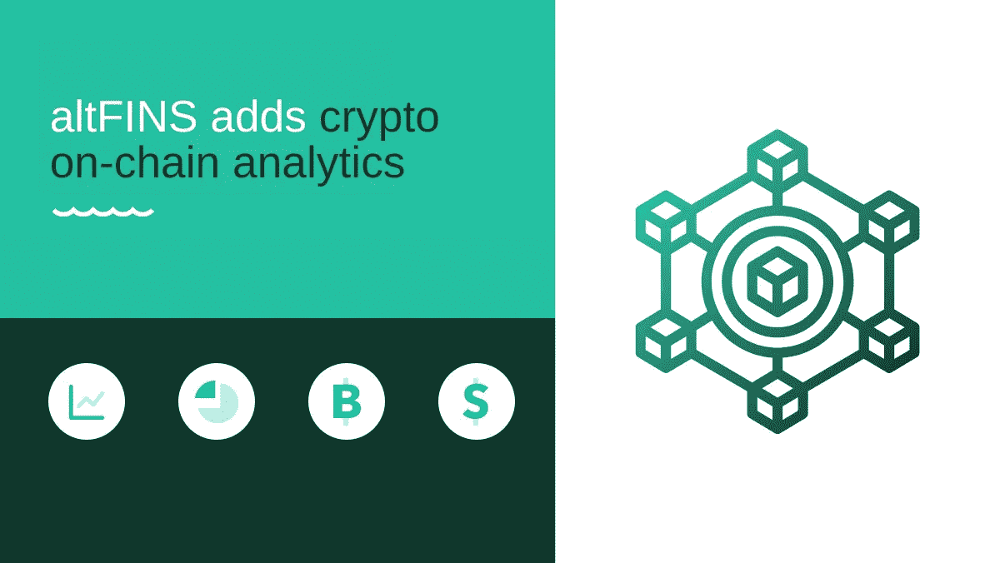

Source: [altfins.com](https://altfins.com/on-chain-data)

**链上数据是关于在区块链网络上发生的交易的可公开访问的信息。**该数据包括构成区块链的所有内容，如数据块、交易历史和地址。通过了解链上数据，您可以深入了解区块链的工作原理和使用方式。

链上数据有多种用途。例如，它可以用于**跟踪区块链上的资金流动，了解哪些地址是活跃的，并查看特定区块链上发生了多少活动。**此外，链上数据可用于评估区块链网络的健康状况，并识别长期趋势。

交易通过验证后，交易数据将永久存储在数字分类账中，无法更改。因此，可公开访问的数据是可信和准确的，这使得它对于创建 dapps 和其他 Web3 计划非常有用。通常可以访问各种形式的数据，包括钱包地址、区块时间戳、矿工费用、转账金额、智能合同代码等等。

总而言之，链上数据本质上是区块链网络上公开的关于交易、区块和智能合约的信息。这些交易是通过网络进行的，因此每笔交易都有不可撤销的记录。

# 离线数据与在线数据

比较链上数据和链下数据对完全理解链上数据非常有帮助。简而言之，离线数据是指没有存储在区块链网络上的信息。因此，这些更传统的数据存储在标准数据库和服务器中。

# altFINS 上的链上数据

加密投资者现在可以根据他们的**收入和锁定的总价值(TVL)，以及市值对收入和市值对 TVL 等估值比率，扫描和分析数百个项目。**

收入和 TVL 指标可以帮助投资者找到具有真实产品和价值主张的项目，从而获得广泛的关注，并避免那些只是“热空气”骗局或失败的项目。

您可以在[链上](https://altfins.com/on-chain-data)数据部分找到该内容。

**新增的** [**链上分析**](https://altfins.com/on-chain-data) **包括:**

1)总收入

2)总收入的市值比

3)协议收入

4)协议收入的市值

5)总值锁定或 TVL

6)TVL 的市值

这个视频将展示我们平台的最新改进，特别是增加了链上数据。

Source: altfins.com

altFINS 提供关键链上数据的审查，如总收入、协议收入、市值/总收入比率(Mcap/TR)、市值/协议收入比率(Mcap/PR)和锁定的总价值(TVL)。

在 altFINS [crypto screener](https://altfins.com/crypto-screener) 中查看关键基本面指标随时间的表现:**收入、**Mcap/S、 **TVL:**

*   **收入**选项卡显示一个项目的收入金额。总收入是供应方收入和协议收入的总和。供应方收入是指在利害关系证明协议项目的情况下分配给验证者的交易费用，而协议收入表示属于令牌项目的收入金额。该选项卡还包括 7 天和 30 天期间的年化收入值以及业绩变化值。

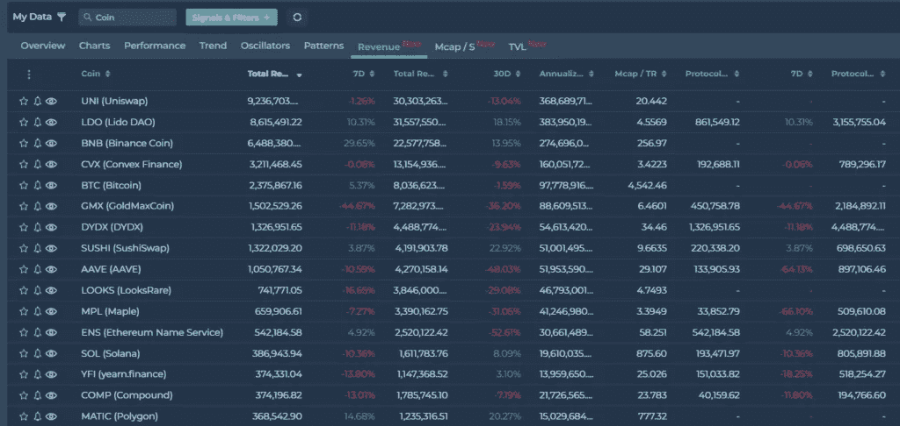

Source: [altfins.com](https://altfins.com/on-chain-data)

*   **Mcap / S** (也称为**价销比**tab)既包括项目的市值，也包括过去 12 个月的协议销售额或协议收入。投资者可以使用这种衡量方法来识别一个令牌是被低估还是被高估。该比率越低，投资就越有吸引力，因为它表明价值被低估，因为其市场资本与其收入实力不匹配。该选项卡还包括 7 天、30 天和 90 天期间的年化收入值以及业绩变化值。

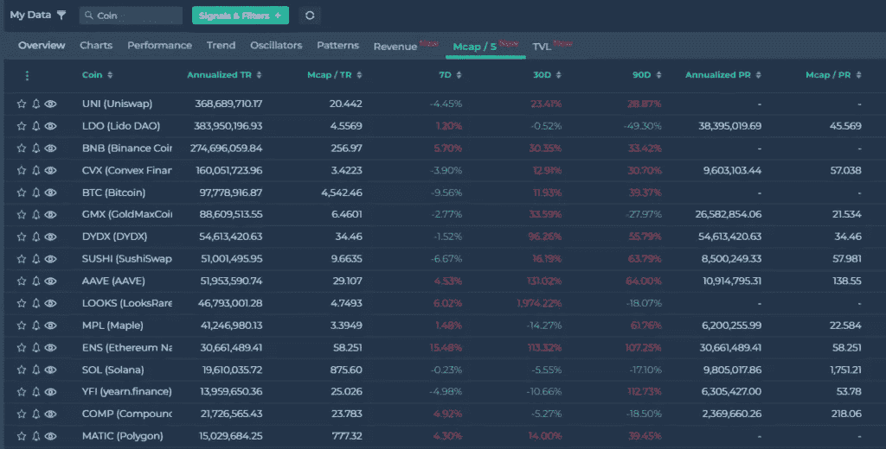

Source: [altfins.com](https://altfins.com/on-chain-data)

*   **TVL** 选项卡显示当前在特定协议中被下注的所有资产的价值。它衡量项目的整体健康状况，投资者可以看到人们愿意在特定项目的智能合约中锁定多少价值。TVL 越高，人们对项目越有信心。该选项卡包括 1D、1W、1M 和 3M 周期的值以及 Mcap/TVL 比率的性能变化。总收入。

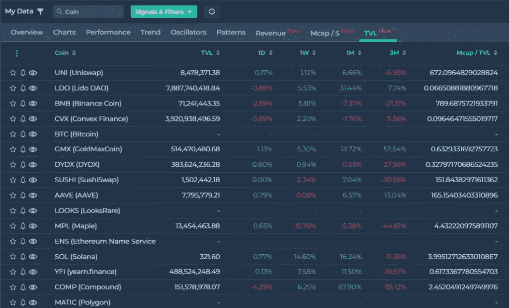

Source: [altfins.com](https://altfins.com/on-chain-data)

# 在 altFINS 上获得有价值的[链上数据](https://altfins.com/on-chain-data)

# 连锁数据:总收入

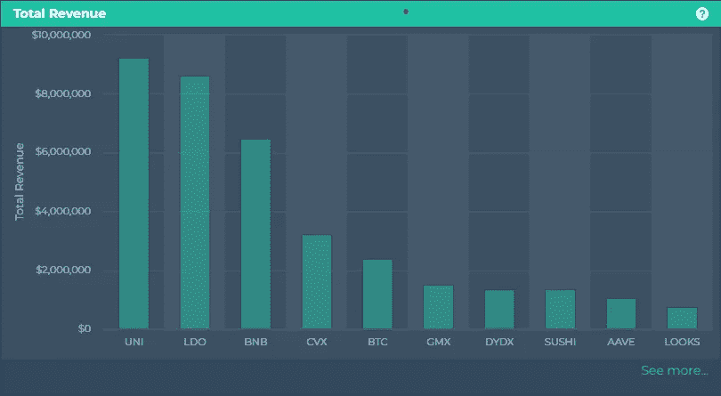

Source: [altfins.com](https://altfins.com/on-chain-data)

总收入代表支付给协议财政部和供应方的总费用。它代表了平台收到的用户费用的总和。包括进入供应方和议定书国库的总费用。点击此处查看 altFINS crypto screener [的当前结果。](https://altfins.com/crypto-screener?tab=COINS&eViewType=REVENUE&column=TOTAL_REVENUE_1W&timeInterval=60&filters=A%3Cmdi%2CMARKET_CAP%2C100000.0%2C%3E&desc=true)

# 连锁数据:协议收入

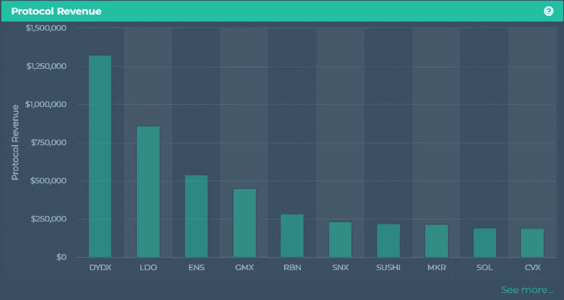

Source: [altfins.com](https://altfins.com/on-chain-data)

通过 burn 机制仅进入协议国库或直接进入其令牌持有者的费用份额，这类似于股票回购，因为它减少了流通中的令牌数量。点击查看 altFINS crypto screener [中的当前结果。](https://altfins.com/crypto-screener?tab=COINS&eViewType=REVENUE&column=PROTOCOL_REVENUE_1W&timeInterval=60&filters=A%3Cmdi%2CMARKET_CAP%2C100000.0%2C%3E&desc=true)

# 连锁数据:市值/ TR

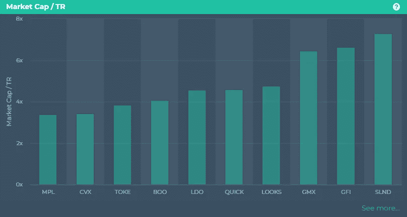

Source: [altfins.com](https://altfins.com/on-chain-data)

Mcap/TR，也称为价格收入比，是一个财务指标，它考虑了项目的市场资本总额以及前 12 个月的总收入。因为它显示了低估，因为市值不能反映公司收入的强度，比率越低，投资越有吸引力。点击这里查看 altFINS 密码筛选软件[的当前结果。](https://altfins.com/crypto-screener?tab=COINS&eViewType=MCAPS&column=MARKET_CAP_SALES&timeInterval=60&filters=A%3Cmdi%2CMARKET_CAP%2C100000.0%2C%3E&desc=false)

# 链上数据:Mcap/PR

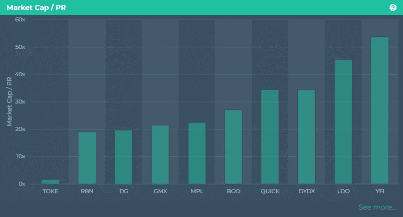

Source: [altfins.com](https://altfins.com/on-chain-data)

Mcap/PR，通常被称为价格收入比，是一个财务指标，它考虑了项目的市值和前 12 个月的协议收入。因为它显示了低估，因为市值不能反映公司收入的强度，比率越低，投资越有吸引力。点击这里，查看 altFINS 密码筛选软件[的当前结果。](https://altfins.com/crypto-screener?tab=COINS&eViewType=MCAPS&column=MARKET_CAP_PR&timeInterval=60&filters=A%3Cmdi%2CMARKET_CAP%2C100000.0%2C%3E&desc=false)

# 连锁数据:市值/TVL

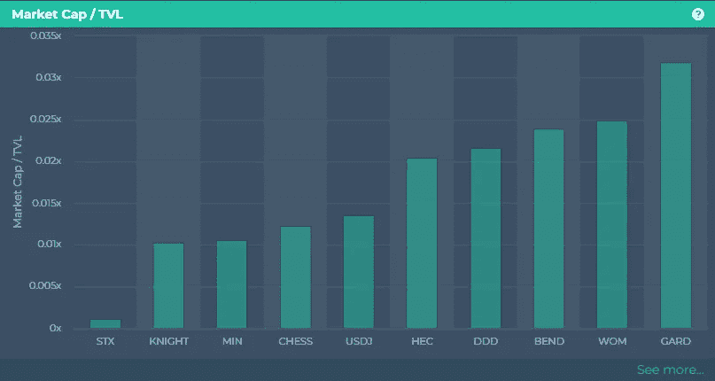

Source: [altfins.com](https://altfins.com/on-chain-data)

市值/TVL 是项目的市值除以锁定的总价值。当比率低于 1.0 时，硬币被低估，当比率高于 1.0 时，项目现在被高估。点击查看 altFINS crypto screener [中的当前结果。](https://altfins.com/crypto-screener?tab=COINS&eViewType=TVL&column=mcapTvl&timeInterval=60&filters=A%3Cmdi%2CMARKET_CAP%2C100000.0%2C%3E&desc=false)

# 链上数据:锁定的总价值(TVL)

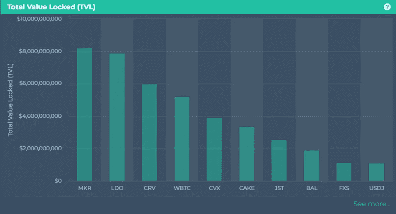

Source: [altfins.com](https://altfins.com/on-chain-data)

锁定的总价值(TVL):在协议的智能合同中投资的金额。投资者可以观察人们准备在一个项目的智能合约中锁定多少价值，以及一个项目在整体上有多全面。随着 TVL 的上升，人们对这个项目更有信心了。点击查看 altFINS crypto screener [中的当前结果。](https://altfins.com/crypto-screener?tab=COINS&eViewType=TVL&column=TVL&timeInterval=60&filters=A%3Cmdi%2CMARKET_CAP%2C100000.0%2C%3E&desc=true)

# 交互式图表，用于比较细分市场中的竞争对手

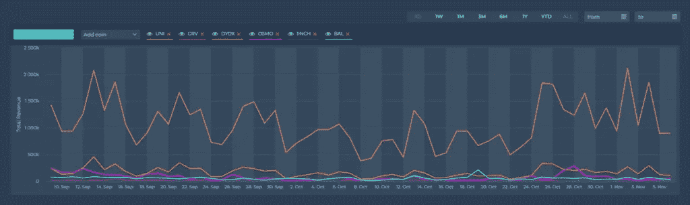

Source: [altfins.com](https://altfins.com/on-chain-data)

在这个[图](https://altfins.com/on-chain-data)中，您还可以比较多个 DeFi 项目的趋势。您可以选择要使用的链上指标，并选择要比较的项目。例如，在 DEX 部门，我们可以比较多个 DEX 竞争对手的收入:UNI、DYDX、OSMO、1NCH 和 let's add SUSHI。您也可以隐藏它们。您还可以更改图表的时间范围。

访问 altFINS.com 了解更多信息。

> 交易新手？试试[密码交易机器人](/coinmonks/crypto-trading-bot-c2ffce8acb2a)或[复制交易](/coinmonks/top-10-crypto-copy-trading-platforms-for-beginners-d0c37c7d698c)