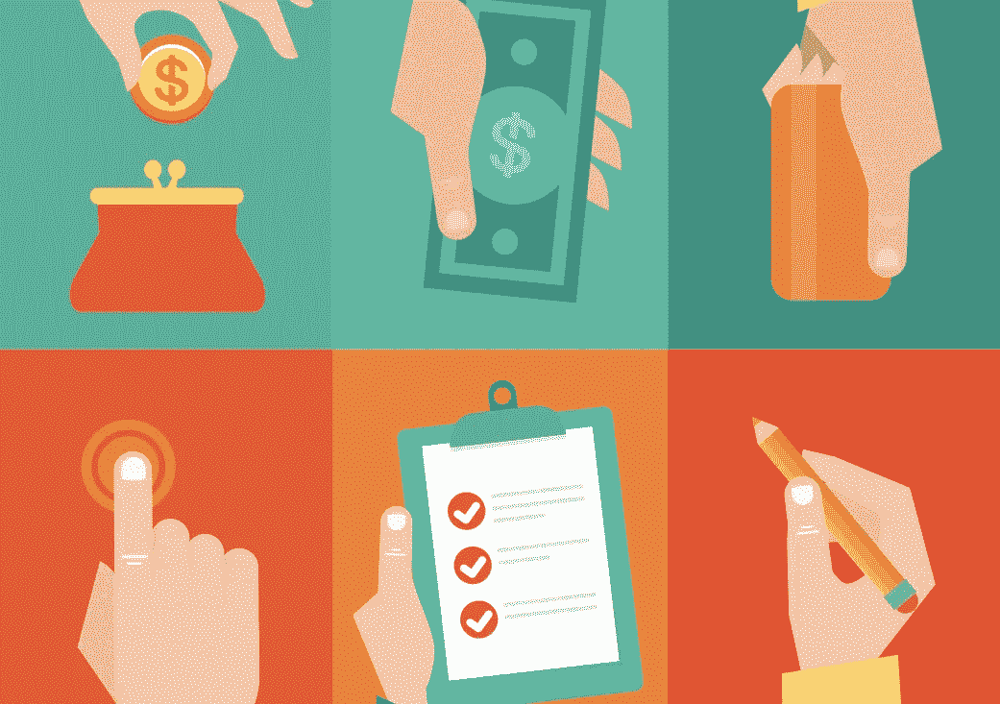
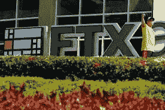
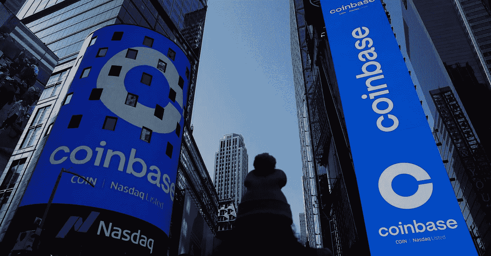

# 什么是加密货币？如何投资它们？

> 原文：<https://medium.com/coinmonks/what-are-cryptocurrencies-how-to-invest-in-them-67381581b9f6?source=collection_archive---------28----------------------->

Source: eamesBot on Shuttershock

你可能听说过一种叫做比特币的加密货币。比特币是最著名的加密货币之一，是一种交换媒介。最近，随着 2022 年初的加密崩溃和许多交易所公司的倒闭，加密货币一直是一个热门话题。但首先，让我们深入了解什么是加密货币。

# 什么是加密货币？你如何使用它们？

加密货币，也称为 crypto，是一种受密码术保护的数字货币，使得伪造和重复消费几乎不可能。由于没有中央权力机构，他们使用分散的区块链系统来记录交易和发行新单位。

Source: [blog.fasset.com](https://blog.fasset.com/what-is-cryptocurrency/)

你可以使用密码购买传统的商品和服务，但大多数人投资密码就像投资股票和债券等其他资产一样。然而，支付形式尚未完全成为主流，但少数零售商，如微软和 Overstock，接受比特币。加密借记卡是使用比特币购买任何东西的最简单方式，你选择的加密货币预装在一些卡上。零售商收到法定货币，而你花密码。

Source: Nicholas Tomain on Coindesk

# 如何投资加密货币？

购买加密货币时，你必须对它们有足够的了解，以了解每个系统的工作原理，因为购买它们可能有风险。当谈到风险时，这些风险的一个例子是不久前的 FTX 崩溃。加密货币交易公司 FTX 倒闭了，因为它没有足够的资产来满足客户的需求，交易停止了。FTX 随后申请破产，这让许多客户陷入尴尬境地，等待有关他们资产的答案。

FTX logo at the Miami Heat’s FTX Arena. Source: Marco Bello on [Reuters](https://www.reuters.com/lifestyle/sports/sports-teams-may-look-beyond-crypto-after-ftx-collapse-say-industry-experts-2022-11-14/)

现在，让我们回到投资加密货币上来。加密货币的投资方式有很多种:直接购买加密，投资加密公司，投资专注于加密的基金。首先，你可以直接购买从比特币到新发行的硬币的各种加密货币，从购买它们到商店或场地。第二，可以投资加密货币公司。PayPal 和比特币基地等加密货币兑换公司和支付服务是受欢迎的投资场所。

The logo of Coinbase is displayed on the Nasdaq jumbotron at Times Square, New York. Source: Shannon Stapleton on [Reuters](https://www.reuters.com/business/finance/coinbase-says-hackers-stole-cryptocurrency-least-6000-customers-2021-10-01/)

要通过交易所购买加密货币，首先要选择你想使用的公司。然后，在兑换公司开一个账户，用法定货币填满你的账户。之后，你决定购买你选择的加密货币，下订单，并最终将其存储在你的数字钱包中，这是你的密码和支付信息的安全之家。尽管如此，自今年早些时候加密市场崩溃和加密的波动性以来，许多像比特币基地这样的交易所公司都面临着很大的压力。第三，你可以投资与密码相关的基金。还有投资加密货币投资信托或交易所交易基金(ETF)等选项。最后，始终要意识到加密的风险，并知道你会让自己陷入什么样的境地，因为它在网上存储加密不像银行账户那样有足够的保护。

感谢阅读！

> 交易新手？试试[加密交易机器人](/coinmonks/crypto-trading-bot-c2ffce8acb2a)或者[复制交易](/coinmonks/top-10-crypto-copy-trading-platforms-for-beginners-d0c37c7d698c)