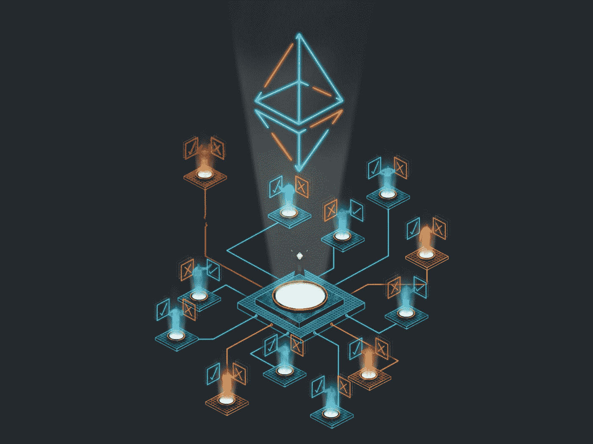
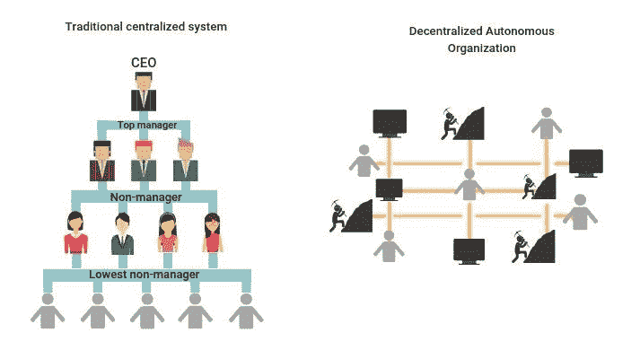
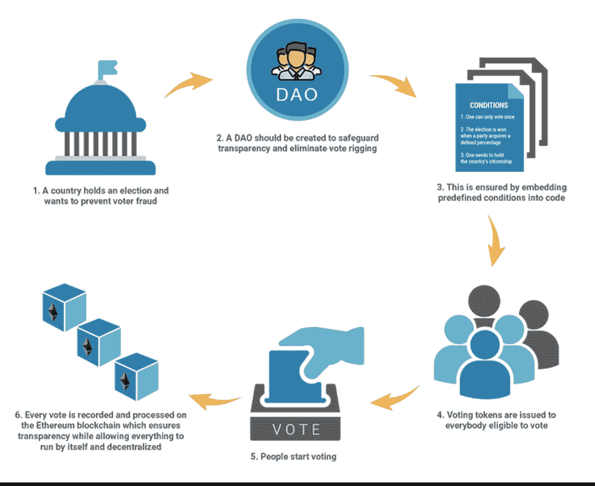
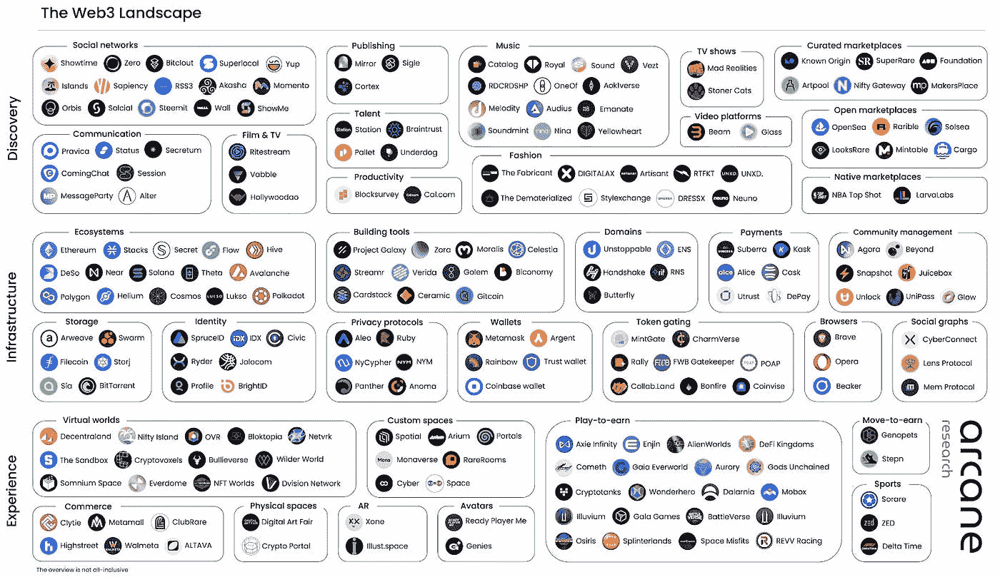

# 道是什么？它们增加了什么价值？

> 原文：<https://medium.com/coinmonks/what-are-daos-and-what-value-do-they-add-b5c774ffbe56?source=collection_archive---------18----------------------->

[Www.Hongkiat.com](http://www.hongkiat.com)

# 什么是去中心化自治组织(DAO)？

考虑和一群来自世界各地你不认识的人安排在一起，作为一个没有中心领导的团队，为了相同的目的和目标一起工作，在这里你可以建立自己的规则，独立地做出自己的决定。所有这些都是在一种被称为区块链技术的独特技术上编码的；很酷，对吧？

DAOs(去中心化自治组织)使这成为可能。

根据维基百科，DAO 被定义为一个由区块链上一套编码为透明计算机程序的规则引入的组织，由组织成员控制，不受中央政府影响。因为规则被嵌入到代码中，所以不需要管理器。

# Dao 是如何工作的

任何组织都可以作为 DAO 运行，并使用该软件实现完全虚拟化。一般来说，要使 DAO 正常工作，需要三个基本组件。

[Www.DappRadar.com](http://Www.DappRadar.com)

## **智能合同创建**

首先，由开发人员和社区成员组成的核心团队通过智能合约建立一套规则。然后在区块链上部署智能合同。这些合同建立了 DAO 将在其中运行的框架。当满足一组标准时，它们会自动执行。

## **资助**

一个 DAO 必须有某种内部属性，比如可以被组织使用或者用来奖励组织内部特定行为的令牌。

此外，通过投资于一个 DAO，用户获得了投票权，并因此获得了影响其运营方式的能力。

购买这些代币的人用他们的钱换取投票权。投票权的程度各不相同；它们通常与代币持有数量成比例。例如，拥有 60 个 DAO 令牌的用户的投票权是拥有 20 个令牌的用户的三倍。

## **部署**

从这一点开始，没有中央权威机构，包括编写智能契约的人，能够干涉或修改 DAO 的规则。

相反，令牌持有者群体决定了 DAO 的未来。它是通过社区投票达成共识来实现的。

例如，社区成员可以对提案进行投票，以决定如何以最有利的方式使用筹集的资金。

当一个"一体行动"全面运作时，如何使用其资金的决定是通过协商一致做出的。"一体行动"利益攸关方可以为本组织的未来提出建议。可能需要一笔押金来防止网络上充斥着各种提议。

提案由利益相关者投票表决。要开展任何行动，必须得到大多数利益相关者的同意。该准则规定了达成协议所需的利益相关方的数量。这些选择包括:

解雇 CEO 或者干脆换个 CEO；

聘请律师；

付给某人一定的金额作为工资或奖金。

# **刀的优点**

## **自主结构**

道的自治结构确保该组织的每个成员都能自给自足。然而，由于自上而下的结构，现代组织和公司面临着巨大的管理挑战。

## **中立**

在 Dao 中没有权力游戏或冲突，因为没有拥有相当大权力的中间人或管理者。Dao 都是关于保持系统自主运行的智能合约。

## **问责**

DAOs 最突出的特点之一是透明度，这要求所有组织成员承担责任。将要求每个"道"成员贡献一部分资源来评估新提案。因此，成员们应该完善这些建议，为本组织的未来确定正确的方向。

# 道的弊端

## **投票权的集中**

DAO 中的分散治理严重依赖于 DAO 令牌所有权。虽然 DAO 被设计为易于访问，但一小部分投资者可以积累大量的 DAO 令牌。因此，根据他们拥有的治理令牌的数量，他们将获得更高的投票权。

## **监管影响**

分散自治组织(DAO)可能成为监管的噩梦，因为缺乏明确的 DAO 税收和管理规则。对于分散的自治组织来说，实施任何规章制度都是相当困难的。

## **代码漏洞**

对智能合约代码的依赖。大多数 Dao 都认为智能合约代码会处理好一切。Dao 显然提供了不可信的环境，尽管它们依赖于智能契约代码的真实性和有效性。需要注意的是，所有代码都有漏洞，Dao 可以部署有漏洞的代码。这可能会对项目的未来发展产生重大影响。

# 领导分散的自治组织

[**uni swap**](https://uniswap.org/)**:**uni swap 是最大和最受欢迎的 Dao 之一，作为建立在以太坊区块链上的加密货币交易所运营。

****:**DAO 并不是一个巨大的成功故事——DAO 是最早尝试为众筹风险资本建立去中心化金融(de-fi)网络的公司之一。**

**[**去中心化**](https://decentraland.org/) **:** 这是一个由道治理的在线虚拟世界，利益相关者的行政和治理决策都是在这里民主做出的。**

> **交易新手？尝试[加密交易机器人](/coinmonks/crypto-trading-bot-c2ffce8acb2a)或[复制交易](/coinmonks/top-10-crypto-copy-trading-platforms-for-beginners-d0c37c7d698c)**