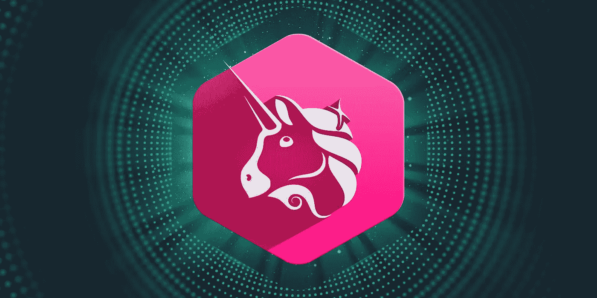

# 什么是 Dao，为什么它们很重要？

> 原文：<https://medium.com/coinmonks/what-are-daos-and-why-are-they-important-f18cc676d744?source=collection_archive---------30----------------------->

## 人类合作的前沿。

Decentralization. Credit: [Vecteezy](https://www.vecteezy.com/vector-art/7494772-nft-non-fungible-token-infographic-with-lines-and-dots-network-pay-for-unique-collectible-in-video-game-art-isometric-vector-illustration-of-nft-with-blockchain-technology-for-web-banner-template).

随着 web3 的出现，分散自治组织(Dao)应运而生。如果你是 web3 的新手，你可能听说过这个术语，但你可能不确定它的意思。它通常被附加在协议名的后面，如 MakerDAO 或 PleasrDAO。在这篇文章中，我将向您简要介绍 Dao 是什么，以及为什么它们对 web3 和全球协作的未来如此重要。

# 道是什么？

Dao 是人们在数字世界中组织和与志同道合的个人一起工作的一种方式。这是一个集体所有的组织，没有集中的领导，存在于区块链。所有的决定都是由集体做出的，没有多数人的同意，任何一个领导者都不能做出决定。Dao 是不可信的集体治理，具有检查和平衡，由代码保护。

大多数 Dao 都有一个公共资金库，只有在集团批准的情况下，或者在基础代码允许的特定情况下，才能访问该资金库。

类似于 NFTs，DAOs 治理规则是基于代码的。NFT 的基本智能合约决定了它们的特征，而治理 DAO 的智能合约为组织奠定了统治框架，决定了如何做出决策、如何提出治理建议以及投票规则。多亏了区块链，管理 DAO 的智能合约是开源的，任何人都可以从任何地方查看和审计。可以把 DAO 的智能合约想象成相当于美国宪法。它告诉你作为道的公民你的宪法权利是什么。

许多 web3 应用和 DeFi 协议都是以 Dao 的形式构建的。通常，它们是由一个集中的组织开发的，然后被放在“野外”，从那时起，它们被它们的管理社区所控制。

要成为 DAO 的所有者并拥有投票权，您通常需要持有治理令牌。这些是具有特定用途的加密货币。它们不一定是为了盈利而交易的，尽管有几个治理令牌在加密牛市中取得了重大收益。

[Uniswap](https://uniswap.org/). Credit: [SwissBorg](https://swissborg.com/blog/what-is-uniswap).

例如， [Uniswap](https://app.uniswap.org/) 是一个自动做市商，允许人们通过 web3 生态系统交易代币，以换取少量交易费。传统上，这将作为一个集中的利润交换与业主和集中的领导。领导团队将决定公司的发展方向，并规定利润的支出方式。另一方面，Uniswap 由 UNI 令牌持有者所有。令牌持有者在 Uniswap 论坛上讨论协议的想法和方向，有时还会提出治理建议。当提案提交后，UNI token 持有者可以前往 [Uniswap 投票仪表板](https://app.uniswap.org/#/vote?chain=mainnet)对提案进行投票。多数票决定提案的结果和协议的未来方向。

# 它们为什么重要？

如前所述，传统组织遵循集中治理的层级结构，在这种结构中，一小群高管做出大部分决策。这种结构在组织中实现了令人难以置信的效率和速度。纵观经济史，传统的公司结构已经演变成一种稍微分散的经营方式。[你可以在无银行网站上阅读关于公司性质的整篇文章。](https://newsletter.banklesshq.com/p/why-daos-are-the-new-firms)

然而，在今天的数字社会中，许多新企业都是在网上成立的。从未谋面的人们因为一个共同的目标而联系在一起，并一起创建了一个组织。这带来了新的挑战，需要极大的信任。但是你怎么能相信一个你从未见过的人呢？在某些人眼中看到的真相可能是伪科学和直觉的混合物，但这是有道理的。

有了 DAOs，这不再是问题。您不必信任与您一起工作的任何人，您只需要信任管理组织的智能契约代码。这段代码是 100%透明的，任何人都可以公开验证。这对人类合作的未来有着深远的影响。Dao 本质上消除了全球范围内合作的障碍。

假设你住在伦敦，对气候恢复充满热情。你可以加入一个论坛，和志同道合的人联系。你会在洛杉矶找到一个和你一样热衷于恢复自然环境的人。通过建立一个 DAO，您可以建立一个会员和捐赠机制，使您能够将资金集中捐赠给世界上最重要的项目。任何人都可以捐钱，该组织将通过治理提案决定如何最好地使用这笔钱。智能合约代码可防止任何一方在未经集团同意的情况下获取资金。此外，道的所有活动都在区块链上进行，对公众完全透明，因此任何时候资金被花费或转移，每个人都知道。

DAO 中的每个成员通常都有一个共同的目标，并且会根据实体的最大利益行事。显而易见，这显然不同于当今全球企业的运作方式，在当今的全球企业中，决策往往是为了少数人的最大利益而做出的。“道”的概念可能有一天会进入政治领域。利用 DAOs 的技术结构可以对我们如何治理世界各国产生深远的影响，并带来更纯粹的民主形式。

# 探索流行的道

为了更好地理解 Dao 是什么以及它们是如何操作的，我推荐今天查看几个流行的 Dao。现在有数以千计的 Dao 在运行，所以我在下面列出了几个，建议您查看一下。

[**【马克尔道】**](https://makerdao.com/en/)一个分权而不偏的财政体系，负责稳定货币的戴。

**全球加速气候金融。挑战气候变化。**

****未来分散的世界储备货币。****

****[**BanklessDAO**](https://www.bankless.community/)Web3 媒体和社交 DAO 肩负着搭载下一个 10 亿人口的使命。****

****[**git coin**](https://gitcoin.co/)web 3 中的公共产品资助。****

****如果你想探索更多的[道，你可以前往 DeepDAO](https://deepdao.io/organizations) 。您会发现现有的所有 Dao 的列表，并且可以按照国库价值、治理令牌持有者、活跃成员等等对它们进行排序。****