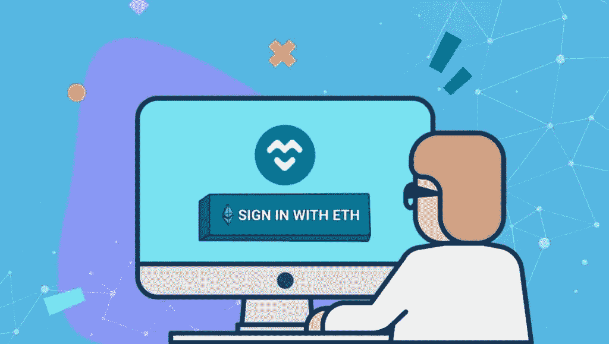

# 什么是分散的 Web3 域，它们的未来是什么

> 原文：<https://medium.com/coinmonks/what-are-decentralized-web3-domains-and-what-are-their-future-52e66a20e2e6?source=collection_archive---------11----------------------->

# Web3 域

> 随着元宇宙的发展，互联网的技术也在不断发展。Web3 技术正处于开发阶段，很快将取代现有的 Web2 技术。在这篇文章中，我们将讨论什么是 Web3 域名以及如何注册它们。

# 什么是 Web3 域？

标准域名系统(DNS)地址(如 Cointelegraph.com 或 newslack.io)不同于 Web3 域。DNS 就像一本电话簿，但它不是列出电话号码，而是索引公共网站及其 IP 地址。对于 Web3 区块链域名系统，记住一个较短的短语就足够了。

术语“Web3”是指即将到来的 Web 法律、技术和货币架构版本，包括加密货币、智能合约和区块链技术。Web 3 上的项目可以分为数字服务、分散金融(DeFi)和收藏品等。

分散加密域不是提供人类可读的字符集合作为 IP 地址，而是用人类可读的地址代替您的加密钱包。在 Solana 的 Solsea 或 OpenSea 等交易所，这些 Web3 域名可以作为不可伪造的令牌(NFT)或有效的数字证书进行交易。其他 Web3 域扩展包括. crypto、.道，和. eth

一个代表区块链地址的 Web3 域名很有吸引力，原因显而易见。例如，对于发送者来说，记住并执行命令“将薪水发送给 bob.eth”要比背诵一些晦涩的 42 个字符的加密钱包地址简单得多。

Web3 有时被称为“读写信任网络”和“去中心化网络”，旨在从亚马逊、谷歌和微软等垄断性科技巨头手中夺回用户数据和内容的控制权，并从他们手中夺取网络控制权。Web3 DNS 在哪些方面与传统域名不同，Web3 将如何运行？

如今，传统区块链的局限性使其难以使用，并降低了其吸引力。典型的钱包地址是这样的:“0x 483 add 48 edbd 9 f 83 FB 5 db 0289 c 7 ed 48 c 83 f 56992”。

这会吓跑普通人，从而阻止收养。为了得到广泛应用，互联网必须克服这个与 IP 地址相关的问题。

区块链企业需要名称服务来创建跨公共地址的数字身份。与一串随机的字母和数字相比，一个有名字的地址对客户来说也更简单。受 DNS 影响的分层名称空间的一个例子是分散的 Web3 名称服务，如 RIF 名称服务。RNS 设计的目标是提供一个可以应用于资源的命名方案。

# 什么是 ENS，它是如何工作的？

以太坊名称服务(ENS)的主要目标是将名称转换成机器可读的标识符，例如以太坊地址。

任何人都可以购买、拥有、管理自己的域名，并根据需要将其从一台主机迁移到另一台主机。他们还拥有对所有底层数据的完全控制权和所有权。网络最初是一个基于 DNS 的分散系统。分散的 Web3 名称服务运行，但如何运行？

基于以太坊的新名称服务 ENS 已经引起了社区的极大兴趣。一项名为以太坊名称服务的 Web3 区块链技术使用户能够创建他们自己独特且容易记忆的用户名。

因此，通过使用以太坊智能合同来控制域名注册和解析，ENS 旨在提供一种替代 DNS 的补充方案。您可以使用服务(DWebs)为您的所有电子钱包地址和分散的网站提供单一名称。例如，“alex.eth”使您能够在分布式环境中识别并轻松找到钱包地址。

# 什么是？eth 域名用于？

ENS 可用于将冗长的数字转换成易于记忆的术语。因此，出错的机会更少，体验更直接。

ENS 域所有者也可以创建子域，并向它们分配附加数据。然而，它并不总是必须是一个钱包地址。相反，可以使用它来引用智能协定、元数据或事务。

传统域名投资者和区块链企业家这两个极其激动人心的市场在 ENS.eth 域名的交汇处相遇。可悲的是，尽管全球有数百万区块链用户，但只有很少的区块链域名被注册。

正如区块链用户发现的那样，选择一个区块链域名会让他们的应用程序更容易使用，而且现在对域名有相当大的被压抑的需求。与传统域名一样，你也可以出租你的区块链域名，甚至可以建立一个租赁购买协议，让其他人在你的财产上建立品牌价值，同时保持你的选择开放。

# **如何注册 A .ETH ENS 域名？**

***通过 ENS 服务，Web3 域名的想法可以变成现实。如果您对加密货币感兴趣，请继续阅读以了解如何获得 Web3 域名。***

## 1.登录启用以太坊的浏览器

为了购买 ENS 等 Web3 域名，您的钱包中至少需要有少量 ETH 来支付交易费用和您的 [NFT](https://koop360.com/blog/social-media-are-simplifying-nft-trading/) 域名的第一年年费。您还需要使用与您希望获得的域名相同的钱包登录您的以太坊浏览器。

在台式机上，这可能是勇敢的加密钱包功能激活或加载元掩码插件的 Chrome。您也可以使用任何移动以太坊浏览器、TrustWallet、比特币基地钱包、MetaMask Mobile 或其他钱包。

## 2.导航到 ENS 管理器以获得您想要的。eth 名称

在点击“搜索”按钮之前，在 [app.ens.domains](https://app.ens.domains/) 网站的“搜索名称”区域输入您想要的. eth 名称(如 ayelyn.eth)。

## 3.选择时间间隔并启动注册方法

**注册你的 ENS 名字**

使用“-”和“”按钮，选择您希望首次支付年费的年数。姓名必须在 ENS 经理处注册至少一年。通过付费，你可以再注册一年。您可以选择推迟注册期的结束时间。

必须点击右下角的蓝色“请求注册”按钮。如果您选择 MetaMask 作为您的钱包，将会出现一个对话框，要求您确认交易。点击“确认”按钮提供证据。要“完成注册”，请等到绿色条穿过“请求注册”和“等待一分钟”

## 4.完成注册过程

当您的等待时间结束时，会出现橙色字体“点击注册进入第三步”。接下来，选择相邻的蓝色“注册”按钮。

您将看到一个新的 MetaMask 窗口，要求您完成交易，以确定您的姓名并支付注册费。从下拉选项中，选择“确认”管理页面上的“注册”按钮将被“发送待定”取代。交易确认后，您的名字将被注册。

# **结论**

类似于 PayPal 可能被用来以加密货币支付朋友的午餐，以太坊名称服务旨在使加密货币交易更加实用和可用。

ENS 是区块链技术易用性的一大进步。随着 ENS 的使用和日益流行，我们可能会看到 ENS 名称的增加，就像我们不再使用 IP 地址访问网络一样。

由于 Web3 托管，商业将变得更加开放和以用户为中心。在未来，人们、应用程序和网站将使用基于区块链的域名，让用户访问分散的网络。这为区块链打开了大门。

元宇宙最新的交易工具是加密货币和 NFT。 [**KOOP360**](https://koop360.com) NFT 创作平台可用。这个平台非常适合实现元宇宙和 NFT 生态系统的定制增长，因为它是开源和分散的。人们可以通过使用人工智能/人工智能技术简单地实现他们的想法。

> 交易新手？尝试[加密交易机器人](/coinmonks/crypto-trading-bot-c2ffce8acb2a)或[复制交易](/coinmonks/top-10-crypto-copy-trading-platforms-for-beginners-d0c37c7d698c)