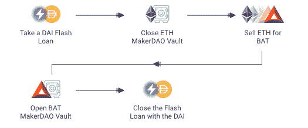
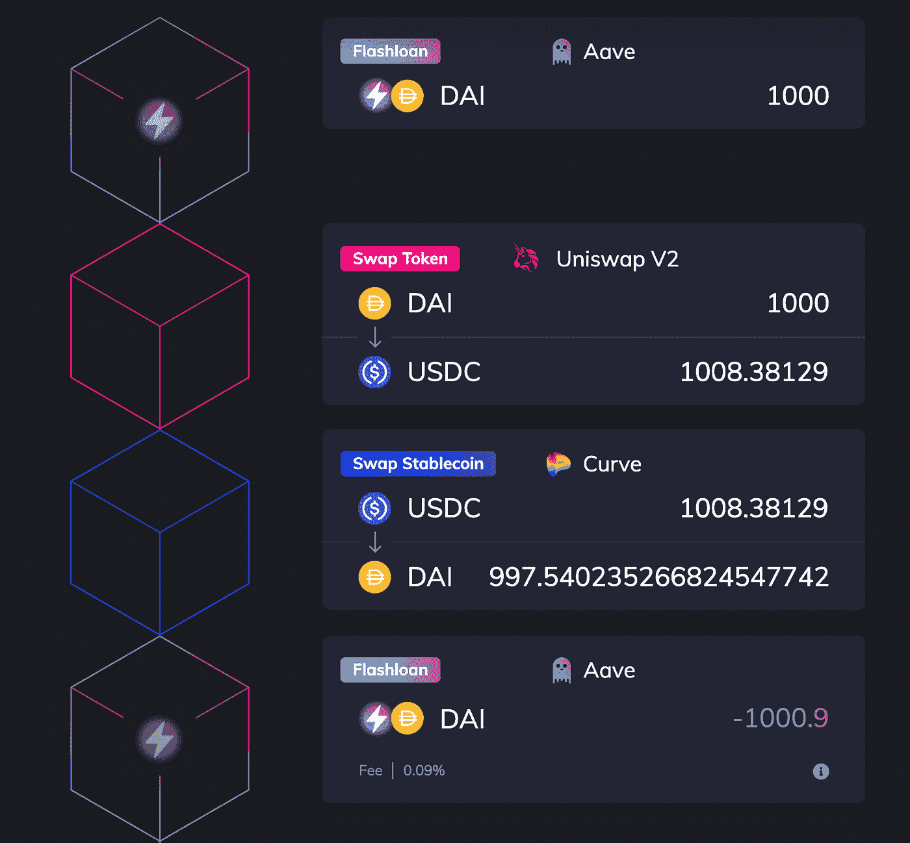

# 什么是 DeFi 闪贷？不投资赚几百万。

> 原文：<https://medium.com/coinmonks/what-are-defi-flash-loans-make-millions-without-investing-99ed11b2bb8d?source=collection_archive---------7----------------------->

我们都同意，区块链和他们的产品是迷人的技术，除非你是婴儿潮一代，更喜欢经典的传统金融。这没什么大不了的。当你读完这篇文章的时候，我相信你会考虑加密。

通过传统银行获得贷款需要一系列文件。区块链技术引入闪贷；顾名思义，这种贷款是立即提供的，必须在几秒钟内偿还。因为它们是基于 Defi 技术的，所以它们在密码世界中无可否认是独一无二的，许多人声称它们非常有价值。

分散金融，或 Defi，是一个宏伟的区块链技术部门，旨在分散金融工具和工具，如贷款和货币兑换。这种魅力才刚刚开始，而且它会一直存在，所以请继续关注它；在这个市场赚钱从来都不是一个坏主意。

# 闪贷是 defi 技术中最具争议的功能之一

用基本术语来说，闪贷就是无抵押、即时的贷款(没有抵押物、没有授权的贷款)。你将不必提交任何繁琐的文书工作来获得这笔钱-要明确的是，无论你是无家可归还是肮脏的富人，你都可以获得价值数亿美元的贷款，而不必回答一个问题。

# 这项技术的独特之处是什么？

*   **智能合约**

智能合约是大多数区块链使用的一种技术，用于确保在满足一组特定条件之前不会转移资金。

*   **无抵押贷款**

与传统贷款不同，闪贷是无担保的，这意味着不需要抵押品。

*   **即时交易**

智能合同允许快速贷款比传统贷款处理得更快。贷款到手，必须在几秒钟内偿还。

别担心。我知道你在想什么:“让我拿着贷款永远不还，这样我就可以买一辆新的布加迪了。”

## **不，那不行……**

# **不还怎么办？**

那么你将无法在第一时间获得贷款。

如前所述，整个闪贷是在一次交易中完成的。如果借贷双方都不遵守规则，贷款就不会发放，这就是智能合同的好处；除非所有条件都满足，否则不会允许资金流动。

因此，如果借款人在同一笔交易中没有立即还钱，智能合同将简单地撤销交易，并将钱退还给贷款人。

# 办理闪贷有什么好处？

交易者可以获利，而不会将资金置于风险之中。快速贷款可用于各种目的，包括:

## **。套利**

交易员通过识别交易所之间的价格差异和利用时间的推移，从快速贷款交易中获利。例如，如果一枚硬币的价格在两个交易所之间变化，交易者可以使用快速贷款借入他们想要的数量，比如 100 万美元，并使用第二个智能合约在一个交易所以 1 万美元购买代币，在另一个交易所以 1.1 万美元出售，从而获得 10 万美元的利润。然后，交易者偿还贷款并保留利润。然而，当市场高度波动时，这通常最有效。

## **。变更抵押品**

交易员可以使用快速贷款来快速替换低质量的抵押品，使他们能够用更高质量的抵押品来支持贷款。

## **。降低交易费用**

由于快速贷款推广将所有复杂的操作合并到一个步骤中，所需的汽油费用相对较低，而标准交易通常涉及多个阶段。交易者还可以通过使用闪贷服务买卖数字货币和代币来节省汽油费用。

# 快速贷款交易的风险

几年来已经发生了几次针对闪贷的攻击，由于 Defi 协议不完善，造成了数百万美元的损失。恶意行为者继续开发各种方法，以各种方式利用贷款流程；因此，以太坊网络和 Defi 的基础技术通常需要一些改进。

智能合同并不总是被恰当地构建，从而导致黑客可以利用的安全缺陷。此外，提供的数据有时不正确或不安全，使合同容易受到攻击，并使网络犯罪分子能够带走数百万的借贷资金。

# **没有代码可以用吗？**

是的，已经有一些工具可以让最终用户从快速贷款中受益，比如 collateralwap 或 defisaver。

甚至可以通过用户界面(如 furucombo 提供的界面)使用没有编码技能的闪贷

# 结论

快速贷款是奇妙的金融工具，展示了 Defi 的力量和它给金融界带来的创新。同时，很明显，现在这个领域的每个人都有几个机会，最终会使金融世界自由化。

同样重要的是要记住，快速贷款仍处于早期阶段，它们的实际意义还有待彻底研究。但是闪贷前景看好，所以继续关注。

> 交易新手？尝试[加密交易机器人](/coinmonks/crypto-trading-bot-c2ffce8acb2a)或[复制交易](/coinmonks/top-10-crypto-copy-trading-platforms-for-beginners-d0c37c7d698c)