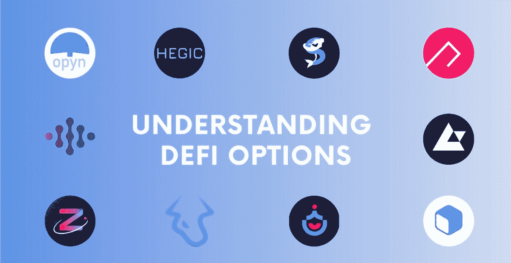

# 什么是 DeFi 选项库(dov)？

> 原文：<https://medium.com/coinmonks/what-are-defi-optionvaults-dovs-f0c42af335d5?source=collection_archive---------28----------------------->

期权是一种交易产品，可以用来押注市场方向，从波动中获利。期权可以提供卓越的风险调整回报，这种产品是 TradFi 中产生回报的重要来源，特别是在股票中，但是，由于期权交易很复杂，因此很难正确使用期权交易。