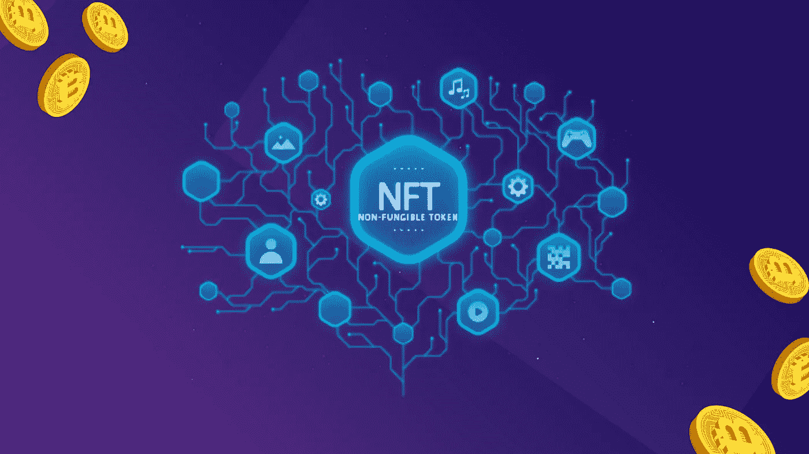
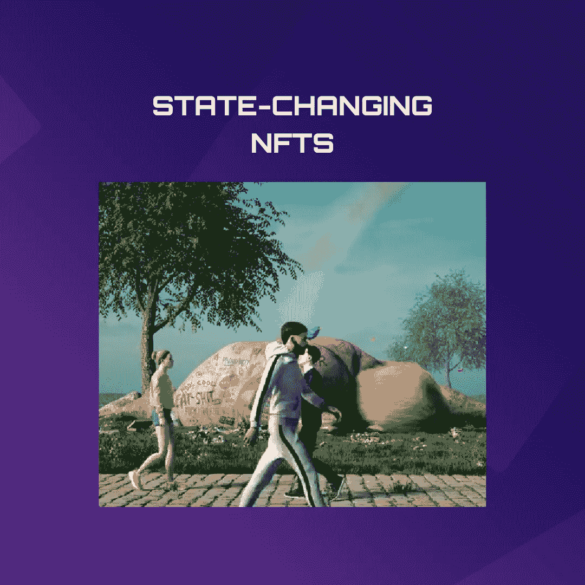
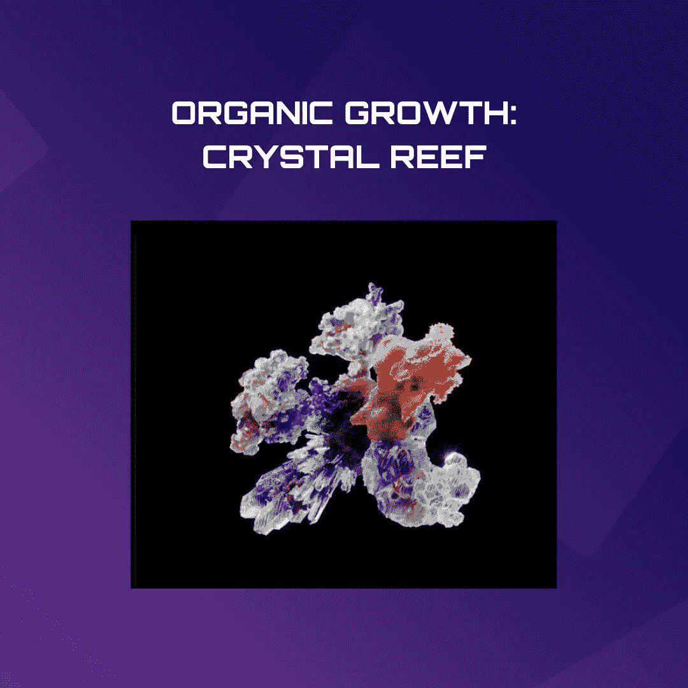
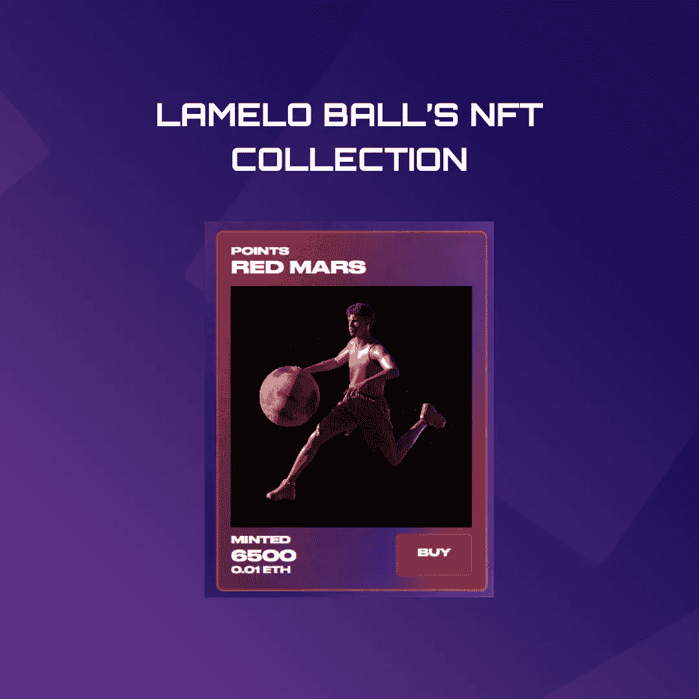
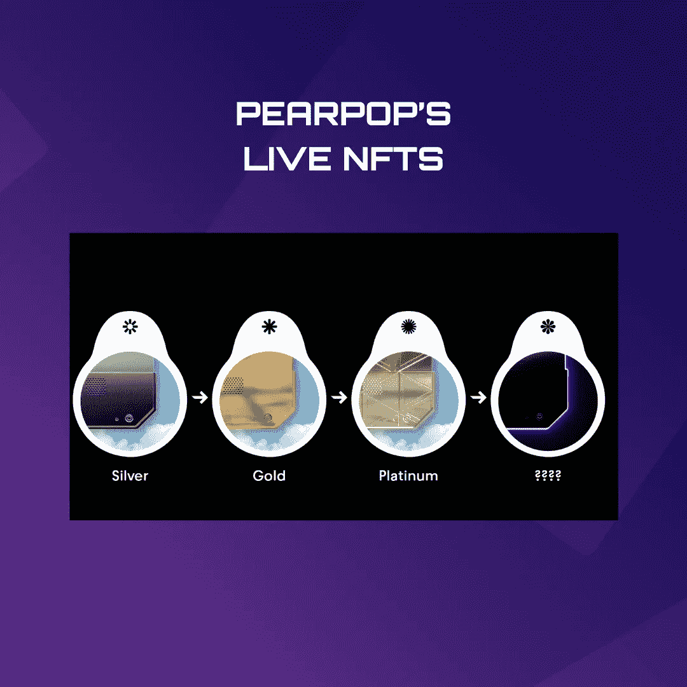

# 什么是动态 NFT，它们是如何工作的？

> 原文：<https://medium.com/coinmonks/what-are-dynamic-nfts-and-how-do-they-work-c649ae08c4?source=collection_archive---------17----------------------->

虽然所有的 NFT 都被永久记录在区块链上，但这并不意味着它们都是恒定不变的。事实上，有一个完整的动态 NFT 子类，也称为动态 NFT，它可以根据创建者编程的特性和属性随时间变化和进化。与 CryptoPunks 等典型的个人资料图片(PFP)倡议(保持静态)相比，一个实时的 NFT 完全是动态的。活的非功能性交易为持有者提供了有趣的新方法，将他们的线上和线下行为和行动与他们正在积累的非功能性交易联系起来。

那么，动态的 NFT 和标准的 NFT 有什么不同呢？简而言之，动态 NFT 的元数据可能会根据各种因素而改变，例如时间、其他 NFT，或者更常见的是外部数据，例如从跟踪实际数据的源收集的数据，如风向标或实况体育比分。例如，个人资料图片的服装可能会根据特定地理位置的天气变化而变化，或者玩家的表情可能会根据他们最近一次游戏的结果而变化。所有这一切都是由活体 NFT 实现的，活体 NFT 使用智能合约将这些组件包含到 NFT 的元数据中。

# 状态改变 NFTs

数字艺术家 Mike Winkelmann，通常以艺名 Beeple 为人所知，制作了第一个可以改变其状态的 NFT。2020 年末，就在美国总统大选之前，皮普尔创作了名为[十字路口](/@orbis86/all-you-need-to-know-about-the-most-expensive-nfts-ever-sold-df2d7bda6657?source=user_profile---------12----------------------------)的艺术品——这是一个 NFT，旨在根据大选结果改变其外观。如果美国前总统唐纳德·特朗普(Donald Trump)击败了乔·拜登(Joe Biden)，NFT 可能会播放一部特朗普臃肿的身体在公园里溃烂的动画。人们只需要轻轻一按开关就能做到这一点。此外，如果特朗普赢得第二个任期，NFT 将永远播放他像哥斯拉一样冲过地狱景观的视频。

当然，正如现在在皮普尔的《NFT》中所看到的，拜登击败了川普。然而，比普尔在此之前卖掉了他的 NFT，向潜在客户证明，即使他们不知道他们最终可能会购买哪辆 NFT，这样做也有助于保留某个特定的时刻。在 Beeple 以 66，000 美元的价格出售 Crossroad 后，它以 660 万美元的价格(打破了当时的纪录)被转售，这表明至少有一名竞标者的积极性很高。虽然在当时毫无疑问是有争议的，但是 [Beeple 的 live NFT](https://www.niftygateway.com/marketplace/item/0x12f28e2106ce8fd8464885b80ea865e98b465149/100010001) 只是暗示了具有状态改变能力的 NFTs 的潜力。使用可编程智能契约，开发人员可以创建 NFT，这些 NFT 可以根据他们有能力编写的任何内容自动更新自己。

# 有机生长:水晶礁

另一个动态 NFT 的例子是[有机生长:水晶礁](https://ogcrystals.com/)，由 Michael Joo、Danil Krivoruchko 和 Snark.art 创作的生殖艺术作品，包含 10301 个 2021 年 10 月铸造的 3D 晶体。这些水晶最终将发展成为一件公共艺术品。这些水晶最终将被转化为有形的雕塑，并被运往世界各地的博物馆和美术馆，供有兴趣观看的人欣赏。这个概念是，艺术家可能会购买某种“种子晶体”，几天后，它会变成一种特殊的 OG:Crystal，可以反映所有者。智能合约的算法将根据每个钱包的历史和 ID 构建水晶的轮廓。例如，隐朋克持有者有机会给他们的水晶添加一种独特的形式。在首次出售后，一种算法会在三个月内每次连续出售后定期向晶体中添加额外的比特。水晶会在这一点上“锁定”到位，使雕塑家能够将其融入雕塑。

# 拉梅洛·鲍尔的 NFT 收藏

活着的 NFT 可以使用来自一个人实际生活的信息，除了处于真空中，时间的流逝是唯一影响他们突变的事情。2021 年 NBA 年度最佳新秀拉梅洛·鲍尔拥有一套由 Playground Studio 在 2021 年发布的[收藏 NFTs](https://lameloball.io/#/) ，这套 NFTs 将根据他的表现得分，这些信息来自 Chainlink Sports 的数据馈送。每当夏洛特黄蜂队的球员帮助进球时，持有者可能会选择收集“银月”，或者每当拉梅洛从对手那里偷球时收集“蓝色海王星”。如果某些条件得到满足，NFT 化身也可能完全进化成别的什么东西。

这种策略提供了一种处理数字贵重物品的新方法。在现实世界中，增加一个人收集棒球卡或艺术品的唯一方法就是购买新的东西。拥有一个随时间而变化的收藏的机会只有活着的 NFT 才能提供。2022 年，NBA 还推出了协会，这是一个动态 NFT 的集合，其中每个 NFT 代表属于 16 支参赛球队之一的球员。NFT 根据球员的表现在季后赛中改变它的外观。盖帽、扣篮、助攻、篮板、三分球改变了个人形象，而球队的表现改变了 NFT 的背景和“框架”。

# Pearpop 的现场 NFTs

由 Reddit 的发明者亚历克西斯·奥哈尼安和企业家马克·库班创建的, [Pearpop 的 live NFTs](https://pearproof.com/) 将于 2022 年向艺术家开放。这些基于 Solana 的 NFT 是动态的，因为它们利用来自 web2 元数据的信息，包括喜欢、评论和分享，随着帖子变得流行而增加排名。每一个等级，包括银级、金级和白金级，都给予其拥有者额外的奖励，例如进入专属的 Discord 频道。无论是实现篮球抱负的 NBA 球员，还是博客作者的社交媒体帖子，在这两种情况下，“活着”的不是 NFT，而是数据的来源。

# 结论

由于动态 NFT 因源数据本身而存在，因此建设者和 Dao 可能会利用这一创新来创建有围墙的社区、极具排他性的奖励以及新的游戏选项。这表明，实时 NFT 使用的数据来源将始终是影响其发展的一个因素。自然，这也提供了一个可能的故障点，如果一个活动的 NFT 数据点不复存在，那么 NFT 本身也将不复存在。

> 交易新手？试试[密码交易机器人](/coinmonks/crypto-trading-bot-c2ffce8acb2a)或者[复制交易](/coinmonks/top-10-crypto-copy-trading-platforms-for-beginners-d0c37c7d698c)