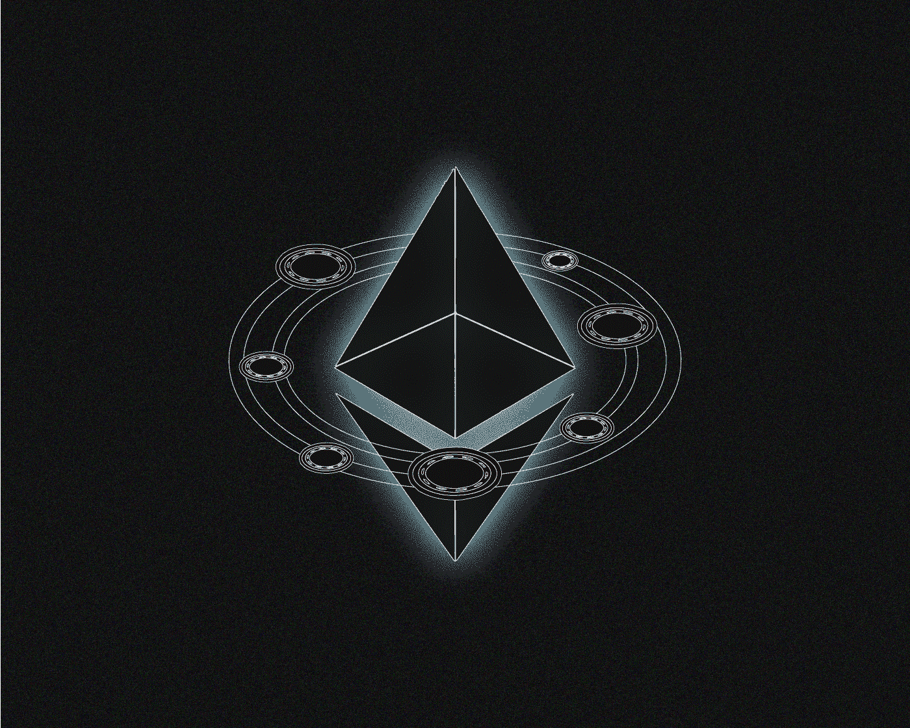

# 什么是 ERC 20 代币？

> 原文：<https://medium.com/coinmonks/what-are-erc-20-tokens-afcccbc53962?source=collection_archive---------38----------------------->

ERC-20 是基于以太坊的智能合约的流行标准。为什么这么受欢迎？它是如何工作的？我们来想办法吧！

**ERC-20** **20** 是在创建负责参数和新用户令牌发放的契约时要遵循的一组规则。

该标准极大地简化了创建新加密货币的过程。

在以太坊网络上，各种 ERC-20 代币可以转移并存储在同一个地址。

任何开发者都可以在不需要单独的区块链的情况下发布他们的数字资产，这已经成为加密货币历史上的一个转折点。

# **ERC 20 是什么意思？**

**ERC** (以太坊征求意见)是一个官方协议的名称，用于提出改进以太坊的建议。 **20** 是提案的编号。

# **ERC-20 是怎么出现的，什么时候出现的？**

引入用户令牌单一标准的提案最早于 2015 年 11 月**发布[。它的作者是以太坊的创造者**维塔利克·布特林**和开发者**法比安·沃格斯泰勒**。](https://eips.ethereum.org/EIPS/eip-20)**

ERC-20 已经成为创造可互换代币的指南——相同的代币可以互相交换。

尽管 ERC-20 令牌在以太坊团队建立的框架内工作，但这个框架相当广泛，在创建它们时给予开发人员更大的灵活性。

# 我们为什么需要 ERC-20？

比特币为其他加密项目建立了范式:为了发行任何数字货币，必须推出一个单独的区块链。

这个规则已经被以太坊打破了。智能联系人使您能够创建令牌，并在您自己的应用程序中为其分配独特的有用功能。

然而，在 ERC-20 之前，令牌兼容性存在问题，因为每个令牌都有一个唯一的智能合约。换句话说，为了让交易所或钱包支持令牌，创建者每次都必须编写新代码。

因此，支持越来越多的令牌变得越来越困难。因此，开发了用于所有令牌的标准协议。

ERC-20 协议极大地简化和统一了单一网络内的代币发行。这个标准和智能合约一起，已经成为使用区块链创建和盈利应用的通用方式。

# **哪些代币有 ERC-20？**

许多流行的加密货币都使用 ERC-20 标准。这在分散融资(DeFi)及相关领域尤为普遍。此外，ERC-20 用于流行的加密货币项目中的管理令牌。这里有几个例子:

*   **制造者(MKR)**
*   **系绳(USDT)**
*   **链环(LINK)**
*   **沙箱**
*   **图表(GRT)**
*   **UNI WAP(UNI)**
*   **轴无限(AXS)**
*   **Aave (AAVE)**
*   **猿类(APE)**
*   **基本注意力令牌(BAT)**
*   **复合(COMP)**
*   **OMG 网络(OMG)**
*   **向往.金融(YFI)**
*   **1 英寸(1 英寸)**
*   **金恩硬币(ENJ)**

# 在哪里存放 ERC-20？

ERC-20 标准的流行钱包有 **Metamask、Trust Wallet、Exodus、MyEtherWallet** 。

一些钱包的界面只显示 ETH 余额，尽管 ERC-20 也可以存储在其地址上。在这种情况下，只需将其导出到支持所需资产的钱包中。

# 在哪里可以找到更多关于 ERC-20 转移的信息？

以太坊块浏览器允许您查看任何 ERC-20 令牌的交易详情，如[以太扫描](https://etherscan.io/)。在同一位置的[单独部分](https://etherscan.io/tokens)中有关于该标准所有资产的链上数据。令牌页面显示持有人的数量、每个地址的令牌分布以及资产智能合同的链接。

# **ERC-20 协议的主要特点是什么？**

该标准为任何智能合约指定了六个强制参数和三个可选(但推荐)参数。

所需参数包括:

*   **total supply 函数**，其负责代币的总发行，确保一旦达到最大数量就不能创建新代币。
*   **balance0f** 确定分配给特定地址的令牌的初始数量。这通常是属于发行者的地址。

该标准还指定了两种移动令牌的方法。转移功能允许将令牌转移给用户，资产交易需要 transferFrom。

还需要两个函数来验证前两种令牌移动方法:

*   **approve** 用于验证基于总发行的智能合约是否可以分发令牌；
*   **津贴**需要验证是否有足够的余额将代币发送到另一个地址。

可选参数包括令牌及其报价器的名称，以及确定小数点后小数位数的最大值(例如，比特币有八个这样的数字— **1.00000000 BTC** )。

这些易于实现的参数允许您维护与任何 ERC-20 智能合约交互的单一代码库。

> 在跟踪更新方面，订阅我们的[媒体提要。](https://medium.com/sunflowercorporation)敬请期待！
> 
> 您也可以在我们的平台[向日葵公司](https://sunflowercorp.com/)上尝试使用加密货币。

# **使用 ERC-20 代币有什么风险？**

因为 ERC-20 代币实际上是智能合约，尽管有效，但它们确实有一些风险。例如，智能合约一旦启动就无法更改。它也可能有缺陷和漏洞。

最著名的例子之一是 DAO 项目的黑客攻击，导致投资者 5000 万美元的加密货币被盗，不得不借助以太坊硬分叉进行补救。

在极少数情况下，骗子会故意在他们的令牌的智能合约代码中包含此类参数，利用这些参数来窃取持有者的资金或实施抽水转储方案。

> 交易新手？尝试[加密交易机器人](/coinmonks/crypto-trading-bot-c2ffce8acb2a)或[复制交易](/coinmonks/top-10-crypto-copy-trading-platforms-for-beginners-d0c37c7d698c)