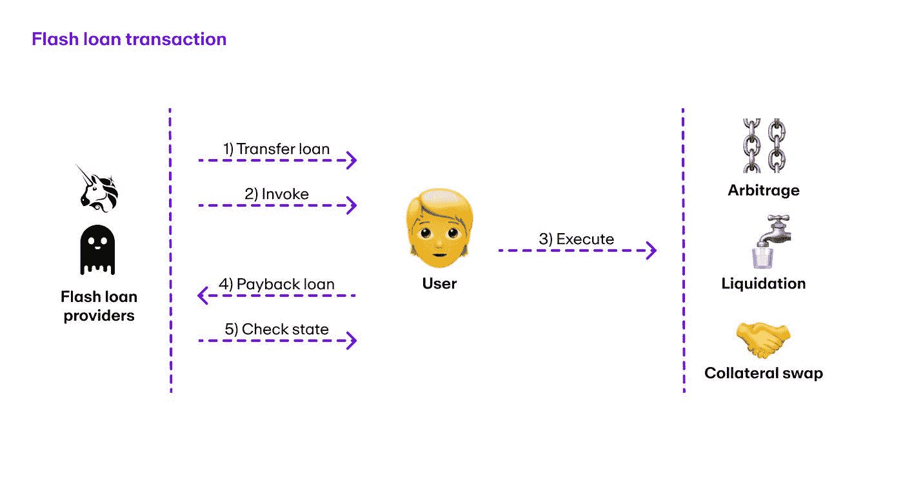

# Defi 中的快速贷款是什么&它们是如何工作的？

> 原文：<https://medium.com/coinmonks/what-are-flash-loans-in-defi-how-do-they-work-1211715a4489?source=collection_archive---------14----------------------->

## 精通轨迹

## 简要解释什么是闪贷，它们如何工作，其使用案例&了解闪贷攻击。

Photo by [Brandon Morgan](https://unsplash.com/@littleppl85?utm_source=medium&utm_medium=referral) on [Unsplash](https://unsplash.com?utm_source=medium&utm_medium=referral)

# 介绍

快速贷款是一种革命性的直接从区块链借贷资金的新方式，已经在区块链的许多分散融资(DeFi)项目中流行开来。

> 快速贷款是一种无抵押贷款，在同一笔交易中批准、执行/使用和偿还，通常持续几秒钟(以太坊大约 13 秒)

这项技术使用户能够在不需要提供抵押品或等待贷款批准的情况下借款数百万美元，但有一个问题:你必须在同一笔交易中偿还贷款。
如果用户无法在交易完成前偿还贷款，智能合约会取消交易，并将钱返还给贷款人。

在传统银行业务中，如果你想申请贷款，需要提供几份文件，包括正式的身份证和收入证明。在快速贷款的情况下，这些都是不必要的。顾名思义，这种贷款可以即时发放，让用户快速获得资金

# 闪贷如何运作？

在传统银行业务中，如果你想申请贷款，需要提供几份文件，包括正式的身份证和收入证明。在快速贷款的情况下，这些都是不必要的。顾名思义，这种贷款可以即时发放，让用户快速获得资金

为了与快速贷款出借人互动，借款人必须制定一份由 3 部分组成的合同——借、互动和归还。

这是快速贷款流程的样子:

**转移**:贷款提供者将请求的资产转移给借款者

**调用**:借款人调用预先设计好的操作

**运行操作**:用户与不同智能合约交互，执行套利、清算、抵押品互换等操作。用借来的资产

**偿还**:一旦完成，借款人将借入的资产归还给快速贷款提供者

**检查状态**:最后，闪贷提供商将检查他们的余额，如果借款人归还的资金不足，提供商将立即撤销交易。

# 这些闪贷怎么用？

Photo by [Christian Holzinger](https://unsplash.com/@pixelatelier?utm_source=medium&utm_medium=referral) on [Unsplash](https://unsplash.com?utm_source=medium&utm_medium=referral)

## 交易套利

如果你在 Gemini(一家加密货币交易所)以 100 美元买入 SOL tokens(索拉纳区块链的本地加密货币)，在比特币基地(另一家加密货币交易所)以 101 美元卖出，你将在交易中获利 1 美元。

通过闪贷，你可以借数百万美元来做这笔交易，让我们看看如何进行——你从 Aave(去中心化加密贷款平台)获得 1 亿美元的闪贷，收取借款金额 0.09%的小额费用(即 9000 美元)。现在你去双子座交易所购买价值 1 亿美元的 SOL 代币，在比特币基地以 1.01 亿美元卖出。恭喜你。！使用闪贷，你刚刚赚了 100 万美元。
现在你把 1 亿美元的贷款还给 Aave，加上 9000 美元的费用&享受你赚的利润，不用投入你的钱。

## 抵押品互换

这并不常用于盈利，但却是借贷的有用工具。假设你有价值 100 万美元的以太币，你想借出去赚取利息。为此，你向戴借了 80 万美元。现在，假设你决定用以太坊换另一枚硬币。要再次进入以太坊，你需要先偿还稳定币。然后，你可以用一枚新硬币交易以太坊&将新硬币放回借贷平台，然后你可以再次借回你的 80 万美元。

听起来很复杂？因为确实如此。这是一个漫长而复杂的过程。

但使用快速贷款，你可以在同一笔交易中同时完成所有这些，而不必经历这些多重步骤。

你可以简单地写一份快速贷款，借钱来偿还你的贷款，把你的以太币换成另一枚硬币，然后存回来，这样，你基本上就换出了你的抵押品，而没有触及你所借的真正的 80 万美元。

## 自动清算

你看好以太坊&相信它会上涨&还想从中赚取利息，所以你去年存了价值 20，000 美元的以太坊。但是你出于某种原因需要紧急资金&你根据你的以太坊贷款了价值 16000 美元的系绳(一种稳定币)。你把系绳提现，存进你的银行账户，然后用了钱。

一年过去了&你存入的价值 20，000 美元的以太坊现在价值 200，000 美元，但它被锁定为抵押品&为了得到它，你需要偿还你借的价值 16，000 美元的系绳，但你没有，因为你把它都提现了。

使用 flashloan 你可以解决这个问题。你用 16，000 美元的快速贷款来偿还你的贷款&拿回你价值 200，000 美元的以太坊。你立即拿走一些以太坊，用它交换系绳，偿还你贷款。

您已经设法释放了价值 184，000 美元的以太坊，而没有预先投入任何资金。

你清算了自己。

# 快速贷款攻击

Photo by [sebastiaan stam](https://unsplash.com/@sebastiaanstam?utm_source=medium&utm_medium=referral) on [Unsplash](https://unsplash.com?utm_source=medium&utm_medium=referral)

尽管快速贷款有助于降低市场的低效率，但它们也可能被用来严重利用小错误。

闪电贷款来自 DeFi 平台&用于在一个交易所操纵加密货币资产的价格，然后在另一个交易所快速出售。快速贷款攻击是最常见的 DeFi 攻击类型，因为它们执行起来最便宜，也最容易隐藏。自从 2020 年 DeFi 的人气飙升以来，他们一直在制造头条新闻，2021 年他们变得更糟，迄今为止损失了数亿美元。

## 对奶油金融的攻击

cream finance

2020 年，[奶油金融](/cream-finance/c-r-e-a-m-dairy-for-beginners-148aa7e5006f)平台发生闪贷。在这次攻击中，一个恶意行为人利用闪贷向奶油金融平台借了大量的戴(stablecoin)。攻击者然后使用 DAI 操纵平台上某些加密货币的价格，导致奖金飙升。

攻击者然后以人为抬高的价格出售加密货币，将利润收入囊中。完成交易后，攻击者偿还交易&然后消失，留下奶油金融平台承担损失。这次攻击从协议中提取了 3700 万美元& 2021 年，类似的攻击再次发生在 Cream Finance 上，这次将 9200 万美元转移到一个地址，2300 万美元转移到另一个地址。从这里，资金被分配到一系列不同的钱包。

像这样的快速贷款攻击可能很难检测和预防，因为它们涉及在几秒钟的极短时间内借入和偿还大量资产。这使得平台很难在攻击完成前识别和阻止攻击。因此，所有的 Defi 平台都需要实施强大的安全措施&让经验证的审计员定期进行审计，以防范此类攻击。

# 结论

尽管快速贷款最近因被用于利用易受攻击的 DeFi 协议而成为头条新闻，导致数百万美元的损失&面临许多批评，但支持者认为快速贷款是金融业套利和快速交易的创新和有用工具，这在区块链之前是不可能的。

总之，它们是用户快速安全地借贷资金的强大工具。然而，了解相关风险并负责任地使用它们是很重要的。

*感谢阅读！如果你喜欢这个博客，请点击* ***点击*** 👏 ***按钮和*** *分享它来帮助别人吧！欢迎发表评论*💬*下图。有反馈？下面我们连线上* [*推特*](https://twitter.com/web3maya) *。*