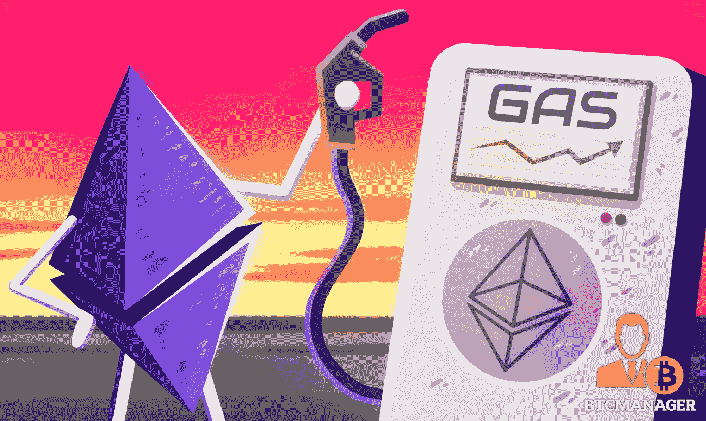

# 区块链网络有哪些燃气费？

> 原文：<https://medium.com/coinmonks/what-are-gas-fees-e4b664e47020?source=collection_archive---------47----------------------->

Image Reference : [https://crypto.news/ethereum-fees-record-high-defi-projects-network/](https://crypto.news/ethereum-fees-record-high-defi-projects-network/)

Gas 是以太网中使用的一个术语，指的是处理交易和执行智能合同所支付的费用。这些费用对于确保网络的安全和正常运行是必要的。

> 不知道什么时候买卖 cryp，试试[复制交易](http://coincodecap.com/go/bityard)。

当用户想要在以太坊网络上发送交易或执行智能合同时，他们必须指定气体限制和气体价格。气限是用户愿意为交易支付的最大气量，气价是他们愿意为每单位气支付的金额。

网络上负责处理交易和执行智能合约的矿商，将竞相把交易纳入他们开采的下一个区块。他们会选择天然气价格最高的交易，因为这对他们来说最有利可图。

为天然气支付的费用被用来激励矿工处理交易和保护网络。它们还包括运行网络的成本，如处理交易和执行智能合同所需的电力和计算能力。

没有天然气费，矿商就没有动力处理交易和保护网络。这可能会导致网络变得拥挤和缓慢，交易无法及时处理。

综上所述，以太坊网络中燃气费是必要的，以保证网络的安全和正常运行。它们激励矿商处理交易和保护网络，并支付网络运行的成本。

> 加入 Coinmonks [电报频道](https://t.me/coincodecap)和 [Youtube 频道](https://www.youtube.com/c/coinmonks/videos)了解加密交易和投资

# 另外，阅读

*   [如何购买 Monero](https://coincodecap.com/buy-monero) | [IDEX 评论](https://coincodecap.com/idex-review) | [BitKan 交易机器人](https://coincodecap.com/bitkan-trading-bot)
*   [CoinDCX 评论](/coinmonks/coindcx-review-8444db3621a2) | [加密保证金交易交易所](https://coincodecap.com/crypto-margin-trading-exchanges)
*   [红狗赌场评论](https://coincodecap.com/red-dog-casino-review) | [Swyftx 评论](https://coincodecap.com/swyftx-review) | [造币厂评论](https://coincodecap.com/coingate-review)
*   [Bookmap 评论](https://coincodecap.com/bookmap-review-2021-best-trading-software) | [美国 5 大最佳加密交易所](https://coincodecap.com/crypto-exchange-usa)