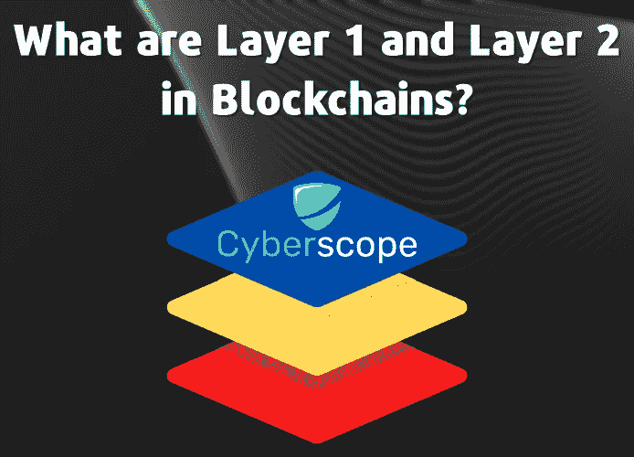
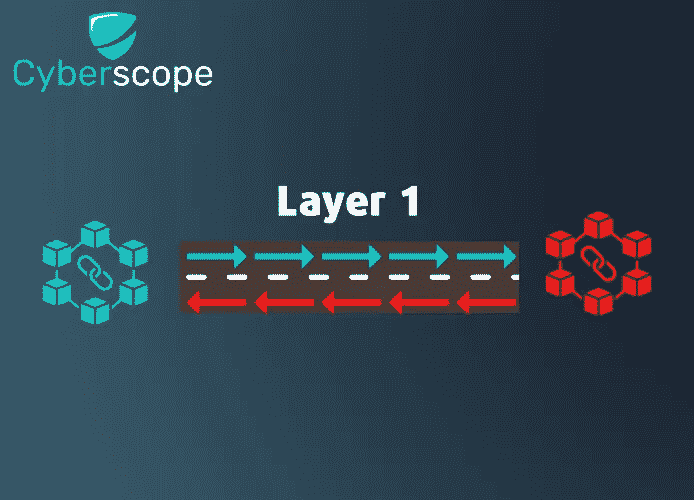
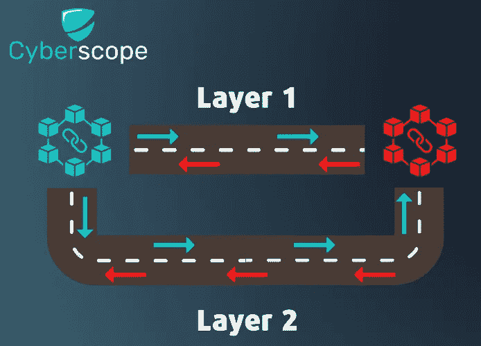

# 区块链的第一层和第二层是什么？

> 原文：<https://medium.com/coinmonks/what-are-layer-1-and-layer-2-in-blockchains-b5adfc22466e?source=collection_archive---------19----------------------->

# **简介**

你可能知道什么是区块链，而且很可能你现在正在使用它进行交易。您可能也听说过第 1 层和第 2 层这两个术语，但不知道它们到底是什么。在本文中，我们将解释在区块链技术中每一个代表什么，以及为什么第 2 层扩展解决方案在区块链的可扩展性和加密交易的整体效率中是重要的。

# 什么是可伸缩性，为什么它很重要？

完成区块链交易的所有步骤通常需要大量的时间和处理能力。区块链网络可能会被堆积如山的交易堵塞。在这种情况下，应用程序无法满足所有用户的所有事务请求。这造成了不公平的用户体验。因此，可扩展性是区块链网络未来的关键要求。

**可扩展性**是指区块链网络在不降低速度的情况下处理越来越多的交易的能力。通常，可伸缩性越高，服务就越好。

# **什么是区块链第一层和第二层？**

为了进一步分析网络的可扩展性是如何提高的，让我们弄清楚**层 1** 和**层 2** 代表什么。

区块链系统的第 1 层被称为区块链网络的基础层(主要结构)。比特币、以太坊和 BNB 链是第一层区块链的著名例子。

**第 2 层**网络构建在基础区块链之上运行。 [Polygon](https://polygon.technology/) 是一个众所周知的第二层，运行在第一层区块链以太坊之上。

使用第 1 层和第 2 层解决方案可以提高区块链的可扩展性。第 1 层解决方案将影响基本区块链的基本规则。另一方面，第 2 层解决方案将利用外部网络独立于基本链进行交易。

# 为什么第 2 层协议的作用如此重要？

区块链技术可能正在快速发展，但它也不是没有缺陷。人们对加密越来越感兴趣，而 DeFi 和 [NFTs](https://www.cyberscope.io/blog/what-is-an-nft-what-are-the-5-most-expensive-nfts-ever-sold) 中的解决方案逐渐将区块链置于聚光灯下。由于网络上的用户数量庞大，交易可能会很快变得缓慢和拥挤，从而导致延迟的结果。开发商必须在解决区块链相关问题的方法上有所创新；例如，利用辅助区块链来帮助缓解网络拥塞。

第 1 层区块链负责事务验证，但这会影响区块链网络的处理速度，并导致可扩展性和体验问题。第 2 层区块链可以通过从第 1 层区块链中移除某些任务来提供第 1 层所需的支持。

第二层区块链协议在无容量限制和提高交易速度方面的优势对于区块链技术的进步至关重要。快速且经济高效的交易处理是区块链技术的基本要素。

# 第 1 层扩展解决方案

第 1 层区块链有几种选择，可以增加网络处理的事务数量和整体容量。

**共识协议** 有几种共识机制，其中一些比另一些更有效。工作证明(PoW)共识协议是目前在比特币等流行的区块链网络上使用的协议。虽然电力是安全，但速度可能会很慢。正因为如此，许多较新的区块链网络更喜欢利益证明(PoS)共识机制。PoS 系统不再要求矿商解决占用大量计算能力的加密算法，而是根据在网络中持有抵押品的参与者来处理和验证新的交易数据块。

**块大小变化** 区块链上每个块的大小会对网络的效率和容量产生重大影响。块越大，可以包含的事务就越多。然而，这并不是没有代价的。加密货币的区块大小变化，需要硬分叉的开发者团队，这可能并不明智。另一个缺点是，大型区块需要大量的采矿能力，其效率与区块大小不成指数关系(32 倍大的区块最多只能快 16 倍)。

增加网络产量的另一种方法是分片。通过这种方法，区块链的操作被分割成多个可以同时处理的更小的“碎片”。

# 第 2 层扩展解决方案

如前所述，第 2 层解决方案使事务能够在与主链并行运行的外部网络上进行。

解决方案分类如下:

## 汇总

在零知识汇总中，链外事务被捆绑在一起，作为主链上的一个事务提交。有效性证明用于检查交易的完整性，资产通过一个[桥接](https://www.cyberscope.io/blog/what-is-a-crypto-bridge)智能契约保留在原始链上，该契约确认汇总按预期运行。

## 侧链

侧链是独立的区块链网络，与它们更大的母链或“主链”相连。父链上事务的签名数据被复制到侧链，并通过一致算法进行验证，以便将其作为新块添加到侧链。交易只能发生在主链和它连接的侧链之间；将资金从一个侧链发送到另一个侧链需要母链上原始交易的输入。

## 国家频道

状态通道是交易方之间的双向通信环境，使用预先约定的智能合约或多重签名安全来封闭底层区块链的一部分，并将其连接到链外交易通道。它们使各方能够在区块链网络上直接互动。这使得交易可以在不涉及主链的情况下进行。因此，矿工将花费更少的时间来验证交易，从而提高处理速度。

状态通道不依赖于通过主区块链的交易验证。相反，他们利用智能合同。一旦事务完成，状态通道确保产生的状态存储在第 1 层。然而，由于公众对分类账的可见性，在分类账上记录最终交易细节会使其易受攻击。

## 嵌套区块链

嵌套区块链由一个主区块链和一个或多个次级链组成。主链负责分配任务和控制参数，而次级链执行事务并报告反馈和批准。这种设计允许链独立运行，同时仍然能够相互通信和协调。

# 结束语

第 2 层区块链协议及其工作机制的众多优势证明了它们的重要性。他们提供的解决方案是一种创造性的方法，可以解决任何关于当前区块链网络可扩展性的担忧。区块链技术的使用正在飞速发展，同时带来了各种各样的新选择，似乎第 2 层解决方案和协议将成为未来的重要组成部分。

*……*

[*原载于 www.cyberscope.io*](https://cyberscope.medium.com/)

> 交易新手？试试[加密交易机器人](/coinmonks/crypto-trading-bot-c2ffce8acb2a)或者[复制交易](/coinmonks/top-10-crypto-copy-trading-platforms-for-beginners-d0c37c7d698c)