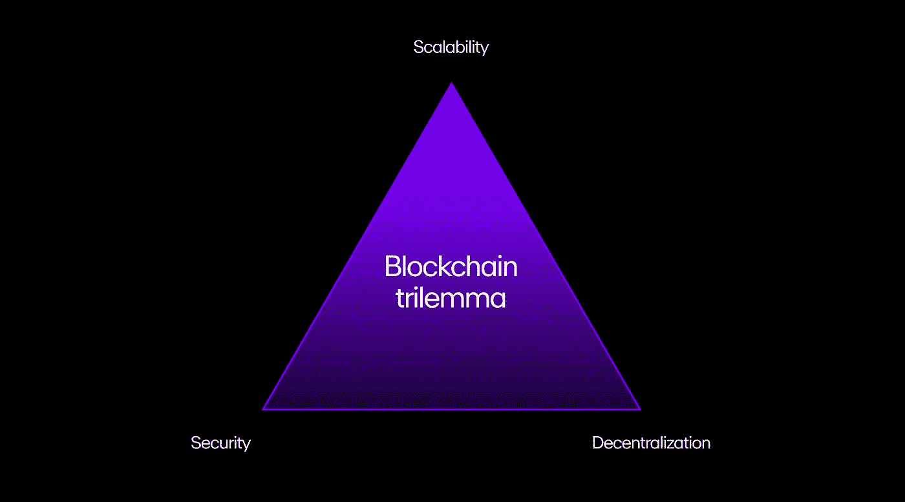

# 什么是第 1 层区块链

> 原文：<https://medium.com/coinmonks/what-are-layer-1-blockchains-81848b81c482?source=collection_archive---------7----------------------->

## 以及为什么它们如此重要

最近，Aptos——一个新的 layer1 协议刚刚推出了它的 mainnet，并慷慨地空投了早期用户。这是又一个推出的第 1 层协议。这些生态系统和协议是加密驱动 it 不同方面的重要组成部分。了解它们是什么以及它们是如何工作的，将使你走在前面，做出更好的密码决策。

image by JONGHO SHIN on iStock

让我们深入第一层世界。

为了在区块链网络上成功执行交易，交易要通过一组或一对计算机节点(共识机制)来验证和完成交易。代币用于支付任何汽油费或交易费用。

*一层协议是区块链网络或生态系统的基础网络。网络上完成的所有交易都由第 1 层执行，其本地令牌用于交易费用。*

第 1 层定义了规则，并设置了生态系统的基本共识机制。

## 一些第 1 层协议

这些是一些主要的第 1 层区块链网络，为大多数分散式应用(DApps)提供支持。

**比特币(BTC)** —世界上最大的加密货币，活跃市值为 3960 亿美元，是一种第 1 层协议，采用工作证明共识机制运行——通过一种使用密集型计算密码难题的算法来确认新块。比特币是分散的，非常安全，但随着需求的增加，它面临着拥堵。

**以太坊(ETH)**——这是第二大的 1 层。它负责引入智能合同。智能合约是在满足所有预设条件后自行验证交易的计算机程序。以太坊最初使用的是工作证明共识机制，但最近过渡到了利益证明验证方法。根据其网站的说法，此举是为了将平台的能耗降低 99.5%。

**Solana (SOL)** — Solana 是支持智能合约的第 1 层区块链平台。它利用了一种被称为历史证明的经过改造的利害关系证明机制。该模型不需要节点进行通信来验证块。历史证明可以确定一个事件发生在一个准确的时间点(一个分散的时钟)。

## 第 1 层扩展和区块链三元悖论

为了验证交易并添加新的区块，区块链必须访问整个系统的数据库。

因为这是计算密集型的，它限制了处理速度，因此第 1 层区块链协议的每秒事务量(TPS)很低。作为背景，像万事达卡这样的集中支付系统处理 5000 TPS 左右，比特币和以太坊平均分别为 4 和 20.5 TPS。

以太坊的联合创始人——维塔利克·布特林(Vitalik Buterin)将这个问题定义为区块链三难问题。

The Blockchain Trilemma

分解一下，区块链网络有三个最重要的属性:

**去中心化:**链条运行没有监管，没有集中的行动者。没有等级制度，由计算机(节点)的分布式网络运行。

**安全性:**至少 51%的参与节点可以抵御链上的攻击。

**可伸缩性:**不断增加的事务负载可以被链容纳而不会产生迟滞。

根据 Vitalik 的三难理论，你不可能在一个给定的时间里同时拥有这三种属性——只能拥有两种。

## 解决区块链三难问题。

迄今为止，为解决这一困境而设想的措施都有其利弊。这些是其中的一些；

**1。共识机制的变化:**利害关系证明机制是安全的，因为它防止黑客访问至少 51%的验证/处理交易的节点(使区块链受到危害)。这是密集的，可扩展性很差，因此像以太坊这样的一些生态系统转变为随机选择验证器来创建新块的利益证明(POS)模型。

像这样的共识机制的改变可以帮助解决区块链三难问题，但是新的共识机制需要大量的研究时间来开发。

**2。增加块大小:**增加块大小看起来是一个显而易见的解决方案，因为区块链有可伸缩性问题，因为块不够大，无法处理事务，但事实并非如此。

将新块循环到网络上的每个节点所需的时间(中继时间 TR)和生成新块所需的时间(块生成时间)是影响该过程的其他因素。

数据块大小翻倍意味着每个节点需要更多时间来下载数据块，这将使 TR 时间翻倍，并降低 TB 限制。

**3。隔离证人(SegWit):** 这是一个区块链的代码被改变，但区块链仍然是单身的过程。

对于所有的交易，都有一个订单、认证和输出(接收者)。攻击者可以通过更改初始交易的交易 ID，使发送方(下订单的人)发送两次交易。这就是所谓的事务可伸缩性。SegWit 就是为了解决这个问题而实现的。

它通过从主块中挑选出事务签名来实现这一点。它创建了另一个称为 SegWit 块的块，该块将签名或“见证数据”移动到扩展块。

这为主块中的更多事务释放了空间，因为见证数据占据了 65%的空间。

SegWit 解决了更改事务 id 和增加 TPS 的问题，但不足以解决可伸缩性问题，因为创建了这种分片。

## 第 1 层分片

分片旨在通过将网络分成称为“分片”的小部分来同时处理多个交易。这些碎片验证交易并注册签名，为验证提供证据。这使得分片非常具有可伸缩性。

分片是可扩展的，并且比具有几个相互连接的区块链的生态系统更安全。它是安全的，因为黑客需要获得 30/40%的股份来攻击系统——而多链生态系统的总股份只有 0.5%。这将很难得到。

得到坏块的碎片被丢弃，整个链避开它。

通过了解不同的第 1 层协议和生态系统以及每个协议和生态系统的运行方式，您将做出更好的决策，它们是加密的发电站。

> 交易新手？试试[加密交易机器人](/coinmonks/crypto-trading-bot-c2ffce8acb2a)或者[复制交易](/coinmonks/top-10-crypto-copy-trading-platforms-for-beginners-d0c37c7d698c)