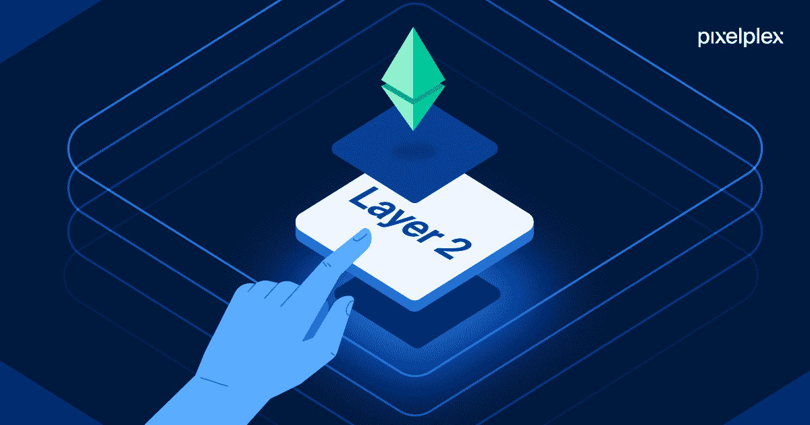

# 什么是第 2 层解决方案？

> 原文：<https://medium.com/coinmonks/what-are-layer-2-solutions-3d2b0cf64a1a?source=collection_archive---------26----------------------->

> 第 2 层解决方案是第三方协议，在底层第 1 层区块链的基础上进行扩展并与之交互，以加快事务吞吐量。

在我的上一篇文章中，我一开始就明确指出第 1 层区块链是整个区块链网络运行和发展的基础设施，就像一座新建筑的地基。

相比之下，第二层解决方案对于第一层区块链就像调味品对于食物一样。这些协议可以比作使基础之上的建筑(第一层)扩展得更加华丽，更加令人愉快，居住起来更加舒适的元素。

***如果您还没有注册电子邮件更新，请点击“关注”按钮。***

[区块链技术](/coinmonks/blockchain-for-10-year-olds-c2728b94e00e)不断发展，以满足其市场不断变化的需求，就像其他每一种需要适应用户不断变化的需求的技术一样。

区块链网络改进的需求为开发区块链网络的第 2 层协议奠定了良好的基础。尤其是考虑到区块链技术正在成为新的经济支柱。

# 什么是第 2 层协议？

第 2 层网络或技术是建立在现有区块链之上的网络或技术，其主要目的是增强区块链协议的可扩展性和效率。

第 2 层扩展解决方案的这一功能包括将区块链协议的一部分事务权重卸载到相邻的系统架构(第 2 层)。该系统然后管理网络的大部分处理，并且仅在之后向主区块链报告以完成其发现。

通过将大部分计算分离到二级架构(第 2 层)，基础层区块链变得不那么拥挤，最终更具可扩展性。

# 为什么需要第 2 层解决方案？

在 [DeFi](/coinmonks/defi-for-10-year-olds-what-is-decentralized-finance-and-how-does-it-work-2e7575a9668f) 和最近的 [NFTs](/coinmonks/nfts-for-10-year-olds-what-is-an-nft-non-fungible-tokens-explained-f3b9369a038c) 、 [GameFi](/coinmonks/gamefi-the-new-generation-of-gaming-d9e011c71f0a) 和[元宇宙](https://www.googleadservices.com/pagead/aclk?sa=L&ai=DChcSEwjs5eKBoMP5AhWI4VEKHWaWC80YABAAGgJ3cw&ohost=www.google.com&cid=CAESauD2fabx_y5L8nMLu1YKpZPSuB6nWrsKscfXVidoKXbqwNbthl3Cq4yT8CbDPzsmciQ096_VcSgAE64QJQEPASuLtl2qcp8Dm7WlUQMCq3NuC-EAdQOsQnpJqjc2mOrnNwA_rYKodYSToKk&sig=AOD64_1St8p5PuYi0ZXNelciARHZ5XKevA&q&adurl&ved=2ahUKEwi5jtyBoMP5AhUKqaQKHSWzAUIQ0Qx6BAgCEAE)中的解决方案稳步提升了区块链技术的接受度，并将其推向聚光灯下。

第 1 层区块链通常处理网络范围内交易验证的每个元素。由于必须在区块链基础设施内的去中心化、安全性和可扩展性之间取得平衡，去中心化网络的底层结构被迫处理一个称为“[区块链三难困境](https://www.gemini.com/cryptopedia/blockchain-trilemma-decentralization-scalability-definition#:~:text=Summary,all%20three%20elements%20at%20once.)的特殊问题

随着区块链和加密货币的普及，越来越多的人使用区块链网络进行各种交易，因此区块链网络出现了周期性拥堵。因此，区块链网络的处理速度受到了负面影响，引发了可扩展性和用户体验方面的问题。

因此，开发人员对区块链层进行了调整，以保证问题的成功解决。

与更低的交易成本、无容量限制和更快的交易时间相关的特征是第 2 层区块链解决方案的当前重要性。第 2 层协议的这些优势使第 1 层区块链网络能够更有效地运行。

通过委派第 1 层区块链的部分职责，第 2 层区块链可以提供第 1 层所需的帮助和解决方案。

# 常见的第 2 层解决方案

随着区块链技术的使用越来越多，第 2 层协议也必须相应地发展。第 2 层解决方案通过将大部分数据处理抽象到一个辅助架构，帮助基础层区块链变得不那么拥挤，因此更具可扩展性。

以下是目前最常见的三种第 2 层协议。

嵌套区块链:区块链网络中第 2 层协议的最早实例之一是嵌套区块链。本质上，嵌套的区块链是放置在另一个区块链内部或者顶部的区块链。分层区块链架构中的主要区块链通常为更大的网络建立规则，执行发生在附属链的互连网络上。

在这种情况下，主链在处理任务分配时管理参数。附属链承担各种主链交易，并提供报告以供批准和反馈。

**侧链:**侧链是对区块链的补充，通常用于大批量交易。侧链采用速度和可扩展性优化的独立共识流程，这与主链截然不同。

在侧链设计中，主链的主要职责是维护总体安全、验证批量交易记录和解决冲突。由于侧链的独立性，侧链的安全缺陷对主链或其他侧链没有影响，记住这一点仍然至关重要。

由于基础设施通常是从头开始构建的，因此建立侧链可能需要大量的工作。

**状态通道:**状态通道通过实现区块链和链外交易通道之间的双向通信来提高总交易容量和速度。

状态通道使得在不考虑初级链的情况下执行交易成为可能。因此，矿工可能会在验证上花费更少的时间，从而提高处理速度。当在状态通道上完成一个事务或一批事务时,“通道”的最终“状态”及其所有固有转换被记录到底层区块链。

状态通道的例子有[灵动网](https://liquid.net/)、 [Celer](https://www.celer.network/) 、[比特币闪电](https://lightning.network/)，以太坊的[雷电网](https://raiden.network/)。

**汇总:**智能合约被称为零知识汇总，或简称为 ZK 汇总，是第 2 层解决方案，能够通过每秒处理数千笔交易来扩展以太坊网络。

ZK-罗博能够更快地核实交易(比 L1)，并通过整合链上和链下操作来帮助降低天然气成本。此外，ZK 汇总使所有验证者能够共享相同的知识，而不使其为公众所知。

# 第 2 层解决方案的优势

第 2 层解决方案通常为基础网络和区块链用户提供一些显著的好处。下面重点介绍了它的一些主要优势。

**降低交易费用:**在第 1 层区块链中普遍存在的一个主要挑战是向寻求交易的用户收取交易费用(或“汽油费”)的问题。每当区块链出现拥堵时，这个问题通常会更加明显，而一旦区块链出现交易高峰，这种情况就很有可能发生。

随着越来越多的人加入区块链网络以及交易量的大幅增加，传统方法需要大量的计算能力。第 2 层协议的重要性有助于降低交易验证所需的计算能力。因此，第 2 层区块链解决方案有助于降低区块链网络的交易成本。

**增强的安全性:**增强的安全性是第 2 层区块链解决方案的主要优势之一。

为了提供更高的可扩展性，第 1 层区块链系统通常需要重新设计其基础层协议。然而，区块链第 2 层协议有助于防止修改基础区块链的设计所带来的问题。

第 2 层解决方案遵循基本的区块链层，防止对基础层或底层协议进行任何修改。

**可扩展性:**可扩展性是指区块链网络容纳高交易吞吐量和未来扩展的能力。可扩展性非常重要，因为这是区块链网络能够有效地与具有快速结算时间的集中式旧系统竞争的唯一方法。

第 2 层协议旨在提供更高的吞吐量，这有助于实现可扩展性。更高的吞吐量可以更容易地扩展区块链网络，并提供更好的用户体验。

# 最后的想法

随着时间的推移，区块链技术的采用显著增加，各种各样的新服务被引入。第 2 层解决方案为解决当前区块链网络的可扩展性和扩展问题提供了一种先进的方法。

看来第 2 层解决方案和协议将在区块链技术的发展和未来中扮演重要角色。该技术具有无限的潜力，因为它可以为区块链网络的扩展奠定基础，从而为用户带来不同的好处和价值。

> 如果你还有任何问题，请留下评论，或者更好的是，在 Twitter ( [@lanre_aderemi](https://twitter.com/Lanre_aderemi) )上直接给我留言，我会尽快回复。感谢您的阅读，如果您能为我鼓掌，那就太好了！

不要忘记点击关注按钮，阅读更多类似的故事；-)

> 交易新手？试试[密码交易机器人](/coinmonks/crypto-trading-bot-c2ffce8acb2a)或者[复制交易](/coinmonks/top-10-crypto-copy-trading-platforms-for-beginners-d0c37c7d698c)