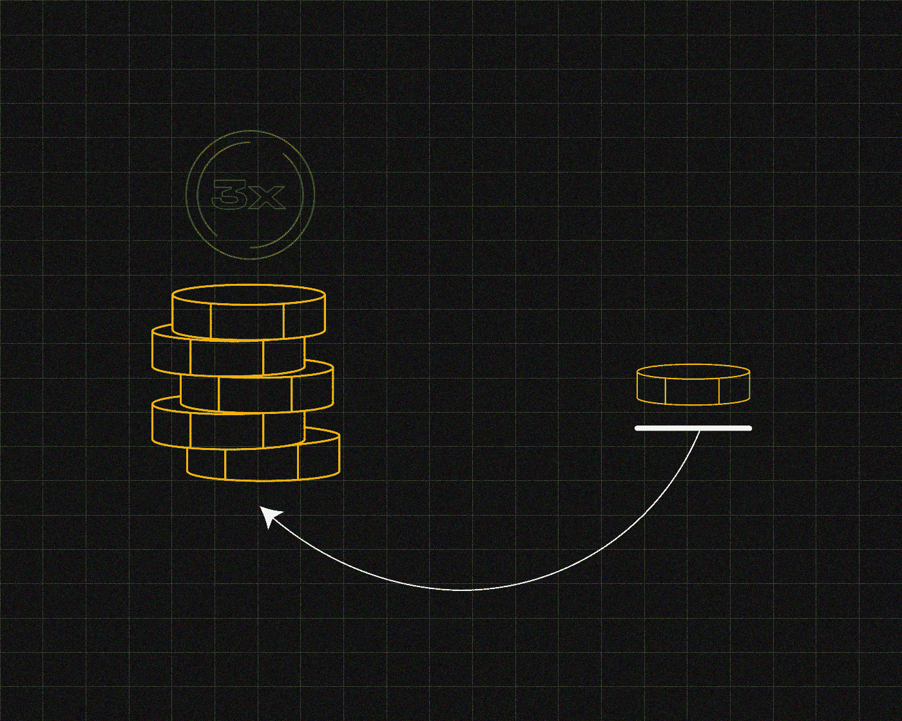
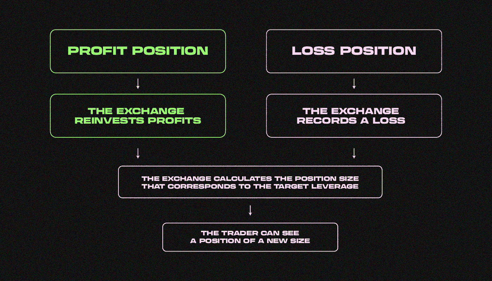
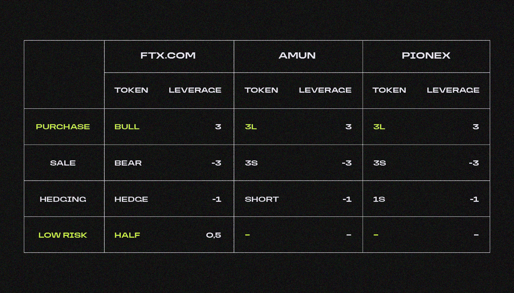
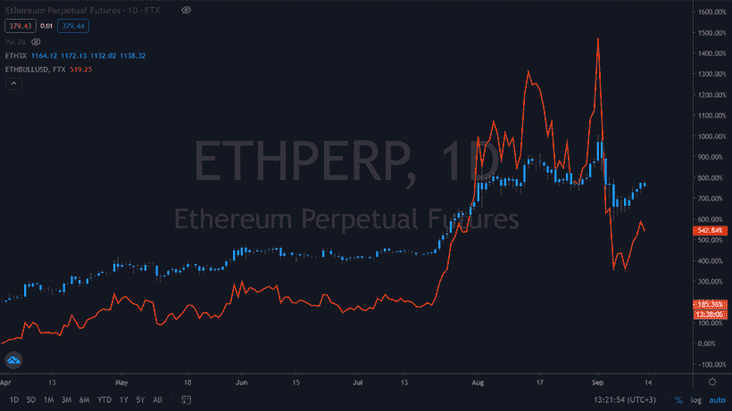
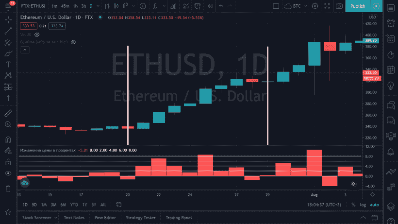
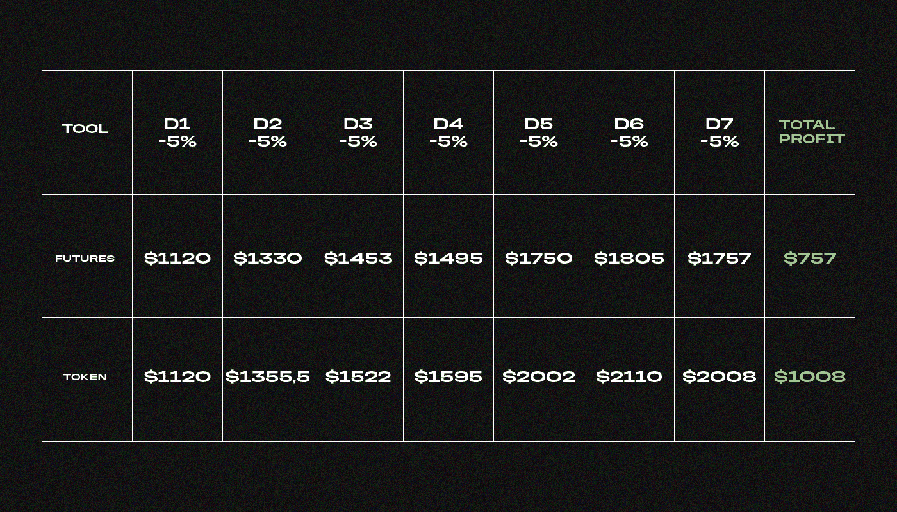
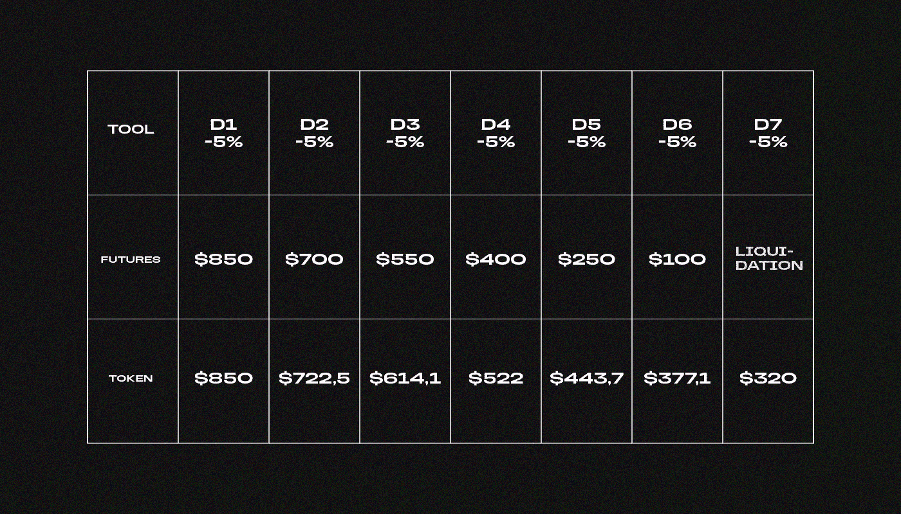
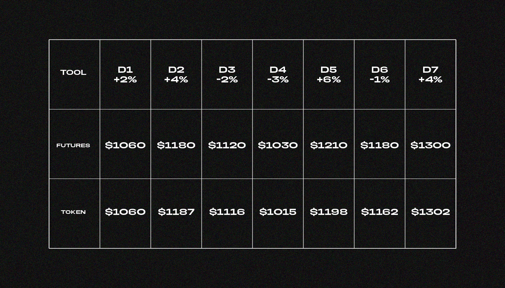

# 什么是杠杆代币？

> 原文：<https://medium.com/coinmonks/what-are-leveraged-tokens-639fb186744a?source=collection_archive---------18----------------------->

***这是一种固定杠杆、自动再投资、平仓风险低的交易工具。如何在他们身上赚钱？让我们来了解一下！***

由于资产价格的稳定趋势和快速变化，杠杆代币比期货合约头寸带来更多利润。

杠杆代币的价格使用以下公式计算:

***【资产价格+(资产价格变动×系数)***

它意味着当资产价格变化 1%时，代币的价值变化 1 × X%。例如 [ETHBEAR](https://ftx.com/ru/tokens/ETHbear) token 系数= -3。如果 ETH 下跌 10 美元，ETHBEAR 令牌的价值将增加 30 美元。

发行者可以将令牌链接到任何加密货币资产。目前，AMUN 只为 BTC 和瑞士联邦理工学院发行了代币，而 FTX 加密衍生品交易所已经发行了 43 枚代币。

# **杠杆代币是如何工作的？**

杠杆代币由发行交易所发行，交易者在现货市场或直接从交易所购买。

交易所利用代币销售筹集的资金来建立永久期货头寸。如果这些头寸获利，杠杆代币的价值就会上升。

代币的价值在交易过程中会波动，但它们的安全性保持不变。交易所每天都在重新平衡，以维持杠杆价值。有两种可能的结果:盈利或亏损。

这就是交易所支持固定杠杆的方式

发行人对代币的发行收取 0.1%的佣金，再平衡每天收取 0.03%。

# **杠杆代币有哪些不同种类？**

根据定价公式，有四种类型的令牌:

*   **牛市:** X ×价格变化，需要靠增长赚钱；
*   **熊:**–X×价格变化，下跌时需要赚钱；
*   **对冲:**–X×价格变化，在 X = -1，需要对冲头寸；
*   **半:** 1/X ×价格变化，风险较小的投资所需。

系数 X 是决定具有杠杆作用的代币的价格变化动态的数字。由于该系数，牛市令牌比资产价格增长更快，而对冲令牌在资产价格增长期间下跌。

当令牌被创建时，该系数的值由发行交易所确定。多头和空头的系数通常是 2 或 3，一半的系数是 2，对冲的系数总是 1。

# 谁发行杠杆代币？

[FTX](https://ftx.com/) 加密货币衍生交易所于 2019 年 8 月在**发行了第一个杠杆代币。该工具在交易者中广受欢迎，与 ETH 相关的交易令牌量每天超过**100 万美元**。截至年底，其他加密货币交易所已经在其平台上放置了 FTX 代币。**

目前，发行杠杆代币的有:FTX 加密衍生品交易所、AMUN fintech 公司和 Pionex 加密交易所。

以下是最受欢迎的杠杆代币列表:

低风险代币仅在 FTX 可用。

FTX 交易所拥有最大的杠杆代币流动性。例如，在 2020 年 8 月的**，FTX 与 BTC 和 ETH 相关的交易代币总量达到**2 . 34 亿美元**。相比之下，Pionex 的这一金额为**1.22 亿美元**，而对于 AMUN 令牌，gate.io 的这一金额为**1.8 亿美元**。**

# **杠杆代币和期货有什么区别？**

杠杆代币的价格动态优于期货。

在趋势环境中，代币价格比期货价格波动更大。因此，代币持有者将比期货持有者赚得更多。我们比较了 ETHUSD 期货和 ETHBULL 令牌的价格，以观察动态变化。该图描述了动态差异。

在趋势的条件下，ETHBULL(红色)带来了 400%的利润，ETHUSD 带来了 3 倍的杠杆(蓝色)——270%。

**在稳定的趋势中，代币比带杠杆的常规头寸更有利可图**

让我们用一个例子来说明。在 7 月 21 日的**，该交易员以 3 倍的杠杆对一份欧元/美元合约建立了一个**1000 美元**的多头头寸。与此同时，他在 FTX 交易所将 1000 美元投入到 ETHBULL 代币中。**

一周以来，这位交易员一直持有头寸。ETHUSD 在此期间增长了 25%。

每日 ETHUSD 期货交易图。下面是每天价格变化的百分比图。

7 月 28 日该交易员平仓。期货的利润是 75.7%，代币的利润是 101%。

代币头寸比期货头寸多赚 58%。

**由于再平衡，交易所不清算代币头寸**

这是另一个例子。该交易员以 3 倍杠杆在 ETHUSD 合约上建立了一个 1000 美元的多头头寸。然后他为 ETHBULL 付了同样的钱。

这位交易员持仓一周。当时，ETH 的价格每天下降 5%。

当 ETHUSD 价格从进场点下跌 33%时，交易所清算了期货头寸。代币的头寸损失了 68%，但没有被清算。

当资产价格下跌 35%时，期货头寸在平仓下下跌，代币头寸亏损 68%。

在重新平衡期间重新开仓时，交易所将清算价格从资产价格转移开。只有当价格每天移动 33%时，3 倍杠杆的代币才会被清算。

例如，ETH 的费用为 300 美元。交易者使用 3 倍的杠杆购买 ETHBULL 代币。象征性头寸的清算点是 200 美元。ETHUSD 在到达清算点的三分之一路程后，第一天收于 267 美元。交易所会在 267 美元开仓，在再平衡过程中将平仓点移到 178 美元。

当价格每天变化 10%时，发行交易所启动强制再平衡:

*   FTX 交易所在标的资产价格变动 11.5%时重新平衡多头代币，在价格变动 6.7%时重新平衡空头代币；
*   当实际杠杆与 3 倍相差 33–66%时，Pionex exchange 会重新平衡令牌。这个值取决于代币的类型和价格变化的方向。

平均而言，当价格变动 11%时，交易所会修复损失并推迟清算点

# **如何交易杠杆代币？**

**就地交换。**杠杆代币可以像其他加密货币一样买卖。

**借助存款。**用户存入兑换并请求发行代币。交易所创建新的代币并将它们交给用户。

**转换成钱包。在 FTX 交易所钱包中，你可以将任何资产换成杠杆代币。**

# **何时可以交易杠杆代币？**

**长期趋势:**再平衡期间，交易所每日进行利润再投资。在这种情况下，代币的利润大于期货的利润。

**保守交易:**由于强制再平衡，交易所不会在基础资产高度波动期间清算代币头寸。交易期货时，你冒着失去全部头寸的风险；交易代币时，你可能会损失一部分代币。

# **什么时候不值得交易杠杆代币？**

**趋势不稳定:**如果资产价格在一天中向不同方向移动，带杠杆的代币比期货合约头寸产生的利润少。

在日内交易中:你不会等待包括利润再投资在内的再平衡。因此，你会赚到和交易期货一样多的钱。

> 在跟踪更新方面，订阅我们的 [Medium feed。](https://medium.com/sunflowercorporation)敬请期待！
> 
> 您也可以在我们的平台[向日葵公司](https://sunflowercorp.com/)上尝试使用加密货币。

# **在不稳定的趋势中，你能从杠杆代币上赚多少钱？**

假设一个交易者在 BTCUSD 期货和 [BULLUSD](https://ftx.com/ru/trade/BULL/USD) 代币中放置了 1000 美元的多头头寸。他持仓一周，期间比特币暴涨 10%。这个交易者从期货中获利 300 美元，从代币中获利 302 美元。

由于趋势不稳定，代币比期货多赚了 2 美元。

一个有期货头寸的交易者在混乱的价格波动中退出市场时，他会弥补一次损失。当交易代币时，交易者每天会遭受一次损失。这种策略减少了头寸，从而减少了最终利润。

> 交易新手？尝试[加密交易机器人](/coinmonks/crypto-trading-bot-c2ffce8acb2a)或[复制交易](/coinmonks/top-10-crypto-copy-trading-platforms-for-beginners-d0c37c7d698c)