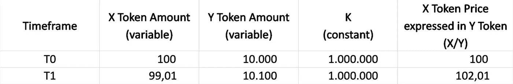

# 什么是流动性池，流动性是如何提供的？

> 原文：<https://medium.com/coinmonks/what-are-liquidity-pools-and-how-does-liquidity-providing-work-ed699fbef260?source=collection_archive---------38----------------------->

随着过去几年 DeFi 协议的日益流行，流动性提供成为市场高速发展、增长和再生的必要机制。

大多数流动性池现在被用来为分散式交易所提供流动性，随着大量项目从 ICO 模式转向 IDO(首次公开发行 DEX)模式，分散式交易所越来越受欢迎，不仅因为其核心交易功能，也因为其作为一种融资手段。

因此，流动性池在加密领域变得至关重要。

但在讨论流动性提供之前，我们必须了解什么是流动性。

流动性是一个经济概念，是一种市场特征，指的是某人能够以反映其内在价值的价格或在不严重影响资产的情况下快速购买或出售资产的程度。它代表了资产出售价格和出售速度之间的权衡。

相对缺乏流动性的资产有房地产、艺术品和收藏品，而现金(法定货币)是所有资产中流动性最强的。其他金融资产，如股票，在流动性谱上处于不同的位置。

类似地，各种加密货币具有不同的流动性水平，也取决于交换手段(无论是另一种数字资产还是法定货币)。

虽然传统金融中有影响流动性的方法，但 DeFi 已经开发了自己的机制，以解决加密市场的流动性不足问题——以流动性池的形式。

# 流动性池

如前所述，流动性池在 DeFi 中有许多应用，但大多数情况下由分散交易所使用。

dex 的早期形式——订单簿模式——采用缓慢，主要是因为它们无法解决流动性差的加密市场(新推出的代币)带来的缺点。

如今，自 AMM(自动做市商)系统采用以来，这种情况已经发生了变化，该系统使用流动性池(预先融资的资产池)来促进及时交易。

Bancor 是最早使用流动性池的协议之一，但这个概念在 Uniswap 流行起来后获得了关注。

那么，更准确地说，什么是流动性池，它们是如何运作的？

流动性池基本上是锁定在智能合约中的代币或数字资产的集合，旨在为分散式交易所和其他 DeFi 产品提供流动性。，而流动性提供者(LP)是为这些资金池提供资金的用户。

在其基本形式中，流动性池持有两种代币，为这一对特定的代币创造了一个新的市场。

这也是 IDO(首次 DEX 发行)所涉及的流程之一，这也是流动性池在过去几年中如此广泛采用的原因之一。

# 流动性池中的资产定价

要计算资产池中资产的价格，最普遍的方法是 Uniswap 首创的 XYK 模型，也称为“恒定产品(自动)做市商”(CPMM)，它基于一个简单的公式:

X * Y = K

其中 X 和 Y 是每个代币的数量，而 K 保持不变。

根据这个公式，第一个流动性提供者确定每项资产的初始价格。

然而，如果资金池的定价与全球加密市场的定价不匹配，就会产生即时套利机会，使流动性提供商面临因套利交易而亏损的风险。

因此，第一个以及随后的其他有限合伙人被激励在池中存放相等价值的两个代币。

当使用资金池交易时，代币价格的变化遵循相同的公式。

为了更好地理解这一点，我们举个例子，假设创建了一个池，其中包含 100 个 X 令牌单元和 10，000 个 Y 令牌单元。

这意味着 K 将等于 1，000，000，而 X = 100 Y。

如果用户想要存放 100 Y 令牌，为了使 K 保持不变，池中 X 令牌的数量需要为~99。因此，用户将收到大约。1 个 X 代币换 Y 代币。

此外，这将导致 X 的价值为 102 Y，从而提高其价格。

相反，X 的价格随着池中 X 数量的增加而降低。

# LP 奖励

## LP 代币(交易费份额)

当有限合伙人向一个资金池提供流动性时，他们会按照所提供的流动性比例获得被称为“有限合伙人代币”的特殊代币。

每当池促成交易时，会扣除一定的费用，并在所有 LP 令牌持有者之间按比例分配。

有限合伙人提供的流动性越多，他收到的有限合伙人代币就越多，因此交易费的比例就越大。这一比例可以双向调节，因为其他有限合伙人会不断创造新的有限合伙人代币，为资金池提供更多流动性。

每当 LP 想要从池中提取资金时，相关联的 LP 令牌就会被烧掉。

## 流动性挖掘

通过向特定的流动性池提供资金，有限合伙人可以额外获得某个 DeFi 项目的代币。

## 下注 LP 代币

一些协议还允许下注 LP 令牌以获得额外奖励。

# 非永久性损失

AMMs 的流动性池机制导致池和全球加密市场之间的价格差异，这导致了所谓的非永久性(或暂时性)损失。

发生这种情况的原因是，当锁定在流动性池中的一项资产的价格发生变化(无论向哪个方向)时，它都会产生未实现的损失，而资产只是被放在钱包里。

它被称为非永久性的，因为在资金从资金池中提取出来之前，损失是未实现的。因此，有限合伙人可以通过持有资金池中的资金来弥补损失，直到价格回到初始水平，但这种情况永远也不可能发生。

如果用户在价格偏差较大时退出池，那么非永久性损失将被“记录”，并因此成为永久性的。

虽然非永久性损失有时很小，有时很大，但它可以被有限合伙人因提供流动性而获得的回报所抵消。

# 赞成的意见

*   流动性存在于流动性差的市场中
*   使交易者始终能够获得报价并完成交易，而不管提交了多少有效订单
*   通过以实时市场价格进行交易，简化了 DEX 交易
*   允许人们提供流动性并从他们的密码中获得回报或利息。
*   通过使用公开的智能合同提供透明度

# 骗局

*   资金被一小撮人控制，这违背了去中心化的理念
*   由于糟糕的安全协议，存在智能合同/区块链漏洞的风险
*   开发人员可能在智能合同代码中拥有特权访问权限，从而允许诸如拉地毯和退出骗局等欺诈行为发生
*   暴露于非永久性损失
*   低流动性池中大订单的高滑点风险
*   与订单簿模式相比，抢先销售的风险更高

关注我们的媒体和其他社交网站，了解更多加密相关内容:[linktr.ee/ImperiumIndex](http://linktr.ee/ImperiumIndex)

> 交易新手？试试[密码交易机器人](/coinmonks/crypto-trading-bot-c2ffce8acb2a)或者[复制交易](/coinmonks/top-10-crypto-copy-trading-platforms-for-beginners-d0c37c7d698c)