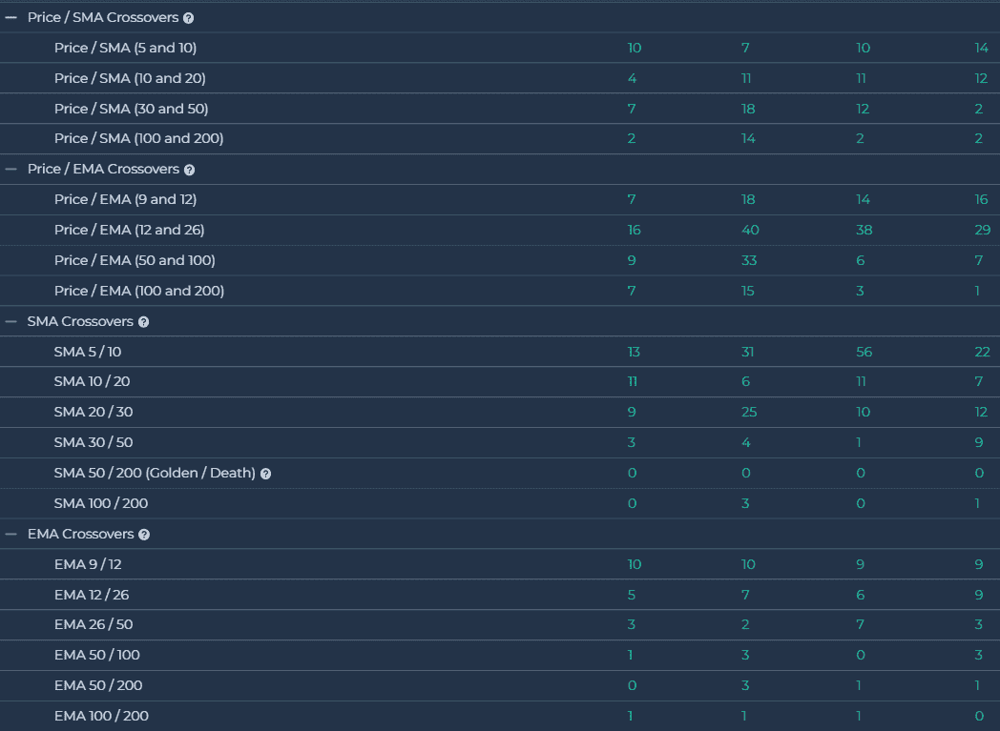
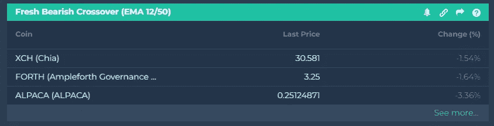
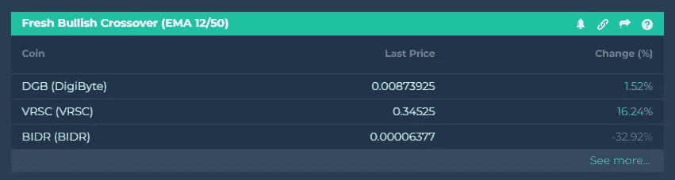

# 什么是均线交叉？

> 原文：<https://medium.com/coinmonks/what-are-moving-averages-crossovers-f51fe9d3fc27?source=collection_archive---------26----------------------->

**如何使用它们进入和退出市场**

均线交叉是进场和出场的常用策略。MAs 还可以突出潜在的支持或阻力区域。虽然这可能看起来是预测性的，但移动平均线总是基于历史数据，只是显示某个时间段的平均价格。

**均线交叉通常预示着趋势即将改变。**将移动平均线交叉策略应用于价格图表，交易者可以识别趋势改变方向的区域，创造潜在的交易机会。

# **SMA 和 EMA 的区别**

*   **简单移动平均线(SMA)** —只是 5、10、20……等的普通平均值。价格。
*   **指数移动平均线(EMA)** —对最近的价格赋予更大的权重，因此比 SMAs 具有更少的滞后；它对价格变化的反应会更快。
*   日均线变化比均线慢，所以日均线更适合时间框架长的交易者。均线反映价格变化更快，因此对短线交易者更好。

**简单移动平均线交叉** **是评估价格趋势的有力信号。**当短期 SMA 与长期 SMA 交叉时，无论是在上方(看涨，上升趋势)还是下方(看跌，下降趋势)，都会发生 SMA 交叉。 **altFINS 允许您比较 SMA。例如，你可以在 5 天均线和 10 天均线交叉的地方找到硬币。你也可以指出 5 天均线高于或低于 10 天均线的百分比(%)。也可以组合多个 SMA 十字线(5/10，5/20，5/30，或者 5/10，10/20，20/30 等。)来加强你屏幕的信号功率。**

你可以在 [altFINS 信号摘要中找到预定义的均线和均线交叉策略。](http://r.email.altfins.com/mk/cl/f/FxacbEk4npHGxCKc-cq67-y3-J0WSY267wmSgd3YhOEudNaJujSkeKZKZIzeWqySTcPX-oyuIocNExJg9oJN01s0nsZ3fm1DSiGxHvK3G388A_mrcpwdnHquw1j8al-q6THvUtsr31zFhuAvaWZivnVXzzSuVFJZqUScoVvAv9UXF3VChpbdd6cr8wTChGnPvwTzbGwGeBcTIQogwjeCYPZndryN9zZ_-Vu5zwrqerbi42OcsI7XwJS1vwiuj4IZfSLheRjc9623BWQ5AxIC6jfT_wx0n6t10LeMfIzz01HEIsxYQzrBhQ)

# **使用哪种 MAs？**

短期的 MAs (5，10，20)会更快的识别出一个新的趋势

*   积极的:尽早抓住趋势，更有上升的潜力
*   负面:会有更多的假突破

**中期均线(20，30，50)和长期均线(50，100，200)将在稍后确定趋势**

*   正面:趋势将更加确定
*   负面:上升潜力较小

**好的折衷方案是使用 EMA 12 / EMA 50 交叉点作为信号**

*   当均线 12 穿过均线 50 时买入
*   当均线 12 低于均线 50 时卖出

[学习如何交易均线 12/50 交叉](http://r.email.altfins.com/mk/cl/f/2oBHVektGSvpU9Ne5U8DvSPfMGUBY88lC_T5mXhNwgQtGw_oZhKqX-xANcR9DO5IpB2WX-pcNi2YeqbuQyoB7gPy-Gg562ebKU6Xhns6koS7DrLpUeSQPxehyVYKuJRz7FOzHq4JHRoqowKvSd6tXn3WeIzgMRRtb5Z6d9w8mi30L_kd-JCcG3XaO0G5tW3MFCwPVpKoE5VWQztFIu87wHtePQw-jaxeD1jhf3Ul2xJFBl1_-OFCeaOPB_rAeX7TBC8Nk8cgTWCuf5-F-4j2EuVPPEe70RX3sMN74kv3rx0bw5dpuFljIPRtJvMXXMQS3WcXTgMXo229gUOnMdtcGDs)

# 看涨或看跌交叉的硬币——均线 12/50

Source: [altfins.com](https://altfins.com/)

你想知道如何交易加密货币吗？在 altFINS.com[注册，开始学习和交易！](https://altfins.com/)

> 交易新手？试试[密码交易机器人](/coinmonks/crypto-trading-bot-c2ffce8acb2a)或[复制交易](/coinmonks/top-10-crypto-copy-trading-platforms-for-beginners-d0c37c7d698c)
> 
> 多样化的密码持有，了解[币安替代品](https://coincodecap.com/binance-alternatives)
> 
> 加入 Coinmonks [电报频道](https://t.me/coincodecap)和 [Youtube 频道](https://www.youtube.com/c/coinmonks/videos)获取每日[加密新闻](http://coincodecap.com/)

## 另外，阅读

*   [复制交易](/coinmonks/top-10-crypto-copy-trading-platforms-for-beginners-d0c37c7d698c) | [加密税务软件](/coinmonks/crypto-tax-software-ed4b4810e338)
*   [电网交易](https://coincodecap.com/grid-trading) | [加密硬件钱包](/coinmonks/the-best-cryptocurrency-hardware-wallets-of-2020-e28b1c124069)
*   [密码电报信号](/coinmonks/top-3-telegram-channels-for-crypto-traders-in-2021-8385f4411ff4) | [密码交易机器人](/coinmonks/crypto-trading-bot-c2ffce8acb2a)
*   [最佳加密交易所](/coinmonks/crypto-exchange-dd2f9d6f3769) | [印度最佳加密交易所](/coinmonks/bitcoin-exchange-in-india-7f1fe79715c9)
*   [面向开发人员的最佳加密 API](/coinmonks/best-crypto-apis-for-developers-5efe3a597a9f)
*   最佳[密码借贷平台](/coinmonks/top-5-crypto-lending-platforms-in-2020-that-you-need-to-know-a1b675cec3fa)
*   [免费加密信号](/coinmonks/free-crypto-signals-48b25e61a8da) | [加密交易机器人](/coinmonks/crypto-trading-bot-c2ffce8acb2a)
*   [杠杆代币的终极指南](/coinmonks/leveraged-token-3f5257808b22)