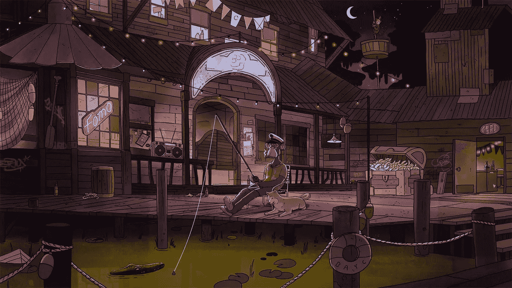

# 什么是 NFT？

> 原文：<https://medium.com/coinmonks/what-are-nfts-1082957a63a0?source=collection_archive---------11----------------------->

当谈到 NFTs 是区块链和加密货币领域的下一个大事件时，每个人都很兴奋。但是什么是 NFT 呢？它在区块链宇宙中有什么意义？许多人认为它只是与游戏有关，并怀疑围绕它的所有炒作是否合理。对这一主题的概述将阐明 NFTs 和区块链技术之间的关系。

**定义**

NFT 代表不可替换的令牌。为了理解上下文，区块链技术中的加密货币是可替代的。这意味着，不管其性质如何，不管是作为[大宗采矿奖励](https://coinsbench.com/understanding-the-architecture-of-a-blockchain-f50ad412bdc4)还是大宗交易费用，也不管它是如何用于公用事业还是治理，每个加密令牌都是完全相同的，因此可以作为金融工具进行交易、[赌注](/coinmonks/what-is-staking-7ca67fa9d4da)和等价交换。相比之下，NFT 表示区块链上的唯一加密元素，代表收藏品或令牌化的现实世界资产。因此，它们不能像常规加密货币如[比特币](/coinmonks/what-is-bitcoin-e98b2b77c81b) (BTC)或[以太](/coinmonks/what-is-ethereum-part-2-design-c9b9f1b39fda) (ETH)一样进行交换或交易。

**所有权和发展历史**

[**Non-fungible token (NFT) ownership**](https://en.wikipedia.org/wiki/Non-fungible_token#/media/File:NFT_ownership_diagram.png)

目前，NFT 所有权不像版权或知识产权那样被视为合法许可。令牌的[智能契约](/coinmonks/what-is-ethereum-part-1-smart-contract-74f259708792)确定 NFT 所代表的数字资产或文件的所有权证明，但不授予任何验证该所有权的法律绑定。相反，NFT 所在的区块链验证其元数据，将其存储在[分布式分类账](/coinmonks/what-is-blockchain-a7082404caa2)中，并通过数字签名跟踪所有权。

第一个被创造的 NFT 的例子将简化这个概念。2014 年 5 月，数字艺术家凯文·麦考伊和阿尼尔·达什用硬币区块链的名字铸造了他们称为量子的 NFT。这是麦考伊妻子的一段视频短片。艺术家们将 NFT 背后的技术简单地描述为“货币化的图形”。后来，麦考伊以 4 美元的价格将数字所有权转让给了 Dash，这标志着第一个拥有和出售 NFT 的案例。

第一个真正的 NFT 项目于 2015 年 10 月启动，在以太坊的区块链上市后不久。名为 Etheria 的项目生产了 457 块六角形瓷砖，每块价值 1 ETH。尽管这些 NFT 是可以购买和交易的，但由于当时对 NFT 的范围缺乏了解，它们无人认领。有趣的是，Etheria NFTs 最近以 140 万美元的价格售出。

2018 年，[以太坊](/coinmonks/what-is-ethereum-part-2-design-c9b9f1b39fda)已经是为与其生态系统兼容的其他区块链设计和推出可替代加密货币的枢纽，发布了以太坊征求意见稿或 ERC 721 号，它是智能合约框架中 NFTs 的 API(应用编程接口)实现的标准协议。ERC-721 令牌的问题在于，它代表单个资产，从而使得多个 NFT 的交易成为昂贵且耗时的事情。

因此，在 2019 年，ERC-1155 成为了 NFTs 的首选标准协议。其 USPs 包括将多项资产捆绑在一份[智能合同](/coinmonks/what-is-ethereum-part-1-smart-contract-74f259708792)中，以促进经济高效的批量转移和可替代性支持。这意味着 ERC-1155 可以创建半可替代令牌(sft)，保留可替代加密货币的属性用于交易目的，并在赎回时将其转换为 NFT。这在去中心化游戏金融(GameFi)中有巨大的好处。此外，ERC-1155 NFT 允许在地址错误的情况下逆转令牌转移，从而使资产交易更加安全，这与 ERC-721 NFT 不同，后者的转移一旦进行就不可撤销。

**NFTs 的用途**

如前所述，NFT 大多与区块链游戏项目有关。然而，作为数字收藏品，NFT 可能不仅仅意味着游戏化身。如今，NFT 存在于一系列领域，如虚拟现实(VR)和增强现实(AR)、数字艺术、数字时尚、音乐、电影、体育纪念品、gif(图形交换格式)、模因等。值得关注的主要 [NFT 项目](/coinmonks/what-is-ethereum-part-3-applications-12097472b9f9)包括分散的土地、沙盒、金恩、奇里兹等。

NFTs 的流行反过来导致了许多专门市场的出现，以促进这些特定加密资产的买卖。领先的例子有 [OpenSea](https://opensea.io/) 、 [EnjinX](https://enjinx.io/eth/marketplace) 、 [Rarible](https://rarible.com/) 、 [AirNFTs](https://www.airnfts.com/) 、 [Nifty Gateway](https://niftygateway.com/) 等。

**gif 和头像**

[**GIF NFTs**](https://artfunder.org/artists/cryptokitties-past-present-future-crypto-collectibles/)

NFTs 的第一个用例可能是它在 gif 中的引入。它们不能像游戏一样玩，但拥有和分享这些稀缺的数字图形在社区互动中非常常见。GIF NFT 的一个著名例子是 CryptoPunks。NFT 头像项目，如无聊猿游艇俱乐部在概念上类似于 GIF NFT，但比像素化图像有更好的图像。

[**Bored Ape Yacht Club (BAYC) avatar NFT example**](https://www.newyorker.com/culture/infinite-scroll/why-bored-ape-avatars-are-taking-over-twitter)

**游戏**

[**CryptoKitties NFTs**](https://www.cryptokitties.co/)

NFTs 最突出的用途是在区块链的游戏中将代币与可收集的头像和卡片联系起来。谁能忘记 Dapper Labs 的 CryptoKitties 视频游戏呢？基于以太坊的游戏允许用户购买和交易猫的化身，其独特的“基因”被硬编码到 NFT 中，用于收养和/或繁殖。

[**Game card NFT example**](https://artfunder.org/artists/cryptokitties-past-present-future-crypto-collectibles/)

随着游戏空间与区块链技术的发展同步前进，NFT 的使用已经从头像和游戏皮肤发展到取代传统游戏卡。这种 NFT 最普遍的使用是在各种在线多人角色扮演策略游戏中，例如电子竞技中的英雄联盟。游戏 NFT 的其他主要用途包括在区块链游戏世界购买和建造虚拟房地产。

**体育**

NFT 交易卡的概念已经从区块链奥运会扩展到体育产业。用户可以收集代表球迷喜爱的球员图像的限量版纪念品，球队穿的球衣和靴子等标志性的运动套件，统计数据，视频剪辑，标志性时刻的剧照等。一个很好的例子是 Dapper Labs 与国家篮球协会(NBA)合作创建 NBA Top Shot NFTs。

[**NBA Top Shot NFTs**](https://artfunder.org/artists/cryptokitties-past-present-future-crypto-collectibles/)

其他引入 NFT 来吸引粉丝的职业运动包括美式足球(NFL 全天 NFT)、棒球和足球(Topps 和 Sorare NFTs)。

**电影和音乐**

莱昂国王的专辑名为*当你看到自己的时候*是音乐 NFTs 的第一个例子。其他以 NFT 形式出售唱片的艺术家包括 3LAU、Lil Pump、Grimes 和 Eminem。最近，华纳音乐集团和 Web3 平台 OneOf 合作，为该音乐公司目录中的几位艺术家创建了独家 NFT。想要跟踪音乐 NFT 的用户可以通过[置顶](https://topoftheblocks.com/)编辑和发布的每周音乐排行榜来实现。

像音乐一样，非物质文化遗产和电影的结合也是最近的事。一些著名的例子是限量版*死侍 2* 的数字海报和*哥斯拉大战孔*的 NFT 艺术作品。最近，奥斯卡获奖导演昆汀·塔伦蒂诺推出了他的标志性电影《低俗小说》的象征性收藏品。

[**Tarantino’s Pulp Fiction NFTs**](https://tarantinonfts.com/)

**其他用途**

运动服品牌耐克拥有 CryptoKicks 专利，这是一种虚拟运动鞋，以数字方式代表现实世界的设计师鞋类。数字时尚 NFT 的需求量也很大，这一点从 LUKSO 区块链驱动的市场[非物质化](https://thedematerialised.com/)中可以看出。然而，NFT 作为加密资产的投机性质是不可否认的，Twitter 创始人杰克·多西的第一条推文(290 万美元)和数字艺术品的天文价格就证明了这一点，Pak 的*Merge*(9180 万美元)和 Mike Winkelmann 的[*Everydays:the First 5000 Days*](https://onlineonly.christies.com/s/beeple-first-5000-days/beeple-b-1981-1/112924)(6930 万美元)。

**NFT 的劣势**

非母语教学面临许多批评，列举如下:

●NFT 不是区块链以太坊[的专利，但它仍然是 NFT 最大的铸造平台。因此，非森林交易的产生和转让伴随着过高的能源消耗。然而，区块链像索拉纳，卡尔达诺，币安链，和 Tezos 有 NFT 创造能力，并与 staking 作为他们的](/coinmonks/what-is-ethereum-part-3-applications-12097472b9f9)[共识](/coinmonks/understanding-the-role-of-consensus-in-blockchain-db724fa63a53)模式，这些非森林论坛更环保。

●由于 NFT 所代表的数字资产的大小和复杂性，区块链无法存储原始资产，仅提供所有权证书以及资产可用网址的可点击链接。这造成了所有权丧失的风险，因为随着时间的推移，所有的网络链接都会被破坏或失效。

●安全性是 NFTs 面临的一大挑战。由于原始资产是离线存储的，并链接到单独的 web 服务器进行内容访问，因此所有权安全可能会受到影响。其他严重的风险包括剽窃艺术品的符号化、deepfakes、NFT 的欺诈性铸造和网络钓鱼骗局。

● NFT 所有权还不等同于法定所有权。例如，塔伦蒂诺卷入了与米拉麦克斯制片公司的诉讼，涉及该电影制作人 NFT 收藏的合法性。

●由于不可替代，NFT 没有可替代加密货币那样的价值。因此，它们的价值取决于它们所代表的数字资产或文件。现在，所有的 NFT 都不值钱了。然而，制作 NFTs 的平台通常向艺术家和买家收取高额费用，这使得它成为一项无利可图的投资。

●如前所述，非金融资产是投机性资产。因此，动荡的加密市场中的熊市已经导致许多非加密技术的价值向下修正。这导致了一场持续的争论，即 NFT 是否适合在加密投资中获得有益的体验。

**结论**

将非功能性翻译仅仅视为现在价值不菲的收藏品或未来升值的前景，是一种不切实际的方法。NFT 的真正价值在于它们利用了[区块链技术](/coinmonks/what-is-blockchain-a7082404caa2)的原理。将非物质技术与各种有形和无形资产联系起来确实有巨大的潜力，如不动产或数字身份的标记化。因此，不可否认的是，非功能性测试的实际应用和它们的区块链能力会使未来变得激动人心和有价值。

**亦读:**

[*什么是区块链？*](/coinmonks/what-is-blockchain-a7082404caa2) *|* [*区块链的历史与演进*](/coinmonks/history-and-evolution-of-blockchain-17e5332e4a6c) *|* [*什么是以太坊？第三部分:申请*](/@DC.600/what-is-ethereum-part-3-applications-12097472b9f9)

跟随我:

[**LinkedIn**](https://www.linkedin.com/in/a600dc/)|[**Twitter**](https://twitter.com/dc_111)

联系人:**arnab.dc111@gmail.com**