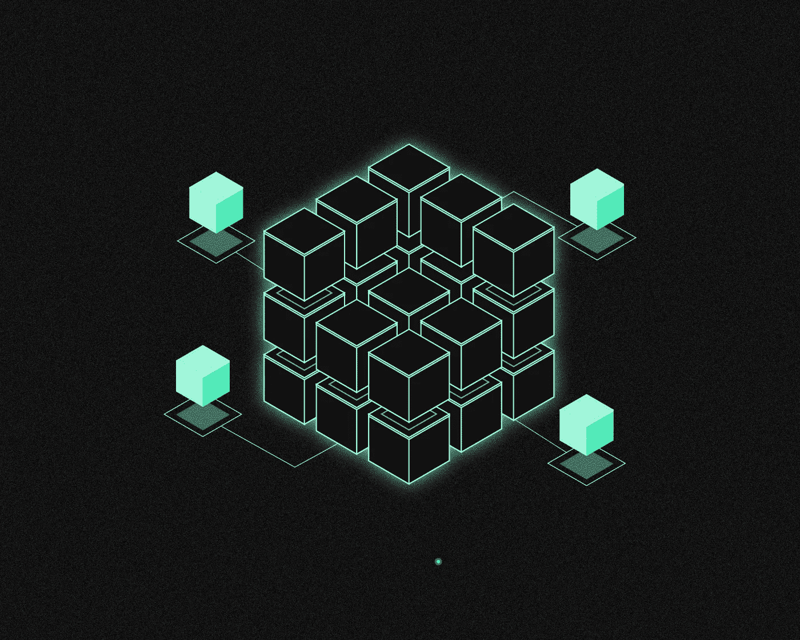
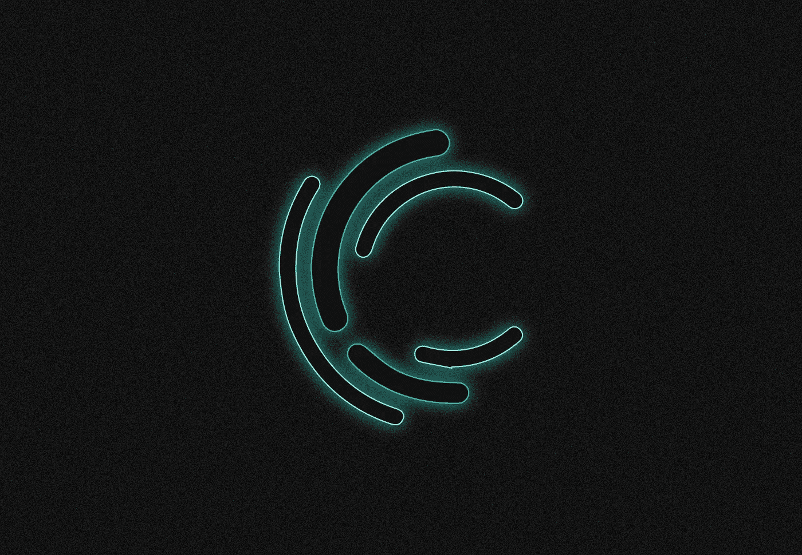
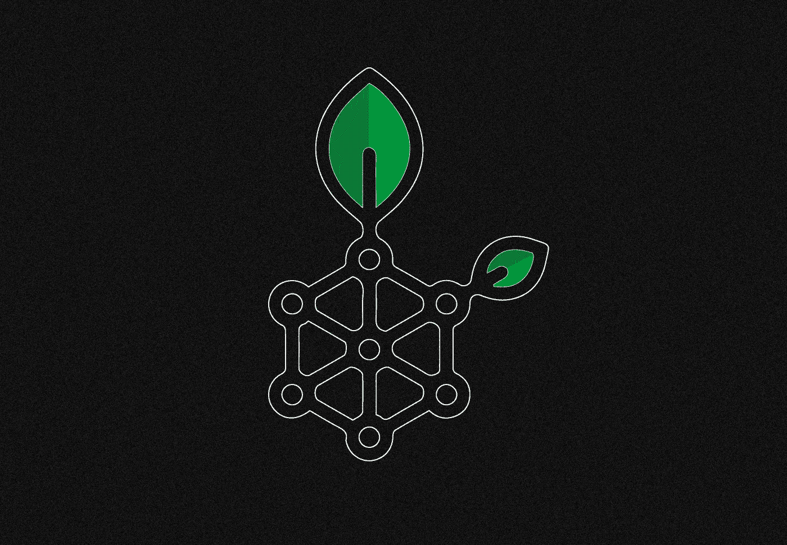
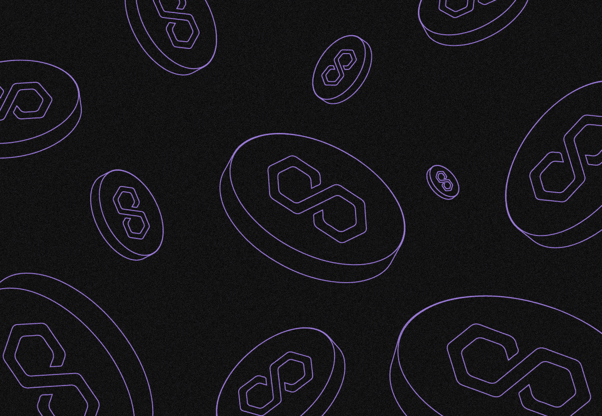

# 什么是侧链？

> 原文：<https://medium.com/coinmonks/what-are-sidechains-1c035097d8df?source=collection_archive---------39----------------------->

***Sidechain 是一种区块链扩展技术，可创建一个以两种方式与主网络相连的并行网络。它是如何工作的？有什么用吗？让我们看看！***

sidechain 解决的主要问题是提高“母”网络加密资产的交易速度和降低交易成本。

由于侧链的有限分散性，主要缺点是安全性降低。

侧链目前主要用于两个区块链:比特币和以太坊。

# sidechain 是如何工作的？

推出几年后，比特币网络开始达到可扩展性的极限:出现了许多加密项目，提供了更快的操作和更低的交易费用。

**2014 年**，Blockstream 的开发者首次描述了[侧链](https://blockstream.com/sidechains.pdf)的概念，这将允许绕过比特币的缺点。

他们描述了创建一个单独的、额外的区块链的概念，它将与“母”网络双向绑定，并具有转移资产的能力。

根据最初的概念，母区块链的用户必须首先向外发地址发送硬币。它们被暂时阻止进行验证，这是为了消除重复支出的可能性。

确认转移后，硬币被转移到侧链，在那里可以自由使用。如果需要，硬币盒也可以将它们放回原来的区块链。

今天，侧链技术主要用于比特币和以太坊，这两个最受欢迎的加密项目正在经历带宽问题。

# 比特币侧链有哪些不同类型？

今天最知名的基于比特币的侧链是 Blockstream 的 **Liquid Network** ，它建立在 [Elements](https://elementsproject.org/) 项目的源代码上。后者是使用比特币代码库创建的，但由于减少了去中心化，在液体中创建块的时间从 10 分钟减少到了 1 分钟。

流动资产没有固有资产。相反，它采用了一种“包装好的”L-BTC 令牌，当比特币从“本土”区块链转移到 sidechain 时就会发行这种令牌。BTC 由比特币以 1:1 的比例支持。此外，Blockstream sidechain 中还有用于保密交易的功能。

与此同时，流动性不能像比特币那样被描述为去中心化的区块链。该项目由[联盟](https://liquid.net/governance)管理，这是一个相对较小的组织团体，分布在世界各地，彼此独立。

他们投票表决协议更新，管理节点和“工作人员”这是一个多签名钱包的钥匙，它需要 15 个功能键中的至少 11 个来确认比特币交易。每个“联盟”的可信成员负责一个密钥。

截至 2022 年，Liquid 尚未在加密货币市场上广泛分布，它的功能更像一个私人区块链:sidechain 由机构投资者、应用程序和钱包使用。

少量的系绳(USDT)稳定粒子已经被释放到液态区块链中。早在【2022 年 9 月,[透露【Blockstream 打算推出 XDAX，这是一个去中心化的比特币交易所，用户可以在这里交换基于流动性的资产。](https://bitcoinmagazine.com/business/blockstream-sevenlabs-launch-decentralized-bitcoin-exchange)

另一个众所周知的比特币侧链是根茎，它内置了一个虚拟机，可以让你创建智能合约。【2022 年 8 月，WakeUpLabs 和 Kilimo [宣布](https://cryptonews.com/news/rootstock-nfts-will-enable-wakeup-labs-kilimo-achieve-water-neutrality-for-farmers-worldwide.htm)计划在根茎网上发布不可替代的代币。

# 以太坊侧链有什么特点？

伸缩性问题在以太坊区块链平台上尤为突出。许多加密项目以某种形式提供了解决方案。侧链是其中一个方向。

它们与以太坊的主要区别是能够使用不同的共识算法，如拜占庭容错、授权证明或委托利益证明(DPoS)。同时，更高级的块参数需要通过减少完整节点的数量来降低分散化水平。这对安全性有影响。

与以太坊虚拟机兼容是以太坊侧链的一个重要特性。用 Solidity 语言编写的合同得到了这种网络的支持。因此，以太坊生态系统应用程序可以轻松部署在其侧链中。

# 以太坊侧链有哪些不同类型？

目前在加密市场上有几种以太坊侧链。**多边形证明桩(PoS)** ，多边形生态系统的组成部分，就是其中之一。多边形位置有三个级别:

1.  博尔。负责通过侧链节点将事务分配到新块中的级别。定期地，在委员会系统的帮助下，节点被“混合”以获得更高的安全性。
2.  海姆达尔。利害关系证明共识的“层”,它确认由 Bor 级别生成的块，并将它们聚合到 Merkle 树中，然后在以太坊主网上发布，以便实现终结。
3.  赌注精明的合同。

多边形 PoS 的带宽比“父”网络高得多。侧链速度估计为 7000 Tx/s，而以太坊的速度为 15 Tx/s。Polygon PoS 是原生加密货币。

资产通过一个桥从以太坊转移到多边形 PoS，这个桥阻塞加密货币并在多边形侧链中释放它。中继机制对此负责:为了确认跨链传输，三分之二的侧链验证者必须同意。

除了 Polygon PoS 之外，Loom Network 在以太坊侧链中脱颖而出。这是一个用于分散应用的多区块链平台，于 2017 年在 **发布**。Loom Network 采用一种称为 Base chain 的 EVM 兼容网络作为其基础层，该网络基于 DPoS 算法运行。ERC-20 标准的织机令牌是该项目的本地令牌。****

Skale 和 Gnosis Chain 是另外两个以太坊侧链项目。Ronin sidechain 通过一个交叉链桥与以太坊相连，并在大规模黑客攻击后于 **2022** 年夏天重启，正由区块链热门游戏 Axie Infinity 的开发者开发。Ronin 用于游戏中的资产交易，特别是 NFT、SLP 和 AXS 代币。

# 侧链是如何固定的？

侧链由它们自己的安全系统保护。更大的可伸缩性需要有限的去中心化，这增加了验证者、挖掘者和侧链中其他关键参与者被黑客攻击的可能性。这正是罗宁的遭遇。

因为每个侧链都是独立的，所以如果它被黑客攻击或破坏，损害会包含在该链中，不会影响主区块链。如果主区块链遭到破坏，侧链将继续发挥作用，但它与母链的联系将会减弱。

一些比特币侧链使用“联合挖掘”机制，允许同时基于相同的共识算法创建两种独立的加密货币。

> 如果您对侧链主题有任何补充，欢迎发表评论！
> 在跟踪更新方面，订阅我们的[媒体提要。](https://medium.com/sunflowercorporation)
> 
> 敬请期待！

> 交易新手？尝试[加密交易机器人](/coinmonks/crypto-trading-bot-c2ffce8acb2a)或[复制交易](/coinmonks/top-10-crypto-copy-trading-platforms-for-beginners-d0c37c7d698c)