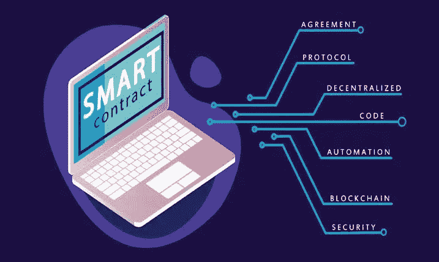

# 什么是智能合约，它们是如何工作的？

> 原文：<https://medium.com/coinmonks/what-are-smart-contracts-and-how-do-they-work-b5ae246168f7?source=collection_archive---------9----------------------->

智能合约是另一项模拟我们实时行为的技术发展。

顾名思义，智能合同本质上是在一个分散的网络上处理合同确认。

当我们谈到元宇宙时，我们提到“元宇宙是互联网作为一个普遍的，全面的，但单一的数字世界的一个想象的模仿物。”

类似地，智能合同代表了一种授权交易和协议的去中心化方式。

在当今世界，我们正在经历的变化不仅使我们的事情更容易，而且节省时间。

有了 NFT 头像，个人可以在任何平台上匿名存在。通过智能合同，我们可以在世界任何地方完成数字交易。

什么是智能合约，它们是如何工作的？这篇文章将解释你需要了解这项技术，以及它如何影响我们的生活和去中心化的空间。

# 智能合同:概述

去中心化已经主导了数字空间，因此大多数金融交易和活动在执行之前不需要任何中央权威机构。

权力下放可以描述为一个实体的控制权和决策权从一个中央机关或机构转移到不同的地方机关和机构的情况。

当今世界上大多数数字项目都是建立在分散技术之上的。其中包括加密货币、区块链和金融科技平台等。

分散式环境意味着任何人都可以为平台做出贡献，并且不需要中央机构或政府机构的授权。

随着所有这些的进行，有一个障碍。信任和诚实的问题出现在相关方之间。

这催生了智能合约的发展。简单地说，智能合同是一个分散的确认或协议系统。

“智能合同”的概念起源于 20 世纪 90 年代，由被誉为智能合同之父的 Nick Szabo 使用。

智能合同可以应用于借款、贷款、投资、交易和其他金融目的。智能合约的一个常见示例存在于以太坊和自动售货机中。

通过这种技术，各方可以开发一个智能合同来支持他们在区块链上的项目。

在对此项目执行任何操作之前，智能合约将要求一定数量的数字签名。

这项技术不仅消除了第三方的参与，还在区块链上建立了信任和安全。

在达到设定的签名数量之前，不会批准任何资金或交易。

***如果这个还不清楚，我们来举个现实生活中的例子。***

假设你是一家公司首席执行官的私人助理。一些投资者希望在你的公司工作，交易已经处于签署阶段。

没有你老板的签名，也没有投资者的签名，任何资金都不会发放给财务部。

# **智能合同是如何运作的？**

*   一旦部署了智能合同，它就会自动获得一个地址。该地址专门用于与合同和其他活动的交互。
*   一个智能合同根据开发者在其上存储的内容采用不同的变量。
*   一旦你将一份智能合同整合到区块链，区块链的每个人都可以与之互动。

***NB:*** *以太网不允许外人修改。*

*   第一个与任何基于证据的一致意见(如利害关系证明、工作证明等)一起确定为有效的节点。将被指定为智能合同的负责人。
*   允许前导节点将其执行结果添加到区块链。
*   有效结果被添加到区块链，作为修改内部变量的新块。
*   这个新变量进一步代表了区块链未来交易的初始值(因为它是不可变的)。

# 2022 年十大智能合同平台(除以太网之外)

以下列出了 2022 年除 Ethereum 之外的十大智能合同平台，由 Rapidinnovation.io 的 [Jesse Anglen](https://www.linkedin.com/in/jesseanglen) 列出。

*   宇宙区块链
*   近协议
*   埃尔隆德议定书
*   阿尔戈兰德区块链
*   雪崩协议
*   Fantom 网络
*   Terra LUNA 区块链
*   波尔卡多继电器链
*   Cardano ADA 智能合同平台
*   索拉纳·区块链

# 最后的想法

智能合同是在允许对项目采取任何行动之前，通过获取相关方的签名来授权各方之间的协议或交易的数字方式。

这个想法起源于 20 世纪 90 年代初，被认为是智能合同之父的尼克·萨伯(Nick Szabo)提出了这个想法。

除了在金融领域的用途之外，智能合同还可以用于房地产、医疗保健、游戏以及整合到整个公司结构中。

最重要的是，它们确定了项目的信任和安全性以及隐私。

请分享您对智能合同的想法。**您认为他们已经永久取代了物理签名者吗？**

点击[此处](/@abdulmuminsolihu/)跟随我上 Medium，了解更多关于密码货币、web3、fintech、区块链和元宇宙的内容。您也可以通过[领英](https://www.linkedin.com/in/abdulmuminsolihu)与我联系。

> 交易新手？试试[密码交易机器人](/coinmonks/crypto-trading-bot-c2ffce8acb2a)或者[拷贝交易](/coinmonks/top-10-crypto-copy-trading-platforms-for-beginners-d0c37c7d698c)