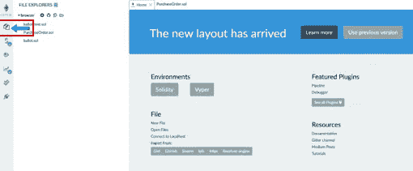
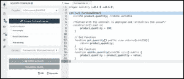
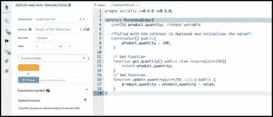
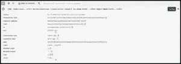
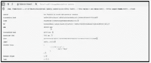

# 什么是智能合同以及如何编写它们——一个完整的指南

> 原文：<https://medium.com/coinmonks/what-are-smart-contracts-and-how-to-write-them-a-complete-guide-65fe3f5baf34?source=collection_archive---------38----------------------->

# 智能合同

 [## 什么是智能合约|区块链技术- KOOP360

### 智能合约是在满足特定条件时运行的程序，并记录在区块链上。

koop360.com](https://koop360.com/blog/what-are-smart-contracts/) 

> *区块链技术正在快速发展，并出现在各个行业。它将主宰未来的世界，大量的操作都依赖于它。区块链技术已经进入了金融领域和教育领域。最近，它已经将触角伸向了医疗保健领域。*

*然而，使用* [区块链](https://koop360.com/blog/what-is-blockchain/) *对新手来说似乎有些吓人。它附带了一些术语，乍一看可能让人不知所措。这就是为什么我们在这里帮助即将到来的区块链开发者习惯与技术相关的术语。其中一个术语是“智能合约”* *在本文中，我们将讨论什么是* ***【智能合约】*** *以及如何编写它们。*

# 什么是智能合约？

智能合约是在特定条件得到满足时运行的程序，并被记录在区块链 T21 上。它们通常用于简化合同的执行，以便所有各方可以立即确定合同的缔结，而无需中间人的参与或时间的浪费。他们还可以通过在满足特定条件时触发下一个活动来简化工作流。

# 智能合同的优势

# 快速、高效、准确

当一个要求被满足时，协议立即被执行。由于智能合同是电子化和自动化的，因此不需要处理文档，也不需要花费时间来纠正手动填写表单时经常出现的错误。

# 值得信赖和透明

没有理由怀疑信息是否被操纵以谋取私利，因为没有第三方参与，交易的加密记录在参与者之间传输。

# 安全性

区块链交易数据经过加密，极难被黑客攻击。此外，由于分布式分类账中的每条记录都与之前和之后的条目相关联，黑客将不得不改变整个链来改变特定的文档。

# 储蓄

智能合约不仅减少了相关的时间延迟和成本，还减少了完成交易的中介需求。

# 如何写你的第一份智能合同？

# 智能合同的结构

博彩业对 NFT 的采用仍处于早期阶段，因此尽管它提供了许多好处，但仍面临相当大的挑战。尽管存在这些挑战，但 NFT 在游戏行业已经获得了突出地位，因为它们有能力彻底改变游戏玩家消费在线游戏和购买游戏内资产的方式

# 杂注指令

使用**“pragma”**关键字可以启用某些编译特性或检查。下面的句子指定源文件(智能合约)不能用 0.4.0 之前和 0.6.0 之后的编译器版本进行编译。这个声明确保了当引入新的编译器版本时，不会引入意外的行为。

1

pragma 实度> =0.4.0 <=0.6.0

# Contract Declaration

The keyword “contract” is used to declare the contract. This declaration creates an empty contract with the name “Purchase Order.”

1

2

contract Purchase Order

{ }

# Storing necessary information in the contract

Any contract, or more broadly, every program, may involve the storage of some data. Providing data to the application gives it more versatility. A key feature is a transition from hard-coded values in the software to user-supplied values. Variables enable you to store data, label data, retrieve data, and alter data.

# Smart Contract Development: Introducing Variables

**在实度中，变量有两种类型**

1.  **值类型:**这些变量由值提供，这意味着它们在用作函数参数或在赋值时总是被复制。整数、布尔值、地址等等。
2.  **引用类型:**这些变量种类复杂，通过引用传递；它们不适合 256 位，必须小心维护，因为复制它们的成本很高。

# 将数据添加到智能合同

让我们在契约中包含一个数据变量。每份订单都必须附有一定数量的商品。让我们添加一个名为 product quantity 的变量，数据类型为 integer 或 number。

我们现在添加的变量是一个由 uint256 表示的无符号整数，其中 256 表示 256 位存储。

*   U- unsigned(意味着该类型只能表示正整数，不能表示正负整数)
*   整数
*   大小为 256- 256 位
*   可以分配给 uint256 的最小值是 0
*   uint256 可以分配的最大值是 2 ⁵⁶-1[一个非常大的数字]

产品数量只是一个正变量，我们目前假设我们将满足库存水平的一个非常大的值。

指定的**“产品数量”**变量是合同状态的一部分，因此在合同空间中维护或存储。该变量当前的默认值为 0。

1

2

3

合同采购订单{

uint256 产品 _ 数量；

}

# 定义构造函数

部署协议时，调用函数 Object(){[本机代码] }。function Object(){[本机代码] }用值填充契约。部署合同时，产品数量在当前情况下设置为 100。可以通过提供一个变量并用所提供的值初始化产品数量来形成参数化的函数对象(){[本机代码] }。

这里需要注意与 function Object(){[本机代码] }链接的访问修饰符“public”。public 关键字表示这个函数对每个人开放；不限。

1

2

3

构造函数()public{

产品 _ 数量= 100；

}

# 添加功能

现在让我们给我们的软件添加一个功能，使它更具交互性。功能是可以引入的程序控制的能力。关键字函数在任何函数之前。函数声明看起来是这样的:**"函数名>访问修改后的>状态赋值器>返回值> "** 。

获取功能

读取存储值是任何软件最基本的属性之一。我们需要阅读以下合同中的“产品数量”变量。引入了 read 函数或 get 函数来提供这种能力。我们没有在这个函数中操作存储的值；相反，我们只是简单地获得它。

**现在让我们剖析一下我们的 get 函数(get quantity)。**

**No.KeywordValue1\.** <函数名>get _ quantity(){无参数传递} **2 .** <访问修饰符>public {任何人都可以访问该函数} **3 .** < state-mutator > view 表示该函数只是检查协议的状态，并不改变它；所以，观。 **4。** <返回>返回由函数返回的内容定义的 uint256 类型的变量

1
2
3 函数 get _ quantity()public view returns(uint 256){
return product _ quantity；
}

# Setter 函数

如前一节所示，查看数据是必需的，但是大多数场景也需要写入数据的机会。setter 函数的添加提供了这个特定的特性。该函数接受来自用户的值作为输入参数。使用用户提供给该函数的值来写入/更新变量“产品数量”的值。

现在让我们解构我们的集合函数(更新数量)。

包括更新产品数量值的功能

**No.KeywordValue1\.** <函数名>update _ quantity(uint256 value){传递 uint 256 类型的参数值} **2 .** <访问修饰符>public {任何人都可以访问该功能} **3 .** <状态变异函数>这是不必要的，因为函数会更新状态。 **4。** <返回>返回由函数返回的内容定义的 uint256 类型的变量 1 2 3 函数 update _ quantity(uint 256 value)public { product _ quantity = product _ quantity+value；}当所有信息加在一起时，这就是最终合同的样子。1 2 3 4 5 6 7 8 9 10 11 12 13 14 15 16 17 18 19 20 pragma 实度>= 0 . 4 . 0<= 0 . 6 . 0；合同采购订单{ uint256 product _ quantity//部署用协定调用的状态变量/*并初始化值*/constructor()public { product _ quantity = 100；} // Get 函数 Function Get _ quantity()public view returns(uint 256){ return product _ quantity；} // Set Function 函数 update _ quantity(uint 256 value)public { product _ quantity = product _ quantity+value；} }

# 部署智能合同

是时候测试智能合约了。我们将利用 Remix Online IDE 来测试这个智能合约。

remix 是一个在线以太坊智能合约游乐场。混音完全基于浏览器。Remix 为创建智能合约提供了一个在线 IDE(集成开发环境)。remix 包括一个在线可靠性编译器功能。Remix IDE 中的智能合约可以使用指定的编译器版本轻松编译。

Remix 还允许你快速测试智能合约。

Remix 提供了一个完整的工具包，用于启动智能契约开发和单元测试，而不需要在本地 PC 上进行任何安装。这对于刚开始使用 solidity 的开发人员来说非常有用，因为他们只需要专注于构建一个智能契约，而不是担心基础设施。

要开始使用 Remix IDE 进行智能合约开发，您需要的只是一个浏览器和一个互联网连接。智能合同概念的快速开发、测试和验证。

Remix 的用户界面刚刚更新。

**当您点击上图中标记的文件图标时，将会打开一个文件浏览器窗口。**

1.  通过单击+图标并将其命名为 PurchaseOrder.sol，可以生成一个新文档。
2.  这将生成一个名为 PurchaseOrder.sol 的空文件，您可以通过单击它来打开它。
3.  让我们将整个合同复制并粘贴到 PurchaseOrder.sol 中。
4.  单击第二个图标，它应该出现在文件图标正下方的左侧菜单中。
5.  在编译器标题下选择编译器版本。目前使用的版本是 0.5.8。
6.  选择编译器版本后，单击“编译 PurchaseOrder.sol”。智能合同将作为此操作的结果进行编译。

7.智能合同编译成功后，单击“编译详细信息”按钮，将出现以下信息。汇编之后，提供了两条关键信息。

*   ABI 代表应用程序二进制接口。这是一个 json 文件，包含关于智能合约提供的所有方法的信息，以及关于这些方法的元数据。
*   字节码是以太坊虚拟机的操作代码。智能契约逻辑在编译期间被转换成字节码。

8.必须首先部署智能合约才能进行测试。要部署智能合同，请导航到左侧菜单中的下一个图标，就在编译图标下方。将出现下面的屏幕。必须首先部署智能合约才能进行测试。单击左侧菜单中编译图标下方的下一个图标，以部署智能合同。将出现下面的屏幕。

# 部署选项

部署屏幕提供了几个选项；让我们一个一个来看一下

*   环境:这类似于决定从亚马逊、Flipkart 或新蛋(这些都是在线零售商)购买笔记本电脑；您可以根据自己的需求选择购买地点。类似地，在 Remix 的情况下，您可以选择部署和测试智能合约。环境标签旁边的下拉列表中有三个选项。
*   JavaScript VM——在浏览器内存中，启动一个本地以太坊单个节点，提供 5 个预付测试帐户，可用于事务(部署、调用函数)
*   2.注入的 Web3 提供—这取决于元掩码。Metamask 充当经纪人或中间人的角色，允许 web 应用程序与智能合约对接。Metamask 支持身份管理以及传输到以太网的交易签名。这个中间人或第三方将协助您确定智能合同将放在哪个区块链网络上。
*   3.Web3 Provider —如果您正在运行本地以太坊节点并且 RPC 端点可用，则可以使用此选项。智能合约将安装在本地以太坊节点上。
*   帐户:选定的环境会填充此信息。举个例子，JavaScript VM 附带了五个预先资助的测试账户。Web3 提供商和注入的 Web3 不提供预先资助的测试帐户。
*   汽油限额:这是发起人准备在任何交易中花费的最多汽油。在无限循环的情况下，这是防止清空账户中所有现金的地方。
*   Value:建立智能合约时可能需要发送的值。这是一个布尔值。

要部署合同，请选择 JavaScript VM 选项，然后从 accounts 下拉列表中选择初始帐户，注意帐户余额(100 ether)。

**确保显示的智能合同名称为 PurchaseOrder，然后单击 deploy。将要发生的关键事件**

1.  从帐户余额中减去部署智能合约的交易费，帐户余额从 100 以太变为 99.999999 以太。
2.  在已部署的协定下，将出现一个新的智能协定磁贴，以及新智能协定的地址，如下所示(0x 692 a70 D2 e 424 a 56 D2 c6c 27 aa 97 D1 a 86395877 B3 a)
3.  控制台窗口中将显示以下信息:
4.  事务哈希—唯一标识合同部署
5.  交易成本
6.  合同地址

# 与已部署的合同交互

1.  在已部署的合同下，可以访问以下两种交互方法:更新数量和获取数量。
2.  这两种交互方法在“采购订单”契约中被定义为公共方法。
3.  更新的数量“更新数量”方法需要一个输入参数，这就是输入框存在的原因。
4.  “获取数量”方法返回产品数量的值。
5.  让我们看看当我们调用 get quantity 时会发生什么；显示在 function Object(){[本机代码] }中设置的返回值 100。这不会导致交易。
6.  让我们使用更新的数量 30 作为输入。这导致了一个交易。

总之，任何触发对契约状态的写操作(即改变契约变量)的操作都会导致一个事务。

任何只是读取契约状态的活动都不会导致交易。

**智能合同开发结论**

通过创建我们的第一个智能合同，我们仅仅触及了坚实的表面。我们刚刚看到了测试智能合约所需的一切，从部署到开始交易。

> 交易新手？试试[密码交易机器人](/coinmonks/crypto-trading-bot-c2ffce8acb2a)或[复制交易](/coinmonks/top-10-crypto-copy-trading-platforms-for-beginners-d0c37c7d698c)